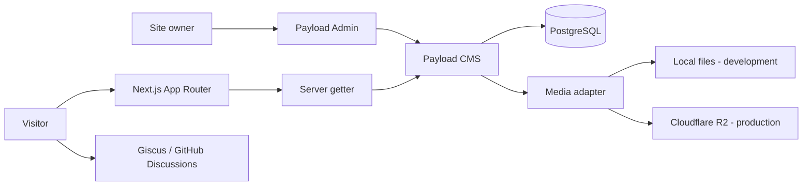

# Kita

[](https://github.com/koharu4ever/Kita/actions/workflows/ci.yml)
[](https://kita.kral-koharu.com)

一个具有视觉小说氛围的自托管游戏目录与长篇评论网站。

A self-hosted game catalog and long-form review site with a visual-novel-inspired atmosphere.

[中文说明](#中文说明) · [English guide](#english-guide)

**在线访问 / Live:** [Home](https://kita.kral-koharu.com/) ·
[Games](https://kita.kral-koharu.com/games) ·
[Reviews](https://kita.kral-koharu.com/reviews) ·
[Tools](https://kita.kral-koharu.com/tools) ·
[About](https://kita.kral-koharu.com/about)

**Stack:** Next.js 16 · React 19 · TypeScript · Tailwind CSS 4 · Payload CMS 3 ·
PostgreSQL 16 · Cloudflare R2 · Giscus · Vitest · Docker Compose · GitHub Actions

## 中文说明

### 项目功能

站主通过 Payload Admin 管理内容，访客通过定制的 React 页面浏览。Kita 面向一个可信站主维护的小型内容站，不是多人社区或通用 CMS 产品。

| 区域     | 已实现功能                                                                            |
| -------- | ------------------------------------------------------------------------------------- |
| Home     | 按需加载壁纸、随滚动出现的 WebGL 雨景、主动开启的循环雨声。                           |
| Games    | Media 封面瀑布流、键盘可操作的 lightbox、游戏详情页和雨窗返回入口。                   |
| Reviews  | 服务端分页信息流、富文本文章、目录、上一篇/下一篇、随机阅读、阅读进度和独立光暗主题。 |
| Comments | Giscus / GitHub Discussions 留言、配套主题及装饰素材，不另建评论后端。                |
| Tools    | 五种展示模式，支持搜索、组合筛选、排序和分页。                                        |
| About    | 项目介绍、全屏窗纱导航、键盘焦点管理和各路由主题色。                                  |
| Admin    | 登录后编辑内容、上传图片、控制发布状态及执行字段校验。                                |

动态效果包含减少动态效果偏好和资源释放处理。开发 preview 只用于界面验证；正式内容不依赖演示数据或静态 fallback。

### 架构与技术分工

Kita 是一个单体应用：**Payload 集成在 Next.js 内，不是第二个需要单独部署的后端服务。**

| 技术                              | 职责                                                                     |
| --------------------------------- | ------------------------------------------------------------------------ |
| Next.js App Router                | 路由、服务端页面、metadata，以及 Payload Admin/API 接入。                |
| React / TypeScript / Tailwind CSS | 类型化 UI、客户端交互和样式；部分页面使用 CSS Modules。                  |
| Payload CMS                       | Admin、认证基础、Collections、Local API、Lexical 编辑器和上传适配器。    |
| PostgreSQL                        | 内容、用户、Media 元数据及关系；不保存图片文件本体。                     |
| Cloudflare R2                     | 生产图片对象存储；通过独立公共域名提供图片访问。                         |
| Giscus                            | 将文章 pathname 对应到 GitHub Discussions，独立于 Payload 账户与数据库。 |
| Docker Compose / Coolify          | 应用打包、服务编排、运行配置与部署。                                     |
| Vitest / GitHub Actions           | 单元测试、备份失败路径、隔离数据库验证和构建门禁。                       |

下面是组件关系图，也供英文章节共用：



公开页面的数据链路为：

```text
Route -> server getter -> Payload Local API -> mapper -> feature DTO -> React UI
                          overrideAccess: false
```

- **getter** 负责查询与公开读取条件，不绕过 Payload 权限。
- **mapper** 把 CMS 文档转换为页面需要的结构。
- **DTO** 是 UI 使用的数据形状，让组件不直接依赖数据库字段或生成的 CMS 类型。
- 例如 Game 查询会解析关联的 Media；mapper 从图片元数据生成封面信息，而不是在 Game 表重复保存 URL、宽高等字段。

Payload 提供现成的后台、认证和存储基础；Kita 实现内容模型、发布规则、权限配置、数据映射、前台交互、迁移、部署及测试。没有再引入独立 API 框架、第二套 ORM、Redis 或微服务。

### 代码从哪里看

| 目录                 | 职责                                                 |
| -------------------- | ---------------------------------------------------- |
| `src/app/`           | 路由、layout、页面组合、metadata 与 route handlers。 |
| `src/features/`      | 按功能组织的组件、mapper、DTO 和展示逻辑。           |
| `src/server/`        | Payload client 与公开页面使用的查询。                |
| `src/payload/`       | Collections、权限、字段校验和生成的类型。            |
| `src/config/`        | 环境变量、站点和 Media 存储配置。                    |
| `src/migrations/`    | 已提交的数据库迁移。                                 |
| `docker/`            | 备份 sidecar 及 shell 测试。                         |
| `tests/integration/` | 隔离 PostgreSQL / Payload 验证。                     |
| `public/`            | 随代码发布的界面图片、声音等静态资源。               |

需要追踪一条实际链路，可以从 [Games getter](./src/server/games/get-games.ts) 进入，再看 [Game mapper](./src/features/games/utils/map-game-document-to-game-detail.ts)。完整说明见 [架构文档](./docs/architecture.md)。

### 本地启动

宿主机需要 **Git、Docker Desktop（Linux containers）、VS Code 和 Dev Containers 扩展**。Node 22、pnpm 和项目依赖在容器中使用，不需要在 Windows 安装项目依赖。

1. 克隆并用 VS Code 打开仓库：

   ```bash
   git clone https://github.com/koharu4ever/Kita.git
   cd Kita
   ```

2. 用编辑器将 [`.env.example`](./.env.example) 复制为 `.env`，已有文件不要覆盖。将 `PAYLOAD_SECRET` 占位值换成至少 32 字符的随机开发密钥；保留 `MEDIA_STORAGE_MODE=local`。默认 Docker-in-Docker 流程使用样例中的本地数据库配置；若修改数据库用户、密码或库名，也要同步修改 `DATABASE_URI`。**不要使用生产凭据。**
3. 在 VS Code 执行 **Dev Containers: Reopen in Container**。等待 `postCreateCommand` 完成依赖安装；首次配置已运行 `pnpm install --frozen-lockfile`，无需在宿主机重复安装。
4. 在容器终端运行：

   ```bash
   whoami
   pnpm dev
   ```

   用户应为 `node`。`pnpm dev` 会先启动并等待容器内 Docker 的 PostgreSQL healthy，再启动 Next.js。保持该终端运行。

5. 打开 [本地首页](http://localhost:3000) 和 [本地 Admin](http://localhost:3000/admin)。若 VS Code 转发到了其他端口，以 **Ports** 面板显示的地址为准。全新开发数据库没有用户时，按 Admin 页面提示创建第一个本地管理员；已有数据库使用已有账号。

本地 PostgreSQL 数据保存在开发 Docker 的 Volume，上传图片在 `.payload-media`，不会通过 Git 自动进入生产环境。若出现 schema push 删除警告，应先核对本地数据和变更，不要仅为打开页面而盲目确认或删除 Volume。

容器内置的 Codex CLI 是可选开发工具，网站运行不需要登录它。日常流程与排障见 [开发指南](./docs/development.md)。

### 录入和查看内容

新数据库的列表可能为空，这是正常状态，不会自动填入生产内容。

- **Games：**先在 Media 上传可使用的图片并填写 alt，再创建 Game、选择 Cover、填写必填内容，将 Publication Status 设为 Published 后保存。
- **Reviews：**填写标题、slug、摘要、正文及其他必填项。封面目前是 `coverImage` 路径/URL，可用仓库已有的 `/home-night-sky.webp` 进行本地检查；远程封面需符合配置的 R2 图片来源规则。保存为 Published 后查看列表和详情。
- **Tools：**填写工具信息及有效 HTTP(S) 链接，保存后在 `/tools` 检查各展示模式。
- **访问边界：**匿名访客只能读取已发布的 Games/Reviews；Media 和 Tools 公开可读；内容写操作要求登录。后台可查看未发布内容，但公开 getter 不因此显示草稿。

本地不需要 R2 凭据。Media 是公开资源，文章尚未发布并不使关联图片保密。Game 封面使用 Media relationship；Review 封面仍是路径/URL 字段，两者不要混淆。已知的保留 slug 和图片校验边界见下方限制说明。

### 测试与生产部署

所有检查在 Dev Container 中以 `node` 用户运行。先用 `Ctrl+C` 停止开发服务，避免 dev/build 同时写 `.next`：

```bash
pnpm test
pnpm test:integration
pnpm check
SKIP_ENV_VALIDATION=true pnpm build
```

- `test`：Vitest 与备份 shell 场景。
- `test:integration`：使用临时 PostgreSQL 16 容器及 `tmpfs`，验证 fresh migration 和真实 Payload 访问控制，不使用现有开发或生产数据库 Volume。
- `check`：格式、ESLint 和 TypeScript。
- 上述 build 是与 CI 一致的构建验证；`SKIP_ENV_VALIDATION` **不能作为正常开发或生产运行配置**。它不配置数据库、不启动网站，也不证明 R2 可用。

GitHub Actions 在 PR 和 `main` 上执行依赖安装、静态检查、测试、隔离 integration 和 production build。带日期的结果只维护在 [当前项目状态](./docs/current-project-status.md#验证证据)。

生产使用仓库 `compose.yaml`：`web` 运行 standalone Next.js/Payload，`postgres` 保存数据，`backup` 在启用后导出数据库并上传独立私有 R2 bucket。Coolify 提供生产配置；web entrypoint 先执行已提交 migration，再启动服务；`/api/health` 检查数据库 readiness。生产图片必须使用完整 R2 配置，不静默退回临时文件系统。部署与回滚按 [部署指南](./docs/deployment.md) 操作，不直接照搬本地 `.env`。

### 范围与已知限制

- 采用可信单站主模型，没有公共注册、多租户或复杂角色权限；Giscus 评论使用 GitHub 账户。
- 评审记录中仍有 Cookie 配置、Media 删除、slug/封面校验和浏览器存储降级等未修复边界，详见 [当前状态](./docs/current-project-status.md#评审结论与已知边界)。文档收尾或 CI 通过不代表这些问题已解决。
- fresh migration 测试不证明带真实数据升级、全部 `down` 或完整灾难恢复。数据库 dump 不包含 R2 图片本体；恢复边界见 [备份手册](./docs/backup-and-recovery.md)。
- 浏览器验证以针对性的手动 smoke 为主，不宣称全设备或完整 E2E 覆盖。
- 视觉资源与保留的第三方材料集中记录在 [Third-Party Notices](./THIRD_PARTY_NOTICES.md)；仓库包含资源不等于授予其通用再分发许可。
- 更多说明从 [文档入口](./docs/README.md) 阅读，不在 README 复制可变待办和完整环境变量表。

---

## English guide

### Features

The site owner edits content through Payload Admin; visitors browse custom React pages. Kita is designed for a small catalog maintained by a trusted owner, not a multi-user community or a general-purpose CMS product.

| Area     | Implemented experience                                                                                                                                 |
| -------- | ------------------------------------------------------------------------------------------------------------------------------------------------------ |
| Home     | On-demand wallpapers, scroll-driven WebGL rain, and opt-in looping rain audio.                                                                         |
| Games    | Media-backed masonry gallery, keyboard-accessible lightbox, detail pages, and a rainy-window return link.                                              |
| Reviews  | Server-paginated feed, rich-text articles, table of contents, previous/next and random reading, reading progress, and a route-scoped light/dark theme. |
| Comments | Giscus / GitHub Discussions with matching themes and decorative assets; no custom comment backend.                                                     |
| Tools    | Five display modes with search, combined filters, sorting, and pagination.                                                                             |
| About    | Project introduction, full-screen window-veil navigation, focus management, and route accent colors.                                                   |
| Admin    | Authenticated editing, image uploads, publication controls, and field validation.                                                                      |

Motion effects include reduced-motion handling and resource cleanup. Development previews are separate from real content; production pages do not use sample data or static fallbacks to hide empty collections or failed queries.

### Architecture and responsibilities

**Payload runs inside the Next.js application; it is not a second backend service to deploy.** See the shared [architecture diagram](#架构与技术分工) above.

| Technology                        | Responsibility                                                                                 |
| --------------------------------- | ---------------------------------------------------------------------------------------------- |
| Next.js App Router                | Routes, server-rendered pages, metadata, and Payload Admin/API integration.                    |
| React / TypeScript / Tailwind CSS | Typed UI, client interactions, and styling, with CSS Modules for some features.                |
| Payload CMS                       | Admin, authentication primitives, Collections, Local API, Lexical editor, and upload adapters. |
| PostgreSQL                        | Content, users, Media metadata, and relationships, not the image files themselves.             |
| Cloudflare R2                     | Production image storage exposed through a dedicated public domain.                            |
| Giscus                            | Maps article pathnames to GitHub Discussions, independently of Payload accounts and data.      |
| Docker Compose / Coolify          | Packaging, service orchestration, runtime configuration, and deployment.                       |
| Vitest / GitHub Actions           | Unit tests, backup failure paths, isolated database verification, and build gates.             |

Public pages use this data path:

```text
Route -> server getter -> Payload Local API -> mapper -> feature DTO -> React UI
                          overrideAccess: false
```

- A **getter** performs the query and keeps Payload access checks enabled.
- A **mapper** converts CMS documents into the shape needed by the page.
- A **DTO** is the UI-facing data contract, keeping components independent of generated CMS types.
- For example, a Game query resolves its Media relationship; the mapper derives cover information from image metadata instead of duplicating the URL and dimensions in the Game record.

Payload supplies the Admin, authentication, and storage foundation. Kita implements content models, publication and access rules, mapping, public interactions, migrations, deployment, and tests. It does not add a separate API framework, second ORM, Redis, or microservices.

### Code map

| Directory            | Responsibility                                                    |
| -------------------- | ----------------------------------------------------------------- |
| `src/app/`           | Routes, layouts, page composition, metadata, and route handlers.  |
| `src/features/`      | Feature components, mappers, DTOs, and presentation logic.        |
| `src/server/`        | Payload client and queries used by public pages.                  |
| `src/payload/`       | Collections, access rules, field validation, and generated types. |
| `src/config/`        | Environment, site, and Media storage configuration.               |
| `src/migrations/`    | Committed database migrations.                                    |
| `docker/`            | Backup sidecar and shell tests.                                   |
| `tests/integration/` | Isolated PostgreSQL / Payload verification.                       |
| `public/`            | Versioned interface images, audio, and other static assets.       |

Follow the [Games getter](./src/server/games/get-games.ts) into the [Game mapper](./src/features/games/utils/map-game-document-to-game-detail.ts) for a concrete example. The [architecture document](./docs/architecture.md) explains the full boundaries.

### Run locally

The host needs **Git, Docker Desktop using Linux containers, VS Code, and the Dev Containers extension**. Node 22, pnpm, and project dependencies run inside the container; do not install project dependencies on Windows.

1. Clone the repository and open its folder in VS Code:

   ```bash
   git clone https://github.com/koharu4ever/Kita.git
   cd Kita
   ```

2. Use your editor to copy [`.env.example`](./.env.example) to `.env`; do not overwrite an existing file. Replace the `PAYLOAD_SECRET` placeholder with a random development secret of at least 32 characters, and keep `MEDIA_STORAGE_MODE=local`. The example database settings match the default Docker-in-Docker workflow. If you change the database user, password, or name, update `DATABASE_URI` accordingly. **Do not use production credentials.**
3. Run **Dev Containers: Reopen in Container** in VS Code. Wait for `postCreateCommand`, which runs `pnpm install --frozen-lockfile`. No host-side dependency installation is needed.
4. In the container terminal, run:

   ```bash
   whoami
   pnpm dev
   ```

   The user should be `node`. The dev command starts and waits for PostgreSQL on the container's Docker daemon, then starts Next.js. Keep this terminal running.

5. Open the [local site](http://localhost:3000) and [local Admin](http://localhost:3000/admin). If VS Code forwards a different port, use the address in its **Ports** panel. On a fresh development database with no users, follow the Admin prompt to create the first local administrator; use the existing account for an existing database.

The local database lives in a development Docker volume; uploaded files live in `.payload-media`. Neither is published to production through Git. If schema push warns about deletion, inspect the local data and schema change before accepting it; do not delete a volume just to make the page load.

Codex CLI is included as an optional development tool. You do not need to sign in to it to run the website. See the [development guide](./docs/development.md) for daily workflows and troubleshooting.

### Add and view content

Empty lists are expected on a new database. Production content is not imported automatically.

- **Games:** Upload an image you may use in Media and provide its alt text. Create a Game, select its Cover, fill the required fields, set Publication Status to Published, and save.
- **Reviews:** Fill the title, slug, excerpt, body, and other required fields. Covers currently use a `coverImage` path/URL; `/home-night-sky.webp` is an existing repository asset suitable for a local check. Remote covers must match the configured R2 image source. Publish the entry to view its public list and detail pages.
- **Tools:** Enter tool information and a valid HTTP(S) link, save, and check the display modes at `/tools`.
- **Access:** Anonymous visitors can read only published Games/Reviews. Media and Tools are public; content writes require authentication. Admin can show unpublished entries, but public getters still exclude them.

Local development needs no R2 credentials. Media is public even when referenced by an unpublished entry. Game covers use Media relationships; Review covers still use path/URL fields. Reserved-slug and image-validation limitations are noted below.

### Tests and production deployment

Run checks inside the Dev Container as `node`. Stop the dev server with `Ctrl+C` first: development and build commands both use `.next`.

```bash
pnpm test
pnpm test:integration
pnpm check
SKIP_ENV_VALIDATION=true pnpm build
```

- `test`: Vitest and backup shell scenarios.
- `test:integration`: A temporary PostgreSQL 16 container backed by `tmpfs`, exercising fresh migrations and real Payload access without using existing development or production database volumes.
- `check`: Formatting, ESLint, and TypeScript.
- The build command matches CI validation. **Do not use `SKIP_ENV_VALIDATION` for normal development or production runtime.** It does not configure a database, start the site, or verify R2.

GitHub Actions runs dependency installation, static checks, tests, isolated integration, and the production build for PRs and `main`. Dated results are maintained only in [Current project status](./docs/current-project-status.md#验证证据).

Production uses `compose.yaml`: `web` runs standalone Next.js/Payload, `postgres` stores data, and `backup` exports the database to a separate private R2 bucket when enabled. Coolify supplies runtime configuration. The web entrypoint runs committed migrations before starting the server, and `/api/health` checks database readiness. Production requires complete R2 configuration rather than silently falling back to temporary local storage. Follow the [deployment guide](./docs/deployment.md) for deployment and rollback; do not reuse the local `.env` as production configuration.

### Scope and limitations

- This is a trusted-owner model, without public registration, multi-tenancy, or complex role management. Giscus comments use GitHub accounts.
- Authentication-cookie settings, Media deletion, slug/cover validation, and browser-storage fallback have unresolved review findings in [Current project status](./docs/current-project-status.md#评审结论与已知边界). Documentation completion and passing CI do not resolve those issues.
- Fresh migration tests do not prove data-bearing upgrades, every `down` migration, or full disaster recovery. Database dumps do not contain R2 image files; see [Backup and recovery](./docs/backup-and-recovery.md).
- Browser verification is based on focused manual smoke checks, not complete cross-device or E2E coverage.
- Artwork and retained third-party material are documented in [Third-Party Notices](./THIRD_PARTY_NOTICES.md). Inclusion in the repository does not grant a blanket redistribution license.
- See the [documentation index](./docs/README.md) for further details. Topic documents are primarily in Chinese; this bilingual README covers the architecture and common workflow without duplicating mutable task lists or the full environment-variable reference.
