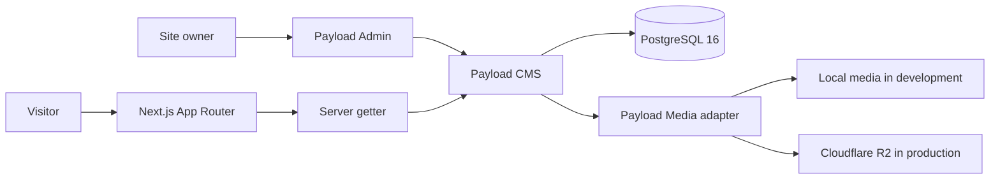

# Kita

[](https://github.com/koharu4ever/Kita/actions/workflows/ci.yml)
[](https://kita.kral-koharu.com)

Kita is a self-hosted game catalog and review publishing platform built with
Next.js, TypeScript, Payload CMS, PostgreSQL, and Cloudflare R2.

The site owner manages games, reviews, and media through Payload Admin. Visitors
can browse published content through a custom React interface that stays
separated from the CMS document shape.

**Core stack:** Next.js 16 · React 19 · TypeScript · Payload CMS 3 · PostgreSQL
16 · Cloudflare R2 · Vitest · Docker Compose · GitHub Actions

> Release screenshots will be captured from the real production site after the
> final content pass. This repository does not use mock screenshots as project
> evidence.

## Overview

Kita combines a public editorial site with a private content workflow:

```text
Site owner
  -> signs in to Payload Admin
  -> uploads media and maintains content
  -> publishes Games and Reviews

Visitor
  -> browses published Games and Reviews
  -> opens long-form entries and curated reference links
```

The application is intentionally a focused monolith. Payload provides the CMS
foundation inside the Next.js application, while PostgreSQL remains the only
business database and Cloudflare R2 stores production media.

## Features

- Responsive Home, Games, Reviews, About, and Tools pages.
- Dynamic Game and Review detail routes with server-rendered metadata.
- Payload Admin with authenticated content and media management.
- Published-only anonymous access for Games and Reviews.
- Centralized validation for required text, slugs, ratings, and HTTP(S) URLs.
- Stable feature DTOs between Payload documents and React components.
- Local filesystem media in development and Cloudflare R2 in production.
- Reviewable PostgreSQL migrations and migration-before-start deployment.
- Multi-stage Docker image, Docker Compose runtime, health-gated PostgreSQL, and
  a scheduled PostgreSQL backup sidecar.
- Required CI for formatting, linting, type checking, tests, and production
  build.

## Architecture



Public pages follow one consistent data path:

```text
Route
  -> server getter
  -> Payload Local API (overrideAccess: false)
  -> mapper
  -> feature DTO
  -> React component
```

This keeps route components focused on composition, prevents UI components from
depending on generated Payload types, and makes CMS schema changes easier to
contain.

## Authentication and access control

| Capability                        | Anonymous visitor | Authenticated owner |
| --------------------------------- | ----------------- | ------------------- |
| Read published Games and Reviews  | Yes               | Yes                 |
| Read draft Games and Reviews      | No                | Yes                 |
| Read public Media and Tools       | Yes               | Yes                 |
| Create, update, or delete content | No                | Yes                 |
| Use Payload Admin                 | No                | Yes                 |

Server getters keep Payload access checks enabled with `overrideAccess: false`.
Production data failures are surfaced instead of being hidden behind development
fixtures.

## What Payload provides and what Kita implements

**Payload provides:**

- Admin UI and authentication foundation.
- Collection, Local API, and upload primitives.
- Lexical rich-text editing.
- PostgreSQL and S3-compatible storage adapters.

**Kita implements:**

- Content schemas, field validation, publication rules, and access policies.
- Server getters, mapping boundaries, stable DTOs, and public React pages.
- Development/production media configuration and R2 fail-closed behavior.
- Production migrations, Docker/Compose/Coolify integration, tests, CI, and the
  PostgreSQL backup workflow.

## Media storage

Development writes uploads to an ignored `.payload-media` directory. Production
requires the S3-compatible adapter and a dedicated Cloudflare R2 bucket; it
refuses to fall back to a temporary container filesystem. Game covers use a
Payload Media relationship as their single source of truth.

## Testing and CI

The local quality gate runs inside the Dev Container as the non-root `node`
user:

```bash
pnpm test
pnpm check
SKIP_ENV_VALIDATION=true pnpm build
```

GitHub Actions repeats frozen dependency installation, formatting, linting,
type checking, tests, and the production build for pull requests and `main`.
The build-only validation escape hatch matches CI; production runtime validation
still requires complete database and R2 configuration.

## Deployment

Production uses the repository `compose.yaml` with three services:

- `web`: the standalone Next.js/Payload image;
- `postgres`: PostgreSQL 16 with a health check and persistent named volume;
- `backup`: an optional read-only sidecar that creates validated custom-format
  dumps and uploads them to a separate private R2 bucket.

The web entrypoint runs committed Payload migrations before starting the server.
Coolify supplies production secrets and runtime configuration; no real secret is
stored in this repository.

## Local development

Prerequisites are VS Code, the Dev Containers extension, Docker, and Git.
Project dependencies are installed inside the container, not on Windows.

1. Clone the repository and open it in the Dev Container.
2. Copy `.env.example` to `.env` and provide a local `PAYLOAD_SECRET`.
3. Install and start the application:

   ```bash
   pnpm install --frozen-lockfile
   pnpm dev
   ```

`pnpm dev` starts and waits for the Docker-in-Docker PostgreSQL service before
starting Next.js. Local media and database data remain separate from production.

See [docs/development.md](./docs/development.md) for the complete workflow and
safety boundaries.

## Engineering decisions

- One TypeScript application instead of a second API framework.
- Payload Local API plus explicit access checks instead of bypassing CMS rules.
- Mappers and DTOs instead of exposing CMS documents to visual components.
- PostgreSQL as the only business database.
- Production migrations instead of schema push.
- Payload's storage adapter instead of a custom upload service.
- A focused monolith instead of Redis, microservices, queues, or Kubernetes.

Each choice solves a current requirement without creating an additional service,
backup surface, or deployment responsibility.

## Known limitations

- The final production content and screenshot pass is still in progress.
- Production content and visual assets still require a final rights/source audit.
- The full migration chain and real access policies are not yet exercised by an
  isolated PostgreSQL integration job in CI.
- Backup creation is automated, but full end-to-end disaster recovery is not
  claimed.
- Kita has one trusted content owner; public registration, multi-role RBAC,
  comments, and multi-tenancy are intentionally out of scope.

## Documentation

- [Architecture](./docs/architecture.md)
- [Current project status](./docs/current-project-status.md)
- [Development workflow](./docs/development.md)
- [Testing and CI](./docs/testing-and-ci.md)
- [Deployment](./docs/deployment.md)
- [Backup and recovery](./docs/backup-and-recovery.md)
- [Payload content and media](./docs/payload-content-and-media.md)
