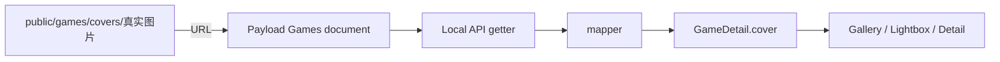

# Games 图片资源解耦方案

> 2026-07-21 状态注记：本文主体是 `public/games/covers` + 普通图片字段方案的历史设计记录。兼容式 Payload Media + Games relationship 已在后续功能分支完成代码和本地验证，旧字段与旧图片仍保留作为回退；Cloudflare/Coolify 配置、生产上传 smoke 和真实内容迁移尚未完成。当前范围、回滚和验收边界见 [`payload-media-and-content-capabilities-evaluation-2026-07-21.md`](./payload-media-and-content-capabilities-evaluation-2026-07-21.md)。

> 目标：把“游戏数据”“图片文件”“数据库结构”拆开。完成一次最终调整后，新增、替换或删除游戏不再修改 collection schema，也不再为每张图片生成 migration。

## 1. 结论先行

当前 `coverKey + enum + 前端 registry` 适合六张固定演示图，不适合长期维护真实游戏内容。

V1 推荐改成：

```text
图片文件
→ 放入 public/games/covers/

Payload Games document
→ 保存图片路径、alt、真实宽度、真实高度

mapper
→ 把 Payload 字段转换成 GameDetail.cover

页面
→ 继续只读取 game.cover，不关心文件来自哪里
```

建议 Games collection 最终保存四个普通字段：

```text
coverSrc
coverAlt
coverWidth
coverHeight
```

例如一条游戏数据保存：

```text
coverSrc: /games/covers/witch-on-the-holy-night-v1.webp
coverAlt: Witch on the Holy Night cover art
coverWidth: 1200
coverHeight: 1600
```

完成这一次 schema 调整后：

- 新增游戏：增加图片文件，新增一条 Games document；
- 删除游戏：删除 Games document，按需清理图片文件；
- 替换封面：增加新图片文件，修改这条 document 的 `coverSrc`；
- 不增加 enum；
- 不修改 collection；
- 不修改 mapper；
- 不生成 migration。

## 2. 先区分四个概念

这是理解整个方案最重要的一步。

### 2.1 数据库结构 Schema

Schema 描述一条 Games 数据“有哪些字段”。

例如：

```text
title
slug
summary
body
coverSrc
coverAlt
coverWidth
coverHeight
```

只有字段结构发生变化，才需要 migration。

例如：

- 新增 `coverSrc` 字段；
- 删除 `coverKey` 字段；
- 把字段从 enum 改成 text；
- 添加索引或外键。

### 2.2 数据库记录 Row / Document

Document 是按照 schema 填入的具体内容。

例如：

```text
title = Witch on the Holy Night
slug = witch-on-the-holy-night
coverSrc = /games/covers/mahoyo-v1.webp
```

新增、修改或删除 document 只是内容变化，不是数据库结构变化，因此不需要 migration。

### 2.3 图片文件 Asset

图片文件是实际的 `.webp`、`.jpg` 或 `.png` 文件，例如：

```text
public/games/covers/mahoyo-v1.webp
```

它不是数据库字段，也不是 migration。

在 Next.js 的 `public` 目录中：

```text
public/games/covers/mahoyo-v1.webp
```

对应浏览器 URL：

```text
/games/covers/mahoyo-v1.webp
```

### 2.4 前端 DTO

`GameDetail` 是前端稳定的数据格式：

```ts
cover: {
  src: string;
  alt: string;
  width: number;
  height: number;
}
```

页面只认这个格式，不直接认 Payload 字段。

mapper 负责把数据库 document 转成 DTO。

## 3. 当前图片链路是怎样的

当前 Payload collection 只有：

```text
coverKey
```

它是一个固定 select/enum，只允许六个值：

```text
sea-side-fragment
night-archive
after-rain
sunset-field
crimson-room
harbor-loop
```

数据库只保存其中一个 key。

mapper 再调用：

```ts
resolveGameCover(game.coverKey);
```

前端 registry 负责把 key 翻译为图片：

```text
night-archive
→ /home-night-sky.jpg
→ alt
→ width
→ height
```

完整路径是：


## 4. 当前方案为什么不适合真实内容

假设要新增一个游戏：

```text
Witch on the Holy Night
```

按照当前设计，需要：

1. 把图片放进 `public`；
2. 在 collection 的 select options 中增加 `witch-on-the-holy-night`；
3. 修改数据库 enum；
4. 生成 migration；
5. 修改 `game-cover-assets.ts`；
6. 增加 key 到图片元数据的映射；
7. 部署代码；
8. 最后才能在 Admin 中选择它。

这意味着：

```text
每增加一条内容
→ 修改 schema
→ 修改代码
→ 生成 migration
→ 部署
```

问题不在于 key 本身，而在于 key 被定义成数据库 enum，同时 registry 又是封闭的固定映射。

数据库 enum 适合真正稳定的有限状态，例如：

```text
draft / published
playing / finished / planned
```

它不适合表示会不断增加的游戏封面。

游戏封面属于内容，不属于数据库结构。

## 5. 推荐的目标链路

目标链路是：



数据库 document 直接保存图片的描述信息，不再保存需要二次查表的 enum key。

例如：

```text
Games document
├── title: Witch on the Holy Night
├── slug: witch-on-the-holy-night
├── coverSrc: /games/covers/mahoyo-v1.webp
├── coverAlt: Witch on the Holy Night cover art
├── coverWidth: 1200
└── coverHeight: 1600
```

mapper 只进行结构转换：

```ts
cover: {
  src: game.coverSrc,
  alt: game.coverAlt,
  width: game.coverWidth,
  height: game.coverHeight,
}
```

不再需要：

```text
coverKey
gameCoverOptions
GameCoverKey
gameCoverAssets
resolveGameCover
```

## 6. 为什么推荐四个普通字段

推荐 Payload document 使用：

```text
coverSrc: text
coverAlt: text
coverWidth: number
coverHeight: number
```

### `coverSrc`

保存图片 URL：

```text
/games/covers/mahoyo-v1.webp
```

它是普通字符串，不是 enum，所以任何新图片路径都可以作为数据写入。

### `coverAlt`

用于无障碍访问和图片加载失败时的文本说明。

不建议自动等于游戏标题，因为 alt 应该描述图片本身。

### `coverWidth` 和 `coverHeight`

当前页面使用 Next.js `<Image>`：

```tsx
<Image
  src={game.cover.src}
  width={game.cover.width}
  height={game.cover.height}
/>
```

宽高的作用不只是控制像素大小，还用于：

- 提前计算图片比例；
- 防止图片加载后页面突然跳动；
- 保持照片墙的 masonry 比例；
- 让详情页和 lightbox 正确计算布局。

每张图片的宽高不同没有问题。

宽高是每条 document 的数据值，不是 schema，因此新增不同尺寸的图片不需要 migration。

## 7. 为什么数据库保存路径不算严重耦合

完全没有关系是不可能的。

页面最终必须知道应该显示哪张图，所以游戏数据与图片之间至少需要一个引用。

我们的目标不是消灭引用，而是把引用缩小成一个稳定数据字段：

```text
coverSrc = /games/covers/mahoyo-v1.webp
```

这是弱绑定：

- 数据库不知道 React 组件；
- 数据库不知道图片 registry；
- 数据库不知道 import；
- mapper 不需要新增分支；
- schema 不枚举具体图片；
- 页面只读取稳定 DTO。

真正不理想的强绑定是：

```text
添加一张图片
→ 改 collection enum
→ 改 TypeScript union
→ 改 registry
→ 改 migration
```

推荐方案只保留：

```text
一条 Games document
→ 一个普通图片 URL
```

## 8. 推荐的资源目录

建议使用一个明确目录：

```text
public/
└── games/
    └── covers/
        ├── mahoyo-v1.webp
        ├── persona-3-reload-v1.webp
        ├── fate-stay-night-v1.webp
        └── tsukihime-remake-v1.webp
```

不建议继续把真实游戏图片混在：

```text
public/home-*.jpg
public/about-bg.jpg
```

因为这些文件属于主页或 About 的视觉资源，不是 Games 内容资源。

### 文件命名建议

使用小写 ASCII、连字符和版本号：

```text
witch-on-the-holy-night-v1.webp
witch-on-the-holy-night-v2.webp
```

避免：

```text
新建文件夹 (2)/魔法使之夜最终最终版.png
```

路径可以与 slug 相似，但不强制完全相同。

这样即使以后修改页面 slug，图片 URL 也不必跟着改变。

## 9. 为什么建议使用版本化文件名

替换封面时，不建议直接覆盖：

```text
mahoyo.webp
```

更稳妥的方式是新增：

```text
mahoyo-v2.webp
```

然后把数据库的 `coverSrc` 从：

```text
/games/covers/mahoyo-v1.webp
```

改成：

```text
/games/covers/mahoyo-v2.webp
```

原因是浏览器、Next Image optimizer、CDN 或反向代理可能缓存旧 URL。

新文件名会产生新 URL，能立即绕过旧缓存。

确认新图正常后，再删除 `v1` 文件。

## 10. 新增一个游戏的标准流程

完成目标结构后，新增游戏不再改代码逻辑。

### 第一步：准备图片

建议：

- 优先使用 WebP 或质量合理的 JPEG；
- 保留真实宽高；
- 避免直接上传几十 MB 的原图；
- 文件名使用稳定 ASCII 名称；
- 确认你拥有使用该图片的权限。

例如：

```text
witch-on-the-holy-night-v1.webp
1200 × 1600
```

### 第二步：放入资源目录

```text
public/games/covers/witch-on-the-holy-night-v1.webp
```

### 第三步：先部署图片文件

因为 `public` 文件属于 Git 仓库和 Docker image，需要：

```text
git add
→ commit
→ push
→ Coolify deploy
```

这叫静态资源部署，不叫数据库 migration。

### 第四步：在 Payload Admin 新建 Games document

先保持 Draft，填写：

```text
title
slug
developer
releaseDate
playStatus
summary
body
coverSrc
coverAlt
coverWidth
coverHeight
tags
links
```

### 第五步：预览和发布

确认图片 URL 能打开、页面比例正常，再把：

```text
publicationStatus
```

改为 `published`。

整个过程没有 schema 变化，也没有 migration。

## 11. 删除一个游戏的标准流程

删除数据和删除文件是两件事。

### 推荐顺序

1. 先把 Games document 改成 `draft`；
2. 检查 `/games` 已不再展示；
3. 删除 Games document；
4. 确认图片没有被其他内容引用；
5. 在后续清理 commit 中删除图片文件。

不建议先删除图片文件。

否则数据库仍处于 published 状态时，页面会引用一个已经不存在的 URL，产生破图或 404。

### 图片暂时不删可以吗

可以。

数据库 document 删除后，留在 `public` 的图片只是暂时成为未引用文件，不会破坏页面。

它占用少量镜像空间，但比提前删图导致线上破图更安全。

## 12. 替换游戏封面的标准流程

建议使用“先加后切再删”：

```text
1. 添加 mahoyo-v2.webp
2. 部署静态文件
3. 修改 document.coverSrc
4. 检查线上页面
5. 删除 mahoyo-v1.webp
```

不要使用：

```text
1. 先删旧图
2. 再上传新图
```

因为两个步骤之间可能出现线上空窗期。

## 13. 删除和新增游戏为什么不需要改照片墙

照片墙并没有手工写死“第一张图多高、第二张图多宽”。

页面通过：

```text
getGames()
→ GameDetail[]
→ games.map(...)
→ GameGalleryCard
```

每一条 published Games document 会转换成一张卡片。

所以：

```text
数据库多一条 published document
→ 照片墙多一张图

数据库少一条 document
→ 照片墙少一张图
```

图片的实际宽高决定卡片纵横比例，CSS columns 负责排列。

不需要为第七张、第八张图片新增 JSX。

## 14. mapper 在新方案中的作用

Payload document 可以继续保持接近数据库的扁平字段：

```ts
type PayloadGameDocument = {
  coverSrc: string;
  coverAlt: string;
  coverWidth: number;
  coverHeight: number;
};
```

前端仍然使用更适合组件的嵌套 DTO：

```ts
type GameDetail = {
  cover: {
    src: string;
    alt: string;
    width: number;
    height: number;
  };
};
```

mapper 负责转换：

```ts
cover: {
  src: game.coverSrc,
  alt: game.coverAlt,
  width: game.coverWidth,
  height: game.coverHeight,
}
```

这保持了已有的数据边界：

```text
Payload document
→ mapper
→ GameDetail
→ 页面组件
```

页面组件不用知道 Payload 把字段存成扁平列，也不用知道数据库结构如何变化。

## 15. 这次需要几条 migration

推荐只做一次最终迁移：

```text
删除 coverKey enum 字段
新增 coverSrc text
新增 coverAlt text
新增 coverWidth number
新增 coverHeight number
删除 enum_games_cover_key 类型
```

生产 `/api/games` 当前返回：

```json
{
  "docs": [],
  "totalDocs": 0
}
```

也就是说生产 Games 表目前没有正式记录。

这是调整结构成本最低的时机，因为不需要把已有六条正式数据从 `coverKey` 回填成路径。

完成这一次 migration 后，未来正常内容操作不再生成图片相关 migration。

## 16. 如果数据库已经有正式数据怎么办

如果未来表中已有大量 Games，不应该直接删除旧字段。

更安全的两阶段方式是：

```text
阶段 1
→ 新增可选 coverSrc/Alt/Width/Height
→ 保留 coverKey
→ 回填旧数据

阶段 2
→ 新字段改为 required
→ 页面切到新字段
→ 删除 coverKey 和 enum
```

但当前生产 Games 是空表，所以没必要增加两阶段复杂度。

## 17. 为什么暂时不推荐 Payload Media Collection

Payload 标准做法还可以是：

```text
Media collection（upload: true）
↑
Games.cover relationship
```

这样可以直接在 Admin 上传图片，并由 Payload 保存 filename、URL、width、height 等信息。

这是更完整的 CMS 方案，但当前会增加：

- Media collection；
- Games 到 Media 的 relationship；
- 文件上传权限；
- 图片存储位置；
- Docker volume 或对象存储；
- 备份策略；
- 删除引用检查；
- 生产环境文件迁移。

### Docker 中最需要注意的问题

容器文件系统不是可靠的永久存储。

Coolify 每次部署都会创建新 Web 容器。如果图片只上传到旧容器内部：

```text
旧容器删除
→ 上传文件一起消失
```

使用 Payload upload 时，至少需要：

```text
持久化 Docker volume
```

或者：

```text
S3 / Cloudflare R2 / 其他对象存储
```

这对当前只准备六篇 Games 的 V1 来说偏重。

## 18. 三种方案对比

| 方案                         | 新增图片是否改 schema | 是否需要部署       | Admin 能否直接上传 | Docker 存储复杂度 | 当前建议   |
| ---------------------------- | --------------------- | ------------------ | ------------------ | ----------------- | ---------- |
| 当前 enum + registry         | 是                    | 是                 | 否                 | 低                | 不继续使用 |
| `public` 文件 + 普通路径字段 | 否                    | 图片文件需要       | 否                 | 低                | V1 推荐    |
| Payload Media + relationship | 否                    | 通常不需要代码部署 | 是                 | 中到高            | 后续升级   |

## 19. 推荐实施范围

这次调整应保持很小：

### 后端

修改 Games collection：

```text
coverKey
→ coverSrc
→ coverAlt
→ coverWidth
→ coverHeight
```

生成一条最终图片字段 migration。

### mapper

删除：

```text
resolveGameCover(game.coverKey)
```

改为直接组装 `GameDetail.cover`。

### 前端

`GameDetail` 不需要改变。

以下组件也不需要理解 Payload：

```text
GameGalleryCard
GameLightbox
GameDetailPage
```

它们仍然读取：

```text
game.cover.src
game.cover.alt
game.cover.width
game.cover.height
```

### 静态 mock

mock 数据直接填写 `cover` 对象即可。

### 删除旧 registry

当 mapper 不再使用它后，可以删除：

```text
src/features/games/data/game-cover-assets.ts
```

这不会删除 `public` 中仍被主页使用的图片。

## 20. 不应该做的事情

### 不要为每个游戏增加 collection option

```ts
options: ["game-a", "game-b", "game-c"];
```

游戏不是固定状态枚举。

### 不要让 mapper 写很多条件分支

```ts
if (slug === "game-a") return imageA;
if (slug === "game-b") return imageB;
```

这会让新增内容继续要求改代码。

### 不要根据 slug 强制推导唯一图片路径

例如：

```ts
src: `/games/${game.slug}/cover.webp`;
```

这个方案看似省字段，但修改 slug、扩展名或封面版本时会产生隐式耦合。

显式保存 `coverSrc` 更容易理解和维护。

### 不要把上传文件只放在生产 Web 容器内部

没有 volume 或对象存储时，重新部署可能丢失文件。

## 21. 最终日常操作模型

完成一次结构调整后，你只需要记住三件事。

### 新增

```text
添加图片文件
→ 部署静态资源
→ Admin 新建 document
→ Published
```

### 替换

```text
添加 version 2 图片
→ 部署
→ 修改 coverSrc
→ 验证
→ 删除 version 1
```

### 删除

```text
先 Draft
→ 删除 document
→ 最后清理未引用图片
```

这三种操作都不会改变数据库结构。

## 22. 最终建议

当前阶段采用：

```text
Git 管理的 public/games/covers 静态图片
+
Payload Games 普通图片元数据字段
+
mapper 转换成稳定 GameDetail.cover
```

这是目前最符合 Kita V1 的平衡点：

- 结构容易理解；
- 不需要引入 Media collection；
- 不需要配置 Docker volume 或对象存储；
- 图片和数据库只有一个普通 URL 引用；
- 新增/删除游戏不修改代码链路；
- 新增/删除图片不改变 schema；
- 现有 Gallery、Lightbox、Detail 视觉组件基本不动；
- 将来升级到 Payload Media 时，页面仍然可以继续使用同一个 `GameDetail.cover` DTO。

需要接受的唯一代价是：图片放进 `public` 后要通过 Git 和 Coolify 部署；但这是静态资源发布，不是 migration，也不会扰动数据库结构。
