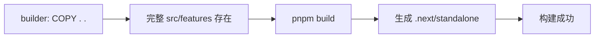
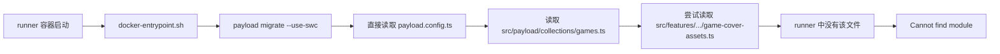

# Games 生产运行时依赖故障复盘

> 事故 commit：`4d1e8a8 feat: add Payload-backed games archive`
> 修复 commit：`e49fc3f fix: keep games collection runtime self-contained`
> 目的：从 Docker 初学者视角解释为什么构建成功但容器无法启动，以及几行代码如何解除错误依赖。

## 1. 先说结论

这次不是数据库 migration 写错，也不是 Next.js 页面构建失败。

真正的问题是：

```text
Payload Games collection（后端配置）
    ↓ import
src/features/games/data/game-cover-assets.ts（前端功能文件）
```

生产 Docker 镜像为了保持精简，只复制了 Payload 运行时需要的后端源文件，没有复制整个 `src/features` 目录。

因此容器启动时，Payload CLI 读取 Games collection，沿着 `import` 寻找前端文件，但该文件在最终镜像里不存在，于是 Node.js 抛出：

```text
Cannot find module '@/features/games/data/game-cover-assets'
```

`docker-entrypoint.sh` 使用了 `set -e`。migration 命令一旦失败，脚本立即退出，Next.js 的 `server.js` 根本没有机会启动，所以 Coolify 找不到可用的 Web 服务，整个站点返回 503。

修复方式是把数据库字段需要的六个 `coverKey` 选项直接定义在 Games collection 中。这样 collection 不再 import 前端文件，Payload migration 只依赖最终镜像中确实存在的 `src/payload`。

数据库字段和值没有改变，因此不需要新 migration。

## 2. 这里的“依赖”到底是什么

“依赖”不只表示安装在 `node_modules` 里的 npm package。

在代码里，只要 A 文件必须读取 B 文件才能运行，就可以说 A 依赖 B。

例如：

```ts
import { gameCoverOptions } from "@/features/games/data/game-cover-assets";
```

这行代码表达了一个运行时关系：

```text
games.ts 无法独立执行
    ↓
它必须先找到并执行 game-cover-assets.ts
    ↓
才能得到 gameCoverOptions
```

所以这里涉及两类不同依赖：

| 类型              | 示例                                      | 来源               |
| ----------------- | ----------------------------------------- | ------------------ |
| 外部 package 依赖 | `payload`、`@payloadcms/richtext-lexical` | `node_modules`     |
| 项目内部文件依赖  | `@/features/games/data/game-cover-assets` | Kita 的 `src` 目录 |

这次缺少的是第二类，不是 npm 包没有安装。

## 3. `@/features/...` 是什么

`@` 是 TypeScript/Next.js 配置的路径别名，一般表示项目的 `src` 目录。

因此：

```ts
@/features/games/data/game-cover-assets
```

可以理解为：

```text
/app/src/features/games/data/game-cover-assets.ts
```

路径别名只是让 import 更容易阅读。它不会自动把文件复制进 Docker 镜像，也不会凭空生成缺失文件。

Node.js 解析这个 import 时，最终还是必须在文件系统或构建产物中找到对应模块。

## 4. Docker 镜像可以理解成什么

可以先把 Docker image 理解成一个独立、只包含指定文件的小型运行环境。

宿主机项目里有这些内容：

```text
kita/
├── payload.config.ts
├── src/
│   ├── app/
│   ├── features/
│   ├── migrations/
│   ├── payload/
│   └── server/
├── public/
└── node_modules/
```

但 production runner 并没有简单执行：

```dockerfile
COPY . .
```

它有选择地复制运行时文件：

```dockerfile
COPY --from=deps /app/node_modules ./node_modules
COPY --from=builder /app/payload.config.ts ./payload.config.ts
COPY --from=builder /app/src/payload ./src/payload
COPY --from=builder /app/src/migrations ./src/migrations
COPY --from=builder /app/public ./public
COPY --from=builder /app/.next/standalone ./
COPY --from=builder /app/.next/static ./.next/static
```

最终 runner 大致是：

```text
/app
├── node_modules/
├── payload.config.ts
├── src/
│   ├── payload/
│   └── migrations/
├── public/
├── server.js
└── .next/
```

注意：这里没有完整的：

```text
/app/src/features/
```

这正是故障发生的物理原因。

## 5. 为什么 Docker 要分 builder 和 runner

Kita 使用 multi-stage build，也就是多阶段构建。

### 5.1 builder 阶段

```dockerfile
FROM base AS builder
COPY --from=deps /app/node_modules ./node_modules
COPY . .
RUN pnpm build
```

builder 拥有整个项目源代码，用来执行 Next.js production build。

它包含：

```text
src/features/games/data/game-cover-assets.ts
```

所以 `pnpm build` 能找到这个文件并成功。

### 5.2 runner 阶段

runner 是最终真正部署和启动的镜像。

它只拿构建结果、依赖、Payload 源文件、migration 和 public assets，不保留全部源代码。

优点包括：

- 镜像更小；
- 启动内容更明确；
- 减少无关源文件；
- 降低生产环境暴露面。

但代价是：任何需要在生产运行时直接读取的源文件，都必须明确复制进去，或者已经被正确打包进运行产物。

## 6. 为什么 `pnpm build` 明明通过了

这是这次最容易困惑的地方。

项目存在两条不同的执行路径。

### 6.1 Next.js 构建路径



在 builder 阶段，整个项目都存在，因此 import 没有问题。

### 6.2 Payload migration 运行路径



Payload migration CLI 不是在浏览器中运行，也不是单纯使用已经打包好的页面代码。

它在容器启动时直接读取：

```text
payload.config.ts
→ src/payload/collections/games.ts
→ collection 的所有 import
```

因此 Next build 成功，不等于 Payload CLI 在精简 runner 文件系统中也一定能成功。

## 7. 容器具体是怎么崩溃的

生产容器的启动命令是：

```dockerfile
CMD ["./docker-entrypoint.sh"]
```

脚本内容是：

```sh
#!/bin/sh
set -eu

echo "Running Payload migrations..."
./node_modules/.bin/payload migrate --use-swc

echo "Starting Next.js..."
exec node server.js
```

执行顺序如下：

1. Docker 创建 Web 容器。
2. Docker 执行 `docker-entrypoint.sh`。
3. entrypoint 先运行 Payload migration。
4. Payload 读取 `payload.config.ts`。
5. `payload.config.ts` import Games collection。
6. Games collection import `game-cover-assets.ts`。
7. runner 中不存在 `src/features` 文件。
8. Node.js 抛出 `Cannot find module`。
9. 因为 `set -e`，shell 遇到非零退出码后立即停止。
10. `exec node server.js` 没有执行。
11. Web 容器不断退出或重启。
12. Coolify 的反向代理找不到健康的应用容器。
13. 用户访问任何页面都得到 `503 no available server`。

日志反复出现 `Running Payload migrations...`，是因为容器在重启后反复从第一步开始，并不表示 migration 成功执行了很多次。

## 8. 故障代码原来是什么

原 collection 中存在：

```ts
import { gameCoverOptions } from "@/features/games/data/game-cover-assets";
```

字段配置使用它：

```ts
{
  name: "coverKey",
  type: "select",
  options: [...gameCoverOptions],
  required: true,
}
```

`game-cover-assets.ts` 同时承担了两件事：

1. 为 Payload Admin 提供 `coverKey` 下拉选项；
2. 为前端提供 key 到图片路径、alt、宽高的映射。

也就是说，后端数据库 schema 为了得到六个字符串选项，必须加载一个属于前端展示层的文件。

这形成了方向不理想的依赖：

```text
后端 collection
    ↓
前端图片 registry
```

## 9. 修复后改了什么

删除这条 import：

```ts
import { gameCoverOptions } from "@/features/games/data/game-cover-assets";
```

然后把六个 schema 选项直接放进 collection：

```ts
{
  name: "coverKey",
  type: "select",
  options: [
    { label: "Sea Side Fragment", value: "sea-side-fragment" },
    { label: "Night Archive", value: "night-archive" },
    { label: "After Rain", value: "after-rain" },
    { label: "Sunset Field", value: "sunset-field" },
    { label: "Crimson Room", value: "crimson-room" },
    { label: "Harbor Loop", value: "harbor-loop" },
  ],
  required: true,
}
```

现在后端执行关系变成：

```text
payload.config.ts
    ↓
src/payload/collections/games.ts
    ↓
Payload packages
```

它不再跳到 `src/features`。

所以只复制 `src/payload` 的 runner 已经拥有 Games collection 所需的全部项目内部代码。

这就是“解除依赖”的含义：不是删除功能，而是让 A 文件不再必须加载 B 文件才能工作。

## 10. 前端图片功能为什么没有消失

前端文件仍然存在：

```text
src/features/games/data/game-cover-assets.ts
```

它继续负责：

```ts
const gameCoverAssets = {
  "sea-side-fragment": {
    src: "/home-sea-girl.jpg",
    alt: "A girl standing near the blue sea",
    width: 720,
    height: 960,
  },
  // ...
};
```

页面获取 Payload document 后，mapper 读取 `coverKey`，再由前端 registry 找到真正的图片展示信息。

完整数据流仍然是：


被解除的只是：

```text
后端 collection 启动时 → 加载前端 registry
```

保留下来的正常关系是：

```text
前端 mapper 渲染时 → 使用前端 registry
```

## 11. 为什么不需要新 migration

migration 关心数据库结构变化，例如：

- 新增或删除表；
- 新增或删除字段；
- 字段类型改变；
- enum 值改变；
- 索引或外键改变。

修复前后的数据库值完全相同：

```text
sea-side-fragment
night-archive
after-rain
sunset-field
crimson-room
harbor-loop
```

改变的只有“这些选项从哪个 TypeScript 文件获得”。

数据库 schema 没有变化，所以原 Games migration 仍然正确，不应额外生成 migration。

## 12. 为什么不直接修改 Dockerfile 复制 `src/features`

也可以用下面的方法让错误暂时消失：

```dockerfile
COPY --from=builder /app/src/features ./src/features
```

但这不是本次最合适的解决方式。

原因是：

1. Payload collection 只需要六个 option，不需要整个 Games 前端 feature。
2. 后端 schema 会继续依赖前端目录结构。
3. 前端目录移动或重构可能再次导致 migration CLI 崩溃。
4. runner 会复制更多本来不需要的源文件。
5. Dockerfile 被迫为一个不合理的代码依赖买单。

复制缺失文件是在扩大运行环境；解除错误 import 是在修正依赖方向。

对于这六个稳定选项，后者更简单，也更符合当前 V1 的边界。

## 13. 直接写两份 key 会不会重复

会有少量重复：

- collection 中保存允许写入数据库的 key；
- 前端 registry 中保存每个 key 对应的图片元数据。

但两边职责不同：

```text
Payload collection：哪些值可以进入数据库
前端 registry：每个值应该显示哪张图片
```

对于目前固定的六张本地图片，这个重复很小，而且换来了清楚的生产运行时边界。

如果未来 key 数量很多、变化频繁，可以再抽成真正的共享模块：

```text
src/shared/games/game-cover-keys.ts
```

然后：

```text
Payload collection ─┐
                    ├─→ shared keys
Frontend registry ──┘
```

同时 Docker runner 必须明确复制 `src/shared`：

```dockerfile
COPY --from=builder /app/src/shared ./src/shared
```

这是可行的第二阶段方案，但对 V1 的六个固定 key 来说，会增加一个目录和 Docker 规则，当前没有必要。

## 14. 这次是如何验证修复的

除了常规检查：

```text
ESLint
TypeScript typecheck
Next.js production build
```

还增加了针对本次故障的验证。

临时构造了与 production runner 接近的目录，只复制：

```text
package.json
payload.config.ts
tsconfig.json
src/payload
src/migrations
node_modules
```

然后执行只读的：

```text
payload migrate:status --use-swc
```

修复前，它会在加载 Games collection 时报告：

```text
Cannot find module '@/features/games/data/game-cover-assets'
```

修复后，它成功加载全部 Payload config，一直执行到尝试连接临时环境中的 PostgreSQL。

最后生产验证结果是：

```text
GET /                  → 200
GET /reviews           → 200
GET /games             → 200
GET /api/games?limit=1 → 正常 Payload JSON，docs 为空数组
```

`/api/games` 能返回标准 Payload collection 响应，也证明：

1. Web 容器已正常启动；
2. Games collection 已注册；
3. Games migration 已在生产数据库执行；
4. 目前只是还没有录入正式 Games 数据。

## 15. 以后如何避免同类问题

### 15.1 区分构建时依赖和运行时依赖

一个文件在 builder 中存在，不代表它在 runner 中存在。

看到 Dockerfile 的 selective `COPY` 时，需要问：

```text
这个文件是在 Next build 时使用，还是容器启动后还会被 CLI 直接读取？
```

### 15.2 后端配置不要随意 import 前端 feature

建议依赖方向：

```text
页面 / 前端 feature
    ↓
稳定数据类型、mapper、server getter
    ↓
Payload / database
```

需要谨慎的方向：

```text
Payload collection
    ↓
页面组件、前端图片配置、客户端 hooks
```

### 15.3 production build 不是全部验证

对当前 Kita 来说，完整发布检查至少有两层：

```text
层 1：pnpm build
层 2：runner 中执行 Payload migration/config loading
```

本次事故正好说明，只验证第一层仍可能漏掉第二层问题。

### 15.4 看日志时先判断失败阶段

可以按以下顺序定位：

```text
git clone 失败
→ 源码获取问题

pnpm install 失败
→ package/lockfile/网络问题

pnpm build 失败
→ Next/TypeScript/构建问题

Docker image build 成功，但容器 503
→ entrypoint、migration、环境变量、数据库连接或 server 启动问题
```

这次日志明确显示 image build 成功、新容器 created/started，但生产持续 503，所以应该继续查看 Runtime Logs，而不是继续盯着 Next build 输出。

## 16. 用一句话记住这次问题

```text
构建镜像时有完整源码，所以 Next build 成功；
运行镜像时只有精选文件，而 Payload CLI 又直接读取源代码，
因此后端 collection import 了未被复制的前端文件，容器就在 migration 阶段退出。
```

修复的本质是：

```text
让 Payload collection 只依赖 Payload 运行时拥有的代码，
让前端图片 registry 只负责前端展示。
```
