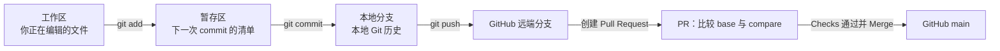

# Kita 的 Git、Commit 与 Pull Request 工作流入门

> 编写日期：2026-07-12
>
> 示例范围：Kita 仓库实际完成的 PR #1、PR #2、PR #3
>
> 目标读者：知道如何修改文件，但还不清楚 `git add`、`commit`、`push`、Pull Request 和 merge 分别做什么的人
>
> 安全边界：本文只解释版本控制流程，不涉及 production secret、生产数据库、Coolify 或 Volume 操作

## 一、先记住最重要的一句话

`git add` 和 `git commit` 是在**本地 Git 仓库里整理并保存版本**；Pull Request 是在 **GitHub 上提出“请把这个分支合并进另一个分支”** 的请求。

它们不是同一层的东西，也不能互相替代：

```text
修改文件
  → git add：选择下次提交要包含什么
  → git commit：在当前本地分支保存一个版本
  → git push：把本地分支和提交上传到 GitHub
  → Pull Request：请求把 GitHub 上的分支合并进 main
  → Checks：自动检查这批变更
  → Ruleset：决定检查不通过时能不能合并
  → Merge：真正把变更纳入 main
```

如果只执行到 `git commit`，GitHub 通常还看不到新提交；如果只 push 了功能分支但没有合并，`main` 也不会改变。

## 二、Git 和 GitHub 不是同一个东西

### Git

Git 是版本控制系统，主要负责：

- 观察文件变化；
- 选择哪些变化进入下一次提交；
- 创建 commit；
- 管理 branch；
- 比较、合并和恢复历史。

Git 可以完全离线工作。本地执行 `git status`、`git add`、`git commit` 时，不需要 GitHub。

### GitHub

GitHub 是托管 Git 仓库并提供协作功能的网站，主要负责：

- 保存远端分支和 commit；
- 创建和讨论 Pull Request；
- 展示 Files changed；
- 运行 GitHub Actions；
- 用 Ruleset 保护 main；
- 在满足条件后合并 PR。

Pull Request、Checks、Actions 和 Ruleset 都是 GitHub 提供的协作层，不是 `git add` 或 `git commit` 的另一种写法。

## 三、一次修改会经过哪些位置

可以把一次修改理解为经过五个位置：



| 位置            | 保存了什么                   | GitHub 能否看到            |
| --------------- | ---------------------------- | -------------------------- |
| 工作区          | 尚未提交的文件修改           | 不能                       |
| 暂存区          | 下一个 commit 准备包含的内容 | 不能                       |
| 本地分支        | 已创建的本地 commits         | 不能，除非 push            |
| GitHub 功能分支 | 已 push 的 commits           | 能                         |
| GitHub main     | 已正式合并的项目主线         | 能，也是部署通常关注的分支 |

## 四、逐个理解常用操作

### 1. 修改文件

例如我们修改了：

```text
docs/kita-code-review-2026-07-09.md
docs/testing-and-github-actions-guide-2026-07-10.md
```

此时只是磁盘上的文件改变了。Git 会发现变化，但还没有保存新的历史版本。

用下面的命令查看：

```bash
git status
git diff
```

- `git status` 告诉你哪些文件 modified、untracked 或 staged；
- `git diff` 显示尚未暂存的具体内容变化。

### 2. `git add`：选择下一张“照片”里有什么

实际命令：

```bash
git add -- docs/kita-code-review-2026-07-09.md \
  docs/testing-and-github-actions-guide-2026-07-10.md
```

`git add` 的作用是把指定版本的文件内容放进暂存区。它：

- 不会上传 GitHub；
- 不会创建 commit；
- 不会修改 main；
- 不会创建 PR。

它只是回答：“下一次 commit 准备包含哪些变化？”

为什么不总是直接使用 `git add .`？因为工作区可能还有无关文件。明确写出文件名，可以避免把临时文件、个人配置或不相关修改误放进同一个 commit。

暂存后检查：

```bash
git diff --cached
git diff --cached --check
```

- `git diff --cached` 显示下一次 commit 将包含什么；
- `--check` 检查常见空白错误。

一个容易忽略的细节：如果先 `git add file.md`，然后又继续修改 `file.md`，暂存区仍保留 add 当时的版本。此时同一个文件可能同时有 staged 和 unstaged 变化。

### 3. `git commit`：在当前本地分支创建历史快照

实际命令：

```bash
git commit -m "docs: close P1-3 testing and CI phase"
```

这一步创建了 commit：

```text
cc16bd4 docs: close P1-3 testing and CI phase
```

commit 可以理解成一个带说明的版本快照，其中包含：

- 被暂存的文件内容；
- 作者和时间；
- commit message；
- 指向前一个 commit 的关系；
- 唯一 commit ID。

`git commit` 后，变化已经进入本地 Git 历史，但仍只存在于本机，直到 push。

PR #3 页面显示 **Commits 1**，就是因为这个分支相对 main 只有一个新 commit：`cc16bd4`。

### 4. Branch：给一组相关修改一条独立轨道

PR #3 使用的分支是：

```text
codex/docs-close-p1-3
```

它从当时最新的 `origin/main` 创建：

```bash
git switch -c codex/docs-close-p1-3 origin/main
```

分支不是项目的第二份完整复制。它更像一个可移动标签，指向某个 commit，并随着新 commit 向前移动。

使用独立分支的价值：

- main 在开发期间保持稳定；
- 可以清楚比较“这次任务改变了什么”；
- CI 可以只检查这批变更；
- 不满意时可以关闭 PR，不影响 main；
- 多个任务可以分开讨论和合并。

### 5. `git push`：把本地提交上传到 GitHub 分支

实际命令：

```bash
git push -u origin codex/docs-close-p1-3
```

它把本地分支及其 commit 上传到远端 `origin`。其中：

- `origin` 是这个 GitHub 仓库的默认远端名称；
- `-u` 建立本地分支与远端分支的跟踪关系；
- 后续在同一分支通常可以直接执行 `git push`。

push 之后 GitHub 能看到 `cc16bd4`，但 main 仍没有改变。

这也是 push 与 merge 的关键区别：

```text
push 功能分支 ≠ 合并 main
```

### 6. Pull Request：提出合并请求

PR #3 创建时页面显示：

```text
base: main
compare: codex/docs-close-p1-3
```

含义是：

> 请审查 compare 分支相对于 base 分支的变化；满足条件后，把这些变化合并进 base。

PR 自己不是新的代码快照。真正的代码内容仍来自分支上的 commit。PR 主要组织：

- 标题和说明；
- commits；
- Files changed；
- 评论和 review；
- Checks；
- 是否有冲突；
- 是否允许 merge。

所以：

```text
commit = 保存变化
PR = 提议合并已经保存并 push 的变化
```

一个 PR 可以包含一个 commit，也可以包含多个 commits。只要继续在同一分支 commit 并 push，GitHub 会自动更新同一个 PR，不需要重新创建 PR。

### 7. GitHub Actions Checks：自动验收 PR

Kita 的 `.github/workflows/ci.yml` 会在指向 main 的 PR 上运行：

```text
install
  → format:check
  → lint
  → typecheck
  → test
  → build
```

PR #3 虽然只改 Markdown，仍然触发了 `CI / quality`。截图中的 **1 check passed** 表示这次 PR 已经过相同的质量门禁。

Checks 只是报告绿色、红色或运行中。真正决定“能不能点 Merge”的，是 Ruleset。

### 8. Ruleset：把建议变成硬性规则

Kita 的 main Ruleset 当前要求：

- 必须通过 Pull Request；
- GitHub Actions 的 `quality` 必须成功；
- required approvals 为 0，适合当前单人项目；
- 禁止 force push；
- 限制删除 main。

因此后续流程不再只是“最好先跑 CI”，而是：

```text
quality 未通过或仍在运行
  → GitHub 不允许合并进 main
```

`Required approvals: 0` 不代表不需要 PR。它只表示当前不要求另一位审查者批准，PR 和 `quality` 仍然是必需条件。

### 9. Merge：真正把 PR 变化纳入 main

PR #3 通过检查后点击 Merge，GitHub 创建了：

```text
7b04e73 Merge pull request #3 from koharu4ever/codex/docs-close-p1-3
```

现在 main 才正式包含那两份文档修改。

截图里同时出现两个 commit ID：

| Commit    | 含义                                              |
| --------- | ------------------------------------------------- |
| `cc16bd4` | 功能分支上的文档 commit                           |
| `7b04e73` | GitHub 把 PR #3 合并进 main 时创建的 merge commit |

它们不同是正常的。使用 **Create a merge commit** 方式时，GitHub 会额外创建一个 merge commit，将 main 和功能分支两条历史连接起来。

如果选择 Squash merge 或 Rebase merge，最终 main 上的 commit 形态会不同，但“先在分支提交，再通过 PR 合并”的核心流程不变。

## 五、用 Kita 的三个 PR 串起完整过程

### PR #1：增加 Vitest 测试

```text
分支：codex/test-ci-pr1-vitest
功能 commit：fcc391f
PR：#1 test: add initial Vitest coverage
结果：测试代码合并进 main
main merge commit：9bf5caa
```

这一阶段解决“项目没有自动测试”的问题。

### PR #2：增加 GitHub Actions

```text
分支：codex/ci-pr2-github-actions
功能 commit：98551b0
PR：#2 ci: add GitHub Actions quality gate
Checks：CI / quality 成功
结果：ci.yml 合并进 main
main merge commit：faf8cea
```

PR #2 创建时 PR #1 还未合并，所以它暂时叠在 PR #1 上。PR #1 先合并后，GitHub 根据共同历史自动把 PR #2 的 Files changed 收敛为真正新增的 CI 和文档变化。

### PR #3：更新 P1-3 状态文档

```text
分支：codex/docs-close-p1-3
功能 commit：cc16bd4
PR：#3 docs: close P1-3 testing and CI phase
Files changed：2
Checks：1 check passed
结果：状态文档合并进 main
main merge commit：7b04e73
```

PR #3 是 Ruleset 建立后的一个实际演示：

1. 文档修改没有直接写入 main；
2. 修改先进入功能分支；
3. 创建 PR；
4. `quality` 运行并通过；
5. GitHub 允许 Merge；
6. merge 后 PR 自动关闭。

## 六、截图中的每个区域是什么意思

你提供的 PR #3 截图可以这样读：

- **Conversation**：PR 描述、评论和事件时间线；
- **Commits 1**：这个 PR 包含一个功能 commit；
- **Checks**：GitHub Actions 自动检查；
- **Files changed 2**：相对 base 分支最终会改变两个文件；
- **merged commit 7b04e73 into main**：变化已正式进入 main；
- **1 check passed**：合并前自动门禁通过；
- **Pull request successfully merged and closed**：PR 已完成，不再接受合并操作；
- **Revert**：提出一个反向修改，用新 commit 撤销这次合并的效果；
- **Delete branch**：删除已经完成任务的远端功能分支。

### Delete branch 会不会删除已经合并的代码？

不会。

merge 后，main 已经能够到达 PR 的变更历史。删除 `codex/docs-close-p1-3` 只是删除一个不再需要的分支标签，不会从 main 删除文档，也不会撤销 merge commit。

如果不确定 PR 是否已经 merge，应先确认页面显示 **merged and closed**，再删除分支。

## 七、最常见的误解

### 误解 1：`git add` 等于保存文件

不是。编辑器保存把内容写到磁盘；`git add` 把某个版本放入暂存区。

### 误解 2：`git commit` 会上传 GitHub

不会。commit 默认只创建在本地仓库，需要 `git push` 才上传。

### 误解 3：push 后 main 就变了

只有直接 push main 才会改变远端 main，而 Kita 的 Ruleset 已禁止这种常规路径。push 功能分支只更新该功能分支。

### 误解 4：PR 是另一种 commit

不是。commit 是历史快照；PR 是 GitHub 上针对一组 commits 的合并提议。

### 误解 5：PR 只能有一个 commit

不是。同一分支后续的 commit 只要继续 push，就会自动出现在原 PR 中。

### 误解 6：CI 绿色等于已经合并

不是。绿色只表示检查通过；还需要执行 Merge，main 才会改变。

### 误解 7：Merge 后本地 main 自动更新

不会。GitHub 上的远端 main 已更新，但本地 main 需要显式同步：

```bash
git switch main
git pull --ff-only origin main
```

### 误解 8：删除功能分支会删除 main 中的内容

不会，只要 PR 已成功合并。分支删除和代码回滚是两件不同的事。

## 八、Kita 以后推荐的标准流程

### 开始任务

```bash
git fetch origin
git switch -c codex/short-task-name origin/main
```

先从最新远端 main 建分支，避免从过时历史或另一个功能分支开始。

### 修改和检查

应用命令、测试和构建应继续在 Dev Container 中由 `node` 用户运行，避免再次产生 root 拥有的 `.next`：

```bash
pnpm test
pnpm check
pnpm build
```

Git 分支、add、commit 和 push 负责版本历史；它们不能替代项目测试。

### 审核并提交

```bash
git status
git diff
git add -- path/to/changed-file
git diff --cached
git diff --cached --check
git commit -m "type: concise description"
```

### 上传并创建 PR

```bash
git push -u origin codex/short-task-name
```

然后在 GitHub 创建：

```text
base: main
compare: codex/short-task-name
```

### 等待门禁并合并

确认：

- Files changed 只有预期文件；
- 没有 merge conflict；
- `CI / quality` 绿色；
- GitHub 显示 Ready to merge。

然后 Merge。不要因为自己是仓库所有者就绕过失败检查。

### 合并后同步本地

```bash
git switch main
git pull --ff-only origin main
```

确认 main 更新后，可以删除已合并的本地分支：

```bash
git branch -d codex/short-task-name
```

GitHub 页面上的 **Delete branch** 删除的是远端功能分支；`git branch -d` 删除的是本地分支，两者不是同一个动作。

## 九、做错一步时怎么办

### add 了错误文件，但还没有 commit

```bash
git restore --staged path/to/file
```

这只把文件移出暂存区，不会删除工作区里的修改。

### commit 后发现还有小问题，但还没有 merge

最容易理解且最安全的做法是继续修改，然后创建新 commit：

```bash
git add -- path/to/file
git commit -m "fix: correct PR detail"
git push
```

原 PR 会自动更新并重新运行 Checks。

### PR 不想要了

可以关闭 PR 而不 merge。main 不会包含这些变更，功能分支仍可保留或删除。

### 已经 merge 后发现需要撤销

不要删除 main 历史或 force push。使用 GitHub 的 **Revert**，或创建一个明确的反向 commit，再通过新的 PR 合并。

### 本地 main 与 GitHub main 不一致

先用只下载、不改变工作区的命令查看远端状态：

```bash
git fetch origin
git log --oneline --decorate -5 origin/main
```

确认后再：

```bash
git switch main
git pull --ff-only origin main
```

## 十、怎样判断当前进行到哪一步

| 看到的状态                                | 说明               | 下一步                     |
| ----------------------------------------- | ------------------ | -------------------------- |
| `git status` 显示 modified/untracked      | 文件只在工作区     | 审核后 add                 |
| `git status` 显示 Changes to be committed | 已暂存             | 审核 cached diff 后 commit |
| 本地有 commit，GitHub 没分支              | 还没 push          | push                       |
| GitHub 有分支，没有 PR                    | 已上传但未提出合并 | 创建 PR                    |
| PR Checks running                         | CI 正在验收        | 等待                       |
| PR Checks failed                          | 自动门禁失败       | 修复、commit、push         |
| Ready to merge                            | 规则全部满足       | Merge                      |
| Merged and closed                         | 已进入远端 main    | 同步本地 main，可删分支    |

## 十一、为什么单人项目也值得使用 PR

即使只有一个开发者，PR 仍然提供：

- 清楚的任务边界；
- 可阅读的变更说明；
- Files changed 最终复核；
- 自动 CI 触发点；
- main 的强制保护；
- 将来回看“为什么改”的时间线；
- 防止误把半成品直接放进部署分支。

在 Kita 中，Coolify 监听 main。使用“功能分支 → PR → quality → merge”的价值尤其明确：只有通过门禁的变化才进入部署关注的分支。

## 十二、最小记忆版

只记下面八句话也够用：

1. 我先从最新 main 创建功能分支。
2. 我在工作区修改文件。
3. `git add` 选择下一个 commit 的内容。
4. `git commit` 在本地分支保存版本。
5. `git push` 把提交上传到 GitHub 功能分支。
6. PR 请求把功能分支合并进 main。
7. Actions 检查代码，Ruleset 决定不通过时禁止合并。
8. Merge 之后，变化才正式进入 main。

## 十三、官方资料

- [GitHub：About Git](https://docs.github.com/en/get-started/using-git/about-git)
- [GitHub：About pull requests](https://docs.github.com/en/pull-requests/collaborating-with-pull-requests/proposing-changes-to-your-work-with-pull-requests/about-pull-requests)
- [GitHub：About status checks](https://docs.github.com/en/pull-requests/collaborating-with-pull-requests/collaborating-on-repositories-with-code-quality-features/about-status-checks)
- [GitHub：Available rules for rulesets](https://docs.github.com/en/repositories/configuring-branches-and-merges-in-your-repository/managing-rulesets/available-rules-for-rulesets)
- [Pro Git：Recording Changes to the Repository](https://git-scm.com/book/en/v2/Git-Basics-Recording-Changes-to-the-Repository)
