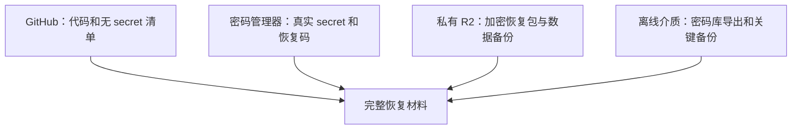
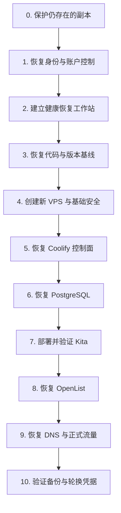

# Kita 灾难恢复资产清单与完整复建操作手册

> 日期：2026-07-16
> 最近状态复核：2026-07-20
> 文档性质：恢复资产盘点模板、备份边界说明、完整复建 Runbook
> 适用场景：本地硬盘损坏、开发电脑更换、VPS 丢失、Coolify 重装、Cloudflare/GitHub 暂时不可访问、PostgreSQL 数据恢复、OpenList 重建
> 安全等级：本文档只允许记录键名、位置和操作方法，不允许填写任何真实 secret

## 1. 这份手册要解决什么问题

Kita 已经不再只是一个 GitHub 仓库。一个可以实际运行的 Kita 由多种彼此独立的资产组成：

- GitHub 中的源代码和 migration；
- 本地开发环境与未提交文件；
- Coolify 中的 Application 配置和环境变量；
- PostgreSQL 中的真实内容；
- Cloudflare 中的 DNS、R2 bucket 和 API 凭据；
- OpenList 的 data Volume、管理员账号和存储挂载；
- VPS、域名注册商、邮箱、Tailscale 等外部账户；
- 2FA、恢复码、SSH key 和平台主密钥。

如果只备份 GitHub，能够恢复代码，但不能恢复真实数据和生产配置。

如果只备份 PostgreSQL，能够恢复内容，但不知道如何重新部署应用、域名和 OpenList。

如果只依赖 Coolify，Coolify 或 VPS 整体丢失时，可能无法取回被平台加密保存的环境变量。

如果只依赖 Cloudflare R2，Cloudflare 账号无法访问时，DNS 和备份会同时失去控制。

因此，这份手册的目标不是承诺“系统绝对不会失效”，而是建立下面的能力：

> 任意一个本地磁盘、VPS 或云平台失效时，仍然能从另一套独立材料恢复；所有关键恢复步骤都经过实际演练，而不是只存在于记忆中。

### 1.1 2026-07-20 当前完成度快照

这份快照用于区分“材料已收集”“单项已验证”和“完整恢复已演练”。任何后续文档都应引用本节，不应把未完成项改写成已闭环。

| 项目                                   | 状态           | 证据/边界                                                                    |
| -------------------------------------- | -------------- | ---------------------------------------------------------------------------- |
| GitHub `main` 与本地 `main`            | 已核对         | 均为 `78ad2d2`；核对时工作区干净，无本地唯一项目文件                         |
| D 盘重要文件与未提交工作               | 已保护         | D 盘不再承担当前 Kita 源码的唯一副本                                         |
| 外部账户、生产/开发配置与关键 secret   | 已盘点         | 真实值在 Bitwarden；本文档和 Git 只记录键名、用途与位置                      |
| PostgreSQL -> R2 自动 backup           | 正在运行       | 有真实成功日志/对象；backup shell 4 个失败/成功控制流场景进入 CI             |
| Coolify SSH keys + `authorized_keys`   | 单项已验证     | AES256 加密归档可解密读取；C 盘副本 SHA-256 与服务器 checksum 一致           |
| Coolify SSH 加密归档私有 R2 副本       | 已上传         | `kita-recovery-private/coolify/2026-07-20/`；Public Access Disabled          |
| R2 再下载 round-trip                   | 明确暂缓       | 尚未从 R2 重新下载后复算 checksum                                            |
| OpenList Application 部署 inventory    | 已记录         | 独立 Application、固定镜像、域名、端口、UID/GID、Volume 和账号边界已明确     |
| OpenList storage 与 data Volume backup | 有意延期       | 最终 provider 尚未确定；当前测试挂载按可丢弃状态处理                         |
| C SSD 全新本地复建演练                 | 已验证通过     | clone、`.env`、Dev Container、全新 PostgreSQL、页面、test/check/build 均通过 |
| PostgreSQL 临时库 restore              | 尚未执行，暂缓 | 自动 backup 不等于 restore 已验证                                            |
| Coolify/VPS 端到端恢复                 | 尚未执行       | 当前不能宣称完整 disaster recovery 闭环                                      |
| 密码库导出与独立离线介质               | 尚未完成       | Bitwarden 登录可用不等于 vault 自身已有独立恢复副本                          |

当前可以作出的准确结论是：**仅 D 盘工作区丢失后的本地复建已经实际验证通过；VPS、Cloudflare 或多个平台同时丢失的完整恢复仍是部分准备状态。**

---

## 2. 恢复设计的核心原则

### 2.1 使用 3-2-1-1-0 思路

Kita 的长期恢复目标可以概括为：

```text
3 份副本
2 种不同介质或平台
1 份异地副本
1 份离线或不可变副本
0 个未经恢复验证的关键错误
```

对应到 Kita：

| 副本     | 建议位置                  | 作用                       |
| -------- | ------------------------- | -------------------------- |
| 工作副本 | C 盘 SSD / VPS            | 日常开发和生产             |
| 异地副本 | GitHub + 私有 R2          | 源代码、数据库和加密恢复包 |
| 离线副本 | 加密 U 盘或另一块物理硬盘 | 云账号和本机同时失效时恢复 |

### 2.2 secret 与备份文件分开管理

不要把所有恢复材料压成一个明文文件上传到 R2。

建议分成四层：



四层的职责是：

| 位置       | 可以保存                                    | 不应该保存                             |
| ---------- | ------------------------------------------- | -------------------------------------- |
| GitHub     | 代码、migration、`.env.example`、键名、流程 | 真实密码、token、private key           |
| 密码管理器 | 密码、API key、APP_KEY、恢复码、安全说明    | 大型数据库 dump、公开文件              |
| 私有 R2    | PostgreSQL dump、Coolify backup、加密恢复包 | 未加密 `.env`、公开 bucket 中的 secret |
| 离线介质   | 加密密码库导出、恢复文档、关键数据副本      | 唯一一份未加密 secret                  |

### 2.3 R2 静态加密不等于端到端加密

Cloudflare R2 会自动对对象进行静态加密，但密钥由 Cloudflare 管理。如果 Cloudflare 账号或 R2 API token 被盗，攻击者仍可能通过合法接口读取对象。

因此：

- 数据库和恢复包上传 R2 前应考虑客户端加密；
- secret 恢复包必须客户端加密；
- 解密密码不能和加密文件放在同一个 R2 bucket；
- R2 bucket 必须保持私有；
- 不给恢复 bucket 绑定公开域名；
- 数据备份 token 与人工恢复 token 分开。

官方参考：

- [Cloudflare R2 Data Security](https://developers.cloudflare.com/r2/reference/data-security/)
- [Cloudflare R2 Bucket Locks](https://developers.cloudflare.com/r2/buckets/bucket-locks/)

### 2.4 恢复材料必须独立于被恢复对象

典型错误包括：

- Coolify `APP_KEY` 只保存在 Coolify 所在 VPS；
- R2 secret 只保存在 R2 中的明文文件；
- Bitwarden 主密码只保存在 Bitwarden Secure Note；
- GitHub 2FA 恢复码只保存在 GitHub 仓库；
- OpenList admin password 只保存在 OpenList data Volume。

这些都形成循环依赖：要打开恢复材料，必须先恢复已经丢失的系统。

### 2.5 真实值只进入密码管理器

本文中的所有表格都只记录：

- 是否存在；
- 由哪个平台使用；
- 在密码管理器中的条目名称；
- 最后验证日期；
- 恢复用途。

禁止在本文填写：

- 实际密码；
- 实际 token；
- private key 内容；
- 2FA seed；
- 未遮挡的 recovery code；
- 完整 production database URI。

---

## 3. 推荐的恢复材料存放结构

### 3.1 GitHub 中保存的无 secret 内容

GitHub 仓库应保存：

- 应用源代码；
- Payload collections；
- migrations；
- Dockerfile；
- Compose；
- backup scripts；
- GitHub Actions；
- `.env.example`；
- 当前事实文档；
- 本恢复 Runbook；
- 环境变量键名清单；
- DNS、Application、Volume 的无 secret 结构说明。

GitHub 不能保存：

- `.env`；
- Coolify secret 导出；
- OpenList admin password；
- Cloudflare API token；
- VPS private SSH key；
- Coolify `APP_KEY`；
- Bitwarden export 明文。

### 3.2 密码管理器中的建议目录

建议使用 Bitwarden、KeePassXC 或同等级的加密密码库。

推荐条目结构：

```text
Identity /
  Primary Email
  Recovery Email

Kita /
  Production / Payload
  Production / PostgreSQL
  Production / R2 Backup
  Development / Local Environment

Infrastructure /
  GitHub
  Domain Registrar
  Cloudflare
  VPS Provider
  Coolify
  Tailscale

OpenList /
  Admin
  Environment
  Storage Driver 1
  Storage Driver 2
```

每个密码管理器条目至少包含：

| 字段         | 内容                                     |
| ------------ | ---------------------------------------- |
| 条目名称     | 稳定且可搜索的名称                       |
| 登录 URL     | 官方登录入口                             |
| 用户名/邮箱  | 实际登录身份                             |
| 密码         | 独立强密码                               |
| 2FA 类型     | Passkey / TOTP / Security Key / SMS      |
| 恢复码位置   | 纸质/离线介质/独立条目                   |
| 账号 ID      | Cloudflare account ID、VPS account ID 等 |
| 备注         | 账号用途、项目归属、恢复注意事项         |
| 最后验证日期 | 上一次确认可以登录的日期                 |

Bitwarden 官方说明：vault 中的名称、notes、custom fields、用户名和密码都会在客户端加密后保存。

- [Bitwarden Encrypted Data](https://bitwarden.com/help/vault-data/)
- [Bitwarden Encrypted Export Guidance](https://bitwarden.com/help/product-faqs/)

### 3.3 私有 R2 恢复 bucket

建议不要把恢复材料和现有 PostgreSQL backup 全部混在一个 bucket。

推荐：

```text
kita-postgres-backups
kita-recovery-private
```

`kita-recovery-private` 内部建议使用时间戳对象，不覆盖旧版本：

```text
kita-recovery-private/
  manifests/
    2026-07-16-kita-recovery-manifest.enc
  source/
    2026-07-16-kita-repository.bundle.enc
  vault/
    2026-07-16-password-vault-export.enc
  coolify/
    2026-07-16-coolify-backup.dump
    2026-07-16-coolify-ssh-keys.tar.enc
  openlist/
    2026-07-16-openlist-data.tar.enc
  checksums/
    2026-07-16-sha256.txt
```

说明：

- `.enc` 表示上传前已经客户端加密；
- 数据库 dump 当前至少受到 R2 静态加密保护，后续可单独评估客户端加密；
- `checksums` 用于验证下载后文件没有损坏；
- 不要将解密主密码写进同一个 manifest；
- bucket 不设置公开访问；
- 人工上传 token 不注入生产 Application；
- backup sidecar token 只访问 PostgreSQL backup bucket。

### 3.4 离线恢复包

至少准备一个只在备份时连接的 U 盘或另一块健康硬盘。

离线包建议包含：

- 密码管理器的密码保护加密导出；
- 本 Runbook 的 PDF 或 Markdown 副本；
- 最近一次恢复资产清单；
- Git repository bundle；
- Coolify backup；
- 加密后的 Coolify SSH keys；
- 最近一次 PostgreSQL dump；
- OpenList data backup；
- 校验文件；
- 一张不包含完整 secret 的纸质说明。

离线介质不应长期插在电脑上，否则勒索软件、误删和电源故障仍可能同时破坏工作副本与备份。

---

## 4. 外部身份与账户资产清单

生产系统能否恢复，首先取决于是否还能登录控制这些系统的账户。

### 4.1 主邮箱和恢复邮箱

主邮箱通常是所有其他账户的恢复入口，优先级最高。

记录模板：

| 项目         | 记录内容               |
| ------------ | ---------------------- |
| 主邮箱地址   | `<只存密码管理器>`     |
| 邮箱服务商   | `<provider>`           |
| 登录入口     | `<official URL>`       |
| 2FA 方法     | `<type>`               |
| 恢复邮箱     | `<location/reference>` |
| 恢复手机号   | `<location/reference>` |
| 恢复码       | `<offline location>`   |
| 最近登录验证 | `<YYYY-MM-DD>`         |

检查项：

- [ ] 主邮箱可以登录；
- [ ] 恢复邮箱不是同一个失效域；
- [ ] 2FA 设备仍可使用；
- [ ] 恢复码存在离线副本；
- [ ] 手机号变更后已经更新；
- [ ] 邮箱不是由即将过期的自有域名唯一托管。

### 4.2 GitHub 账户

需要记录：

| 字段              | 示例用途        |
| ----------------- | --------------- |
| 账号用户名        | 仓库 owner      |
| 登录邮箱          | 账号恢复        |
| 2FA 方法          | 登录验证        |
| recovery codes    | 丢失 2FA 时恢复 |
| SSH key / passkey | Git 操作        |
| 仓库 URL          | 重新 clone      |
| 仓库可见性        | public/private  |
| 默认分支          | `main`          |
| Ruleset           | PR + `quality`  |
| Actions 权限      | 只读 contents   |
| 最近验证日期      | 确认账号可用    |

Kita 当前无 secret 恢复依赖 GitHub Actions。生产 secret 不应存进普通 Actions secrets，除非以后明确引入 GitHub 部署流程。

检查项：

- [ ] 可以登录 GitHub；
- [ ] 2FA recovery codes 有离线副本；
- [ ] `main` 与本地最新合并状态一致；
- [ ] 所有重要未提交文件已 commit 或另行备份；
- [ ] `git bundle` 能作为 GitHub 不可用时的源代码副本；
- [ ] Ruleset 和 workflow 状态已记录。

### 4.3 域名注册商

Cloudflare 管理 DNS 不等于拥有域名。域名注册商账号决定域名最终控制权。

必须记录：

| 字段                 | 说明                         |
| -------------------- | ---------------------------- |
| 注册商名称           | 域名购买平台                 |
| 登录 URL             | 官方入口                     |
| 登录邮箱             | 账号恢复                     |
| 域名                 | `kral-koharu.com`            |
| 到期日               | 防止域名过期                 |
| 自动续费             | 是否启用                     |
| 付款方式状态         | 是否仍有效                   |
| Nameservers          | 当前 Cloudflare nameservers  |
| Transfer Lock        | 是否开启                     |
| EPP/Auth Code        | 仅密码管理器，需要转移时使用 |
| 注册联系人           | 合法所有权信息               |
| 2FA / recovery codes | 账号恢复                     |

检查项：

- [ ] 自动续费已开启；
- [ ] 支付方式不会近期过期；
- [ ] 到期提醒邮箱可用；
- [ ] 注册商 2FA 可恢复；
- [ ] 知道如何更换 nameservers；
- [ ] 不把 EPP code 写入 GitHub 文档。

### 4.4 Cloudflare 账户

需要记录：

| 类别        | 需要记录的信息                         |
| ----------- | -------------------------------------- |
| 登录身份    | 邮箱、2FA、recovery codes              |
| Account     | Account name、Account ID               |
| Zone        | Zone ID、域名、nameservers             |
| DNS         | 每条 A/CNAME/TXT 记录、代理状态、TTL   |
| SSL/TLS     | 当前模式和重要规则                     |
| R2          | bucket 名称、用途、region hint（如有） |
| R2 token    | token 名、scope、使用者、创建/轮换日期 |
| Bucket Lock | prefix、保留期限                       |
| Billing     | 付款方式和通知邮箱                     |

当前至少需要记录的 DNS 逻辑：

| 名称                      | 目标                        | 用途         | Proxy 状态 |
| ------------------------- | --------------------------- | ------------ | ---------- |
| Kita 主域名/子域名        | `<VPS public IP or target>` | Next.js 主站 | `<record>` |
| `archive.kral-koharu.com` | `<VPS public IP>`           | OpenList     | `<record>` |
| Coolify 域名              | `<VPS public IP>`           | 部署控制面   | `<record>` |

不要在 Git 文档中记录 R2 secret key。Git 只记录 token 的逻辑名称，例如：

```text
Kita PostgreSQL Backup Writer
Kita Human Recovery Read/Write
```

检查项：

- [ ] Cloudflare 可以登录；
- [ ] 2FA recovery codes 在离线位置；
- [ ] DNS 记录有无 secret 导出或截图；
- [ ] R2 bucket 全部列入清单；
- [ ] PostgreSQL backup bucket 保持私有；
- [ ] Recovery bucket 保持私有；
- [ ] 不同用途使用不同 token；
- [ ] token 权限最小化；
- [ ] Cloudflare 以外存在第二份加密备份。

### 4.5 VPS 服务商账户

需要记录：

| 字段                 | 说明                    |
| -------------------- | ----------------------- |
| 服务商               | VPS provider            |
| 登录 URL             | 官方控制台              |
| 登录邮箱             | 账号恢复                |
| 2FA / recovery codes | 账号恢复                |
| Server ID / Name     | 定位服务器              |
| Region               | 重建网络延迟参考        |
| Public IPv4/IPv6     | DNS 目标                |
| OS                   | 当前 Linux 发行版和版本 |
| CPU/RAM/Disk         | 复建最低规格            |
| Billing cycle        | 防止实例被停机          |
| Snapshot 状态        | 是否存在、最后日期      |
| Console access       | SSH 失效时使用          |
| Root/SSH 方法        | 只写密码管理器条目位置  |

操作系统层还需记录：

- 防火墙规则；
- SSH 端口和用户；
- Docker Engine 版本范围；
- Coolify 安装方式；
- Tailscale 安装方式；
- 磁盘挂载；
- 时区；
- 自动安全更新策略；
- 不由 Coolify 管理的服务。

检查项：

- [ ] VPS 控制台可以登录；
- [ ] 付款方式有效；
- [ ] SSH private key 不只存在于 D 盘；
- [ ] 可以通过 provider console 进入服务器；
- [ ] 当前规格已记录；
- [ ] Tailscale 与 Coolify 的边界已记录；
- [ ] 知道哪些服务不是 Coolify 创建的。

### 4.6 Tailscale 账户

Tailscale 当前直接安装在 VPS，不由 Coolify 管理，因此 Coolify backup 不会自动恢复它。

需要记录：

| 字段               | 说明                         |
| ------------------ | ---------------------------- |
| 登录身份           | Google/GitHub/Microsoft/其他 |
| Tailnet 名称       | 定位网络                     |
| VPS node 名称      | 重新识别                     |
| Tags               | ACL 管理                     |
| ACL / Grants       | 网络访问规则                 |
| Routes / Exit Node | 如有                         |
| DNS 设置           | 如有 MagicDNS                |
| Auth key 策略      | 不保存过期 key，记录生成方法 |
| 安装方法           | 新 VPS 复建                  |

检查项：

- [ ] Tailscale 账号可以独立恢复；
- [ ] ACL 配置有备份；
- [ ] 知道 VPS 是否发布 route 或 exit node；
- [ ] 不把一次性 auth key 长期写入 Git。

---

## 5. Coolify 控制面资产清单

### 5.1 Coolify 平台本身

必须记录：

| 字段                     | 存放位置                   |
| ------------------------ | -------------------------- |
| Coolify URL              | 无 secret inventory        |
| Coolify version          | 无 secret inventory        |
| Admin login              | 密码管理器                 |
| `APP_KEY`                | 密码管理器 + 加密离线副本  |
| Coolify DB password      | 密码管理器/平台恢复包      |
| Redis password           | 密码管理器/平台恢复包      |
| `/data/coolify/ssh/keys` | 加密 R2 + 离线副本         |
| Coolify DB backup        | R2 + 离线副本              |
| Managed servers          | inventory                  |
| Proxy/domain settings    | inventory / Coolify backup |

Coolify 官方恢复文档强调：

- Coolify backup 恢复 dashboard settings；
- 不自动恢复 Application data Volume；
- 旧 `APP_KEY` 对解密恢复数据非常重要；
- Coolify SSH key 文件需要单独保留。

参考：

- [Coolify Backup and Restore](https://coolify.io/docs/knowledge-base/how-to/backup-restore-coolify)
- [Coolify Database Backups](https://coolify.io/docs/databases/backups)

安全操作规则：

- 不在聊天、截图或普通终端日志中暴露 `APP_KEY`；
- 按官方方法在私密终端读取后直接录入密码管理器；
- 不依赖“Coolify UI 以后还能显示 secret”；
- Coolify backup 与 APP_KEY 不放在唯一同一位置；
- SSH keys 打包后先客户端加密再上传。

### 5.2 Coolify Application 总表

当前至少有：

| Application | 责任              | 域名                              | 数据状态                             |
| ----------- | ----------------- | --------------------------------- | ------------------------------------ |
| Kita        | Next.js + Payload | `<Kita production URL>`           | PostgreSQL                           |
| OpenList    | 归档浏览/下载     | `https://archive.kral-koharu.com` | OpenList data Volume + storage mount |

每个 Application 都要记录：

- Application 名称；
- Environment 名称；
- 部署来源；
- Git branch 或 Docker image/tag；
- 域名；
- exposed port；
- host port mapping（如有）；
- healthcheck；
- environment variable 键名；
- persistent Volume；
- resource limits；
- restart/rolling update 策略；
- 最近成功部署日期；
- 回滚版本；
- 依赖的外部服务。

---

## 6. Kita Production 配置清单

### 6.1 代码与部署基线

记录模板：

| 字段                   | 当前/存放位置          |
| ---------------------- | ---------------------- |
| GitHub repository      | `<repository URL>`     |
| Default branch         | `main`                 |
| Last known good commit | `<commit SHA>`         |
| Docker build           | 仓库 `Dockerfile`      |
| Runtime topology       | `compose.yaml`         |
| Production entrypoint  | `docker-entrypoint.sh` |
| Database major version | PostgreSQL 16          |
| Node major version     | Node 22                |
| Package manager        | pnpm 10.28.2           |
| Main domain            | `<production URL>`     |

每次制作恢复包时，记录：

```text
Git commit SHA
Backup timestamp
PostgreSQL version
Coolify version
OpenList image tag
```

这样可以知道某份数据库 backup 与哪个应用版本配套。

### 6.2 Kita 已知环境变量键名

仓库当前明确要求或支持 15 个主要键。

#### 应用与数据库

| 键名                   | 是否 secret | 恢复说明                               |
| ---------------------- | ----------- | -------------------------------------- |
| `NEXT_PUBLIC_SITE_URL` | 否          | 生产站点 URL                           |
| `PAYLOAD_SECRET`       | 是          | 至少 32 位；必须保留原值或接受会话失效 |
| `ENABLE_DEV_SEED`      | 否          | production 必须为 `false`              |
| `POSTGRES_DB`          | 一般否      | 数据库名称                             |
| `POSTGRES_USER`        | 一般否      | 数据库用户                             |
| `POSTGRES_PASSWORD`    | 是          | 与数据库和 URI 一致                    |
| `DATABASE_URI`         | 是          | 包含数据库密码                         |

#### PostgreSQL R2 backup

| 键名                                   | 是否 secret      | 恢复说明                |
| -------------------------------------- | ---------------- | ----------------------- |
| `POSTGRES_BACKUP_ENABLED`              | 否               | production 应明确设置   |
| `POSTGRES_BACKUP_INTERVAL_SECONDS`     | 否               | 当前正常周期            |
| `POSTGRES_BACKUP_RETRY_SECONDS`        | 否               | 失败重试周期            |
| `POSTGRES_BACKUP_WAIT_SECONDS`         | 否               | 等待数据库时间          |
| `POSTGRES_BACKUP_R2_ENDPOINT`          | 敏感配置但非密码 | 对应 Cloudflare account |
| `POSTGRES_BACKUP_R2_BUCKET`            | 否               | bucket 名称             |
| `POSTGRES_BACKUP_R2_ACCESS_KEY_ID`     | 凭据             | 密码管理器              |
| `POSTGRES_BACKUP_R2_SECRET_ACCESS_KEY` | 是               | 密码管理器              |

#### 代码中存在但通常不需要人工恢复为 production secret

| 键名                   | 说明                                                   |
| ---------------------- | ------------------------------------------------------ |
| `NODE_ENV`             | runtime/build 自动设置                                 |
| `SKIP_ENV_VALIDATION`  | 仅明确 build/CI 场景使用，不应成为 production 逃生开关 |
| `POSTGRES_BACKUP_HOST` | backup script 默认 `postgres`                          |
| `POSTGRES_BACKUP_PORT` | backup script 默认 `5432`                              |

### 6.3 环境变量一致性规则

恢复时必须同时验证：

- [ ] `POSTGRES_DB` 与实际恢复数据库名一致；
- [ ] `POSTGRES_USER` 与实际数据库用户一致；
- [ ] `POSTGRES_PASSWORD` 与 PostgreSQL 容器密码一致；
- [ ] `DATABASE_URI` 内用户、密码、host、port、db name 全部一致；
- [ ] `PAYLOAD_SECRET` 不是 placeholder；
- [ ] `PAYLOAD_SECRET` 长度满足校验；
- [ ] `ENABLE_DEV_SEED=false`；
- [ ] `NEXT_PUBLIC_SITE_URL` 是真实 production HTTPS URL；
- [ ] backup endpoint 与正确 Cloudflare account 对应；
- [ ] backup token 只访问预期 bucket；
- [ ] production 没有依赖 `SKIP_ENV_VALIDATION=true` 启动。

### 6.4 PostgreSQL 数据资产

需要记录：

| 字段                        | 说明                             |
| --------------------------- | -------------------------------- |
| PostgreSQL image/version    | `postgres:16` 基线               |
| Database name               | 密码管理器/无 secret inventory   |
| Database user               | 密码管理器/无 secret inventory   |
| Password                    | 密码管理器                       |
| Coolify/Compose Volume name | 实际名称                         |
| Internal hostname           | `postgres` 或实际 service name   |
| Backup format               | `pg_dump` custom format          |
| R2 bucket                   | `kita-postgres-backups` 或当前值 |
| Object prefix               | `kita/postgres/YYYY/MM/`         |
| Backup frequency            | 当前 production 值               |
| Last successful object      | 对象名和日期，不记录 secret      |
| Last restore drill          | 日期和结果                       |

当前恢复能力边界：

- 已验证 backup 能生成并上传 R2；
- 已验证 backup shell 失败不会误报成功；
- 仍应完成一次隔离 PostgreSQL 16 的完整恢复演练；
- 不得在现有 production database 上测试 restore；
- 不得删除 production Volume 来“模拟灾难”。

---

## 7. OpenList 资产清单

OpenList 是独立 Application。Kita 只保存 archive URL，因此 OpenList 可以单独重建，但它有自己的状态。

### 7.1 部署信息

记录模板：

| 字段                  | 当前/说明                                |
| --------------------- | ---------------------------------------- |
| Image                 | `openlistteam/openlist`                  |
| Image tag             | `v4.2.2`                                 |
| Domain                | `https://archive.kral-koharu.com`        |
| Internal exposed port | `5244`                                   |
| Host port mapping     | 正常应为空/按当前事实记录                |
| Healthcheck           | `GET http://localhost:5244/ping`         |
| Data destination      | `/opt/openlist/data`                     |
| Runtime UID/GID       | 当前验证为 `1001:1001`                   |
| Volume name           | `v84fqp9t2ygajgerckmchihx-openlist-data` |

### 7.2 OpenList 环境与账号

已知需要盘点：

| 项目                      | 是否 secret | 存放位置          |
| ------------------------- | ----------- | ----------------- |
| `OPENLIST_ADMIN_PASSWORD` | 是          | 密码管理器        |
| `SITE_URL`                | 否          | inventory/Coolify |
| `TZ`                      | 否          | inventory/Coolify |
| `UMASK`                   | 否          | inventory/Coolify |
| Admin username            | 敏感身份    | 密码管理器        |
| Guest enabled             | 否          | inventory         |
| Guest permissions         | 否          | inventory         |

### 7.3 OpenList storage driver

截至 2026-07-20，最终 storage provider 尚未确定，当前测试挂载不作为不可替代生产资产。此阶段不需要为了“填满清单”编造一条正式 storage 记录，也不应把临时上游凭据写进 Kita。

当前恢复策略是：

```text
OpenList Application
  -> 从固定官方镜像重建
  -> 恢复已记录的站点/admin/guest 配置
  -> 当前测试挂载允许重新配置或放弃
  -> 最终 provider 确定后，再把该挂载升级为必须备份的资产
```

最终挂载确定后，每个不可替代挂载必须单独记录：

| 字段              | 说明                                     |
| ----------------- | ---------------------------------------- |
| Mount name        | OpenList 根目录显示名称                  |
| Driver type       | WebDAV / S3 / Google Drive / OpenList 等 |
| Upstream URL      | 远程入口                                 |
| Root path         | 限定公开目录                             |
| Username/account  | 密码管理器                               |
| Password/token    | 密码管理器                               |
| Read/write mode   | 建议只读则明确记录                       |
| Guest visibility  | 是否允许匿名访问                         |
| Rename/alias rule | 展示名称                                 |
| Hidden paths      | 不向访客显示的目录                       |
| Last verified     | 最后可访问日期                           |

重要边界：

- storage token 可能保存在 OpenList data database，而不是 Coolify env；
- 只备份环境变量不能完整恢复 OpenList；
- 当 OpenList 开始保存不可替代配置时，data Volume 必须有独立备份；
- 上游存储账号也必须能独立恢复；
- 不挂载 Kita PostgreSQL Volume；
- 不挂载 VPS `/`、`/home` 或其他 secret 目录；
- Guest 权限只开放预期归档目录。

### 7.4 OpenList data backup

当前阶段只完成了部署身份与路径盘点，data backup 随最终 storage 决策延期。应形成下面的证据：

- [x] 知道实际 Volume 名称；
- [x] 知道容器内目标路径；
- [ ] 能在不破坏运行 Volume 的前提下制作一致备份；
- [ ] 备份文件已客户端加密；
- [ ] R2 有一份；
- [ ] 离线介质有一份；
- [ ] 在临时 OpenList 容器中验证过恢复；
- [ ] 恢复后 admin、guest、storage mount 都正常。

未完成项是明确接受的当前边界，不影响 Kita 主站复建。最终 storage 未确定前，不将 OpenList data backup 写成 P0，也不宣称其恢复已经完成。

---

## 8. 本地开发资产清单

### 8.1 当前开发工作区

建议把新的主工作区放在健康 SSD，例如：

```text
C:\dev\Kita
```

具体路径可以不同，但必须记录：

- Git 仓库路径；
- 当前 branch；
- 是否有 untracked/modified 文件；
- `.env` 是否存在；
- Docker Desktop data 位置；
- WSL distribution；
- VS Code 和 Dev Containers 版本；
- 当前 Dev Container named volumes。

### 8.2 本地 `.env`

本地 `.env` 不进入 Git，也不应直接上传明文 R2。

恢复方式应是：

```text
.env.example
+ 密码管理器中的 Development 条目
→ 重新生成本地 .env
```

不要把 production `.env` 直接复制为本地 `.env`。本地恢复必须使用：

- 本地数据库；
- 本地 Payload secret；
- 本地 site URL；
- backup disabled；
- development seed 按需开启后立即关闭。

### 8.3 Dev Container 可重建状态

Dev Container 中不同 Volume 的价值不同：

| Volume                        | 是否需要备份 | 原因                                       |
| ----------------------------- | ------------ | ------------------------------------------ |
| `.next` cache                 | 不需要       | 可重建                                     |
| `node_modules`                | 不需要       | lockfile 可重建                            |
| DIND Docker state             | 一般不需要   | development containers 可重建              |
| PostgreSQL development Volume | 按需要       | 若只含测试数据可重建；若有唯一内容则需导出 |
| VS Code server volume         | 不需要       | 可重建                                     |

正常复建依赖的是 Git、lockfile、`.env` 键值和 Dev Container 配置，不是缓存 Volume。

---

## 9. 恢复包清单模板

每次制作完整恢复包时，建立一个 manifest，但 manifest 不包含真实 secret。

```markdown
# Kita Recovery Package Manifest

- Package date: <YYYY-MM-DD>
- Prepared by: <owner>
- Git commit: <SHA>
- Coolify version: <version>
- PostgreSQL version: 16
- OpenList image tag: <tag>
- Password vault export: <object/file name>
- Coolify backup: <object/file name>
- Coolify APP_KEY location: <password-manager reference>
- Coolify SSH keys archive: <object/file name>
- PostgreSQL backup: <R2 object name>
- OpenList data backup: <object/file name>
- DNS inventory: <file name>
- Checksums: <file name>
- Offline copy location: <physical location reference>
- Last restore test: <YYYY-MM-DD / result>
```

恢复包完成标准：

- [ ] 文件名带日期；
- [ ] 所有 secret 文件已客户端加密；
- [ ] 生成 SHA-256 checksum；
- [ ] 从 R2 下载后验证 checksum；
- [ ] 离线介质有独立副本；
- [ ] 解密密码不在同一包中；
- [ ] 至少在临时环境中打开过加密包；
- [ ] manifest 指向正确 Git commit；
- [ ] 记录制作者和验证日期。

---

## 10. 完整生产灾难的标准复建顺序

本节假设最严重场景：原开发 D 盘不可用、原 VPS 不可用、Coolify 需要重装，但至少能访问密码库、GitHub/R2/离线副本中的一部分。



### 第 0 阶段：保护剩余副本

在任何修复、格式化或删除前：

- [ ] 停止对故障硬盘做大量写入；
- [ ] 不运行会全盘写入的测试；
- [ ] 不删除 Docker Volume；
- [ ] 不清空 R2 bucket；
- [ ] 不覆盖最新 database backup；
- [ ] 复制仍可读取的未提交文件；
- [ ] 记录当前错误和最后正常时间；
- [ ] 如果怀疑账号泄露，先隔离访问，再计划轮换。

### 第 1 阶段：恢复身份与账户控制

按以下顺序确认可以登录：

1. 主邮箱；
2. 密码管理器；
3. 域名注册商；
4. VPS provider；
5. GitHub；
6. Cloudflare；
7. Tailscale；
8. 其他上游存储账号。

验收：

- [ ] 至少一种 2FA 设备可用；
- [ ] recovery codes 可读取；
- [ ] 域名所有权未丢失；
- [ ] 可以创建新 VPS；
- [ ] 可以取得 Git source；
- [ ] 可以取得 database backup；
- [ ] Cloudflare 不可用时存在离线或第二云副本。

### 第 2 阶段：建立健康恢复工作站

推荐在 C 盘 SSD 或新 SSD 上完成。

步骤：

1. 确认 SSD 健康和剩余空间；
2. 安装/确认 Git；
3. 安装/确认 Docker Desktop；
4. 确认 WSL2；
5. 安装/确认 VS Code 与 Dev Containers；
6. 创建全新恢复目录；
7. 不直接覆盖旧 D 盘工作区。

验收：

- [ ] Docker Engine 正常；
- [ ] WSL distribution 正常；
- [ ] VS Code 可以打开新目录；
- [ ] 恢复目录位于 SSD；
- [ ] 旧盘保留为只读来源，直到恢复成功。

### 第 3 阶段：恢复代码与版本基线

优先级：

```text
GitHub clone
→ 如果 GitHub 不可用，使用 git bundle
→ 如果两者都不可用，使用离线 source archive
```

步骤：

1. clone 仓库到 SSD；
2. 查看 `main` 最新 commit；
3. 对照 recovery manifest 的 commit SHA；
4. 若数据库 backup 较旧，优先选择与 backup 同期的已知良好 commit；
5. 阅读当前四份事实文档和本 Runbook；
6. 根据 `.env.example` 重建本地 `.env`；
7. Reopen in Container；
8. 运行 `pnpm dev`；
9. 验证无 production secret 被误用。

验收：

- [ ] Git working tree 可解释；
- [ ] Dev Container 用户为 `node`；
- [ ] `node_modules` 与 `.next` named volumes 生效；
- [ ] PostgreSQL development service healthy；
- [ ] 首页、Tools、Reviews、Games 可打开；
- [ ] Admin 可以使用本地环境访问。

### 第 4 阶段：创建新 VPS 与基础安全

步骤：

1. 选择不低于旧 VPS 的 CPU/RAM/disk；
2. 安装记录中的 Linux 版本或受支持等价版本；
3. 更新系统安全补丁；
4. 配置 SSH key；
5. 配置防火墙；
6. 安装 Docker；
7. 按官方方式安装匹配的 Coolify 版本；
8. 单独恢复 Tailscale；
9. 暂时不要切换正式 DNS。

验收：

- [ ] Provider console 可进入；
- [ ] SSH key 登录正常；
- [ ] root 密码登录策略符合预期；
- [ ] Docker 正常；
- [ ] Coolify 控制面可访问；
- [ ] Tailscale 节点按预期加入；
- [ ] 不必要端口未公开。

### 第 5 阶段：恢复 Coolify 控制面

有两种路径。

#### 路径 A：存在 Coolify backup、APP_KEY 和 SSH keys

按 Coolify 官方 Backup and Restore 文档：

1. 安装兼容 Coolify 版本；
2. 恢复 Coolify database backup；
3. 配置旧 `APP_KEY`/previous key；
4. 恢复 `/data/coolify/ssh/keys`；
5. 重启 Coolify；
6. 检查 projects、environments、applications 和 settings。

#### 路径 B：Coolify backup 不可用

根据本文 inventory 手工重建：

1. 创建 project/environment；
2. 重新连接 GitHub 或 Docker image；
3. 建立 Kita Application；
4. 建立 PostgreSQL；
5. 建立 backup sidecar/Compose；
6. 建立 OpenList Application；
7. 重建 domains、healthchecks、volumes；
8. 从密码管理器录入 environment values。

验收：

- [ ] Coolify admin 可登录；
- [ ] Applications 列表完整；
- [ ] environment values 键名完整；
- [ ] secret 没有出现在日志或截图；
- [ ] Volume mount 与 inventory 一致；
- [ ] 还没有错误指向原 VPS IP。

### 第 6 阶段：恢复 PostgreSQL

安全规则：

- 不在原 production database 上试 restore；
- 不删除现有 production Volume；
- 先检查 archive，再恢复；
- 使用 PostgreSQL 16 或明确兼容版本；
- 保留下载的原始 dump 不变；
- restore 目标使用新建的空数据库。

步骤：

1. 从 R2 或离线介质取得选定 dump；
2. 验证文件大小和 checksum；
3. 使用 `pg_restore --list` 检查 archive 可读；
4. 创建隔离 PostgreSQL 16；
5. 创建与 inventory 一致的 database/user；
6. 将 dump 恢复到空数据库；
7. 检查表、记录数和 `payload_migrations`；
8. 将 Kita staging/temporary instance 指向恢复库；
9. 验证 Admin、Tools、Reviews、Games；
10. 记录恢复耗时与任何 warning。

验收：

- [ ] archive 可列出；
- [ ] restore 命令成功完成；
- [ ] 四个 migration 状态可解释；
- [ ] Users、Tools、Reviews、Games 数据存在；
- [ ] Payload Admin 可读写测试记录；
- [ ] production getter 不使用 fallback；
- [ ] 原 dump 和 checksum 保留。

### 第 7 阶段：部署并验证 Kita

步骤：

1. 选择与恢复数据库匹配的 Git commit；
2. 在 Coolify 录入 production environment values；
3. 检查数据库 URI 内部 host；
4. 检查 `ENABLE_DEV_SEED=false`；
5. 构建 production image；
6. entrypoint 运行 pending migrations；
7. 等待 web health；
8. 使用临时域名或 hosts 验证；
9. 不急于切换正式 DNS。

页面验收：

- [ ] `/`；
- [ ] `/about`；
- [ ] `/tools`；
- [ ] `/reviews`；
- [ ] `/games`；
- [ ] `/admin`；
- [ ] Payload API；
- [ ] 图片和字体；
- [ ] Games archive link；
- [ ] production 错误不会被 fallback 隐藏。

### 第 8 阶段：恢复 OpenList

步骤：

1. 使用 inventory 中固定 image/tag；
2. exposed port 设为 5244；
3. 创建独立 data Volume；
4. 修复 Volume owner 为运行 UID/GID；
5. 恢复 OpenList data backup，或从零配置；
6. 录入 admin password；
7. 恢复 storage driver credentials；
8. 检查 guest enabled；
9. 检查访客只看到预期目录；
10. 检查 `/ping`；
11. 检查真实 archive URL。

验收：

- [ ] `/ping` 返回预期结果；
- [ ] admin 可以登录；
- [ ] guest 无需 admin 密码；
- [ ] visitor 看不到私有目录；
- [ ] storage mount 可读；
- [ ] 不挂载 Kita/PostgreSQL Volume；
- [ ] Games 中 archive URL 可以到达目标文件。

### 第 9 阶段：恢复 DNS 与正式流量

在 Kita 和 OpenList 均通过临时验证后再切换。

步骤：

1. 对照 DNS inventory；
2. 更新 VPS public IP；
3. 检查 Cloudflare proxy 状态；
4. 检查 SSL/TLS mode；
5. 等待 DNS 生效；
6. 从外部网络访问；
7. 清理旧 IP 记录；
8. 保留变更前记录截图/导出。

验收：

- [ ] Kita HTTPS 正常；
- [ ] OpenList HTTPS 正常；
- [ ] Coolify 管理域名正常；
- [ ] 无证书循环或 mixed content；
- [ ] DNS 不再指向旧 VPS；
- [ ] Cloudflare 账号不可用时已有备用 DNS 恢复方案和离线记录。

### 第 10 阶段：恢复 backup、轮换与收尾

步骤：

1. 为新 VPS 创建新的最小权限 R2 token；
2. 不复用已经怀疑泄露的 token；
3. 启用 PostgreSQL backup sidecar；
4. 观察第一次 backup；
5. 确认 R2 出现新对象；
6. 确认失败日志不会误报成功；
7. 重新配置 Coolify 自身 backup；
8. 更新 OpenList data backup；
9. 更新 recovery manifest；
10. 制作新的离线恢复包；
11. 撤销旧 VPS、旧 token 和旧 SSH key。

最终验收：

- [ ] 新生产站稳定；
- [ ] 新数据库 backup 已上传；
- [ ] Coolify backup 已生成；
- [ ] OpenList backup 已生成；
- [ ] 所有旧 access tokens 已撤销或解释；
- [ ] 密码管理器已更新；
- [ ] 离线副本已更新；
- [ ] Runbook 已记录真实恢复耗时；
- [ ] 没有真实 secret 留在终端历史、截图或 Git。

---

## 11. 不同故障场景的最短恢复路径

### 11.1 仅 D 盘损坏

不需要重建生产。

2026-07-20 已完成真实演练：在 `C:\dev\Kita` 从 GitHub 全新 clone，从 `.env.example` 与 Bitwarden 的本地开发记录重建 `.env`，Reopen in Container 后确认以 `node` 用户运行；`pnpm dev` 自动拉取并启动全新 PostgreSQL 16，本地页面 smoke 正常，36 Vitest、4 个 backup shell 场景、`pnpm check` 与 `pnpm build` 全部通过，最终 Git 状态干净并与 `origin/main` 对齐。新库出现 `/admin/create-first-user` 是空本地数据库的预期状态，不是生产数据恢复。

顺序：

```text
停止写入 D 盘
→ 保存仍可读的未提交文件
→ 在 C SSD clone GitHub
→ 从密码管理器重建本地 .env
→ Reopen in Container
→ pnpm dev
→ 验证本地开发
```

推荐新路径：

```text
C:\dev\Kita
```

这条本地路径现已实际验证通过，可以记录为 `LOCAL REBUILD TEST PASSED`。它只覆盖代码与本地开发环境复建；不能把它写成 `PRODUCTION DATA RESTORE PASSED` 或 `FULL VPS RESTORE PASSED`。

不要复制：

- `.next`；
- `node_modules`；
- 可重建的 DIND cache。

必须保存：

- 未提交源文件；
- 未提交文档；
- 本地唯一 `.env` 值；
- 本地唯一数据库内容（如有）；
- 未进入 Git 的素材。

### 11.2 仅 Dev Container 消失

顺序：

```text
确认 Git 工作区仍在
→ 检查 Docker Desktop/WSL
→ Reopen/Rebuild Dev Container
→ 重新安装 frozen dependencies
→ pnpm dev
```

不要删除 PostgreSQL development Volume，除非已经确认它只包含可重建数据并且确实需要删除。

### 11.3 仅 Coolify 损坏，VPS 数据仍在

顺序：

```text
保存 /data/coolify 和 Application Volumes
→ 取得 Coolify backup、APP_KEY、SSH keys
→ 重装兼容 Coolify
→ 恢复控制面
→ 检查 Volume mount
→ 逐个启动 Application
```

不要因为 Coolify UI 看不到 Application 就先删除 Docker Volume。

### 11.4 VPS 整体丢失

执行第 10 节完整流程。

核心依赖：

- password vault；
- source code；
- Coolify backup + APP_KEY + SSH keys，或手工 inventory；
- PostgreSQL dump；
- OpenList data/config；
- DNS control；
- 新 VPS。

### 11.5 GitHub 无法访问

使用离线 `git bundle` 或 source archive。

注意：

- `git bundle` 只包含 Git 已追踪历史；
- untracked `.env`、文档和素材不在 bundle 中；
- 因此重要文件必须 commit 或单独进入加密恢复包。

### 11.6 Cloudflare 无法访问

由于 DNS 和 R2 都在 Cloudflare，必须依赖另一份副本：

- 离线数据库 backup；
- 另一云平台的加密副本；
- 域名注册商控制权；
- DNS records inventory；
- 密码管理器中的 R2/Cloudflare信息。

如果 Cloudflare 长期无法恢复：

1. 在域名注册商更换 nameservers；
2. 使用另一 DNS provider 重建记录；
3. 从离线/第二云取得数据；
4. 更新 domain endpoints；
5. 创建新的对象存储 backup 目标；
6. 轮换原 Cloudflare tokens。

### 11.7 密码管理器账号无法访问

依赖：

- 纸质 master password/recovery sheet；
- 密码保护的 encrypted vault export；
- 离线介质；
- 2FA recovery codes。

密码管理器的主密码不能由同一个密码管理器唯一保存。

---

## 12. C 盘 SSD 本地复建演练

这次演练的目的不是简单搬动文件，而是证明恢复材料完整。

### 12.1 演练前

- [ ] D 盘不再承担唯一副本；
- [ ] 当前新建但未 commit 的文档已复制或 commit；
- [ ] C 盘有足够空间；
- [ ] 不删除旧工作区；
- [ ] 不使用 production database URI；
- [ ] 不使用 production R2 write token；
- [ ] 密码管理器可访问；
- [ ] GitHub 可访问或已有 git bundle。

### 12.2 建立全新工作区

建议路径：

```text
C:\dev\Kita-recovery-test
```

步骤：

1. 从 GitHub clone；
2. 确认 `main` commit；
3. 对照 `.env.example`；
4. 从密码管理器的 Development 条目重建 `.env`；
5. 打开 VS Code；
6. Reopen in Container；
7. 确认用户 `node`；
8. 确认两个 targeted named volumes；
9. 运行 `pnpm dev`。

### 12.3 应用验收

- [ ] Dev Container ready 时间可接受；
- [ ] PostgreSQL 自动 healthy；
- [ ] 首页首次编译时间已记录；
- [ ] `/games` 首次加载时间已记录；
- [ ] `/admin` 可登录；
- [ ] Tools、Reviews、Games 正常；
- [ ] fallback 仅在 development 错误时出现；
- [ ] `pnpm check` 通过；
- [ ] `pnpm test` 通过；

### 12.4 PostgreSQL 恢复演练

此步骤必须使用隔离临时 PostgreSQL 16。

- [ ] 下载一份真实 R2 dump 的副本；
- [ ] 验证 checksum；
- [ ] `pg_restore --list` 成功；
- [ ] 恢复到临时空库；
- [ ] Kita 指向临时恢复库；
- [ ] Admin、Tools、Reviews、Games 可读；
- [ ] 创建一条临时测试记录；
- [ ] 删除临时测试环境，不触碰 production；
- [ ] 记录恢复耗时；
- [ ] 更新 `Last restore drill`。

### 12.5 演练完成标准

```text
GitHub/Bundle 可以恢复代码
+ 密码管理器可以重建环境
+ Dev Container 可以重建工具
+ PostgreSQL dump 可以恢复内容
+ OpenList inventory 可以恢复归档入口
= 恢复闭环
```

演练失败不代表项目失败。失败说明 inventory 仍缺材料，应在旧环境还可访问时补齐。

---

## 13. 恢复验证记录模板

每次演练后追加一条记录：

```markdown
## Restore Drill: <YYYY-MM-DD>

- Operator: <name>
- Scenario: Local disk / VPS / Database / OpenList / Full
- Source commit: <SHA>
- Backup object: <object name>
- Target environment: <isolated environment>
- Start time: <time>
- End time: <time>
- RTO observed: <duration>
- RPO observed: <backup age>
- Result: PASS / PARTIAL / FAIL
- Missing material:
  - <item>
- Unexpected problem:
  - <item>
- Secret rotated: yes/no
- Production touched: no
- Follow-up actions:
  - <action>
```

### RTO 和 RPO 的简单解释

- **RTO（Recovery Time Objective）**：允许花多长时间恢复服务。
- **RPO（Recovery Point Objective）**：最多能接受丢失多少时间的数据。

Kita 当前 PostgreSQL backup 周期若为 86400 秒，理论 RPO 大约是 24 小时，但前提是每次 backup 都成功且被监控。恢复演练后才能知道真实 RTO。

---

## 14. 定期维护计划

### 每月

- [ ] 查看 R2 是否持续出现 PostgreSQL backup；
- [ ] 检查最新对象大小是否合理；
- [ ] 检查 backup 日志没有连续失败；
- [ ] 检查域名和 VPS 账单；
- [ ] 检查 C 盘和 Docker Desktop 空间；
- [ ] 确认 password vault 同步正常。

### 每季度

- [ ] 验证 GitHub、Cloudflare、VPS、Coolify 登录；
- [ ] 更新账户 inventory；
- [ ] 生成密码库 encrypted export；
- [ ] 更新离线介质；
- [ ] 制作 Coolify backup；
- [ ] 备份 Coolify SSH keys；
- [ ] 备份 OpenList data；
- [ ] 验证一个 PostgreSQL archive 可列出；
- [ ] 检查 R2 token scope；
- [ ] 撤销不用的 token。

### 每半年或重大架构变更后

- [ ] 完成一次 C SSD 全新本地复建；
- [ ] 完成一次 PostgreSQL 临时库恢复；
- [ ] 完成一次 OpenList 临时恢复；
- [ ] 更新 Git commit、Coolify version、OpenList tag；
- [ ] 检查 DNS inventory；
- [ ] 检查域名到期和付款方式；
- [ ] 更新纸质 recovery sheet；
- [ ] 记录 RTO/RPO。

### secret 轮换后

- [ ] 更新 Coolify production value；
- [ ] 更新 password vault；
- [ ] 更新 encrypted recovery export；
- [ ] 撤销旧 token；
- [ ] 验证 Application 正常；
- [ ] 不保留无必要的明文旧 secret；
- [ ] Bucket Lock 未阻止合理的 secret 生命周期管理。

---

## 15. 禁止事项

恢复过程中禁止：

- 把真实 secret 粘贴到聊天；
- 把 Coolify secret 截图上传到公开位置；
- 将 production `.env` commit 到 Git；
- 将未加密 secret 文件上传 R2；
- 把 R2 解密密码放进同一个 R2 bucket；
- 在 production database 上测试 restore；
- 为测试删除 production Volume；
- 在未备份前对故障 HDD 跑全盘写入测试；
- 因为 Coolify UI 暂时看不到资源就删除 Docker data；
- 把 OpenList data Volume 与 Kita/PostgreSQL 混用；
- 让 development seed 在 production 开启；
- 依赖 `SKIP_ENV_VALIDATION=true` 掩盖 production 缺失配置；
- 让同一个永久 R2 token 同时用于所有 bucket；
- 把密码管理器主密码只存进密码管理器本身；
- 在没有 restore drill 的情况下宣布恢复已闭环。

---

## 16. 第一次整理时的执行清单

按照以下顺序开始，不需要一次完成所有自动化。

### 第一天：先保护现有资产

- [x] 备份 D 盘重要文件；
- [x] 保存当前 Kita 未提交文件；
- [x] 确保 GitHub `main` 有最新已合并代码；
- [x] 确认主邮箱可恢复；
- [x] 确认 GitHub、Cloudflare、VPS provider 可以登录；
- [x] 建立 Bitwarden 恢复目录；
- [ ] 记录域名注册商和到期日。

### 第二步：盘点 secret，不做架构修改

- [x] 录入 Kita production 与 local development 的配置键；
- [x] 录入真实 secret 到 Bitwarden；
- [x] 录入 OpenList admin；storage credentials 随最终挂载延期；
- [x] 录入 Coolify APP_KEY、内部数据库密码和 Redis 密码的安全位置；
- [x] 加密备份 Coolify SSH keys 与 VPS `authorized_keys`；
- [ ] 录入 R2 token 的用途和 scope；
- [ ] 录入 2FA recovery codes 的离线位置。

### 第三步：建立异地和离线恢复包

- [x] 创建私有 `kita-recovery-private` bucket；
- [ ] 使用独立 token；
- [ ] 生成密码保护的 encrypted vault export；
- [x] 上传 Coolify SSH 加密恢复包与 checksum；
- [ ] 复制到离线介质；
- [x] 在服务器验证加密包可解密，在 C 盘验证接收副本 checksum；
- [ ] 从 R2 重新下载并再次核对 checksum（当前明确暂缓）；
- [ ] 不删除本地原材料直到验证完成。

### 第四步：补齐平台和数据 backup

- [ ] 配置 Coolify 自身 backup；
- [ ] 验证 Coolify backup 对象；
- [x] 保存 APP_KEY 位置并备份 SSH keys；
- [x] 验证 PostgreSQL backup 有真实成功对象；
- [ ] 制作 OpenList data backup（最终 storage 确定前有意延期）；
- [ ] 记录 DNS；
- [ ] 记录 VPS 和 Tailscale 配置。

### 第五步：在 C SSD 做真实演练

- [ ] 全新 clone，不复制缓存；
- [ ] 从 `.env.example` + password vault 重建 local env；
- [ ] Reopen in Container；
- [ ] `pnpm dev`；
- [ ] 页面验收；
- [ ] PostgreSQL 临时库 restore；
- [ ] 记录缺失项；
- [ ] 修订本 Runbook；
- [ ] 演练成功后再让 D 盘退出开发职责。

---

## 17. 恢复完成的最终定义

只有同时满足下面条件，才可以认为 Kita 具备可靠复建能力：

截至 2026-07-20，当前分类为：

```text
D 盘单点丢失       LOCAL REBUILD TEST PASSED（已在 C SSD 实演）
生产数据库恢复      BACKUP AVAILABLE（尚未完成临时库 restore）
OpenList 完整恢复   DEFERRED（最终 storage/data backup 未定）
VPS/Coolify 全灾难  PARTIALLY PREPARED（尚未端到端演练）
```

- [ ] 源代码存在 GitHub 和独立离线副本；
- [ ] 未提交的重要文件没有只留在单一磁盘；
- [ ] 所有生产 secret 都存在密码管理器；
- [ ] 密码管理器有可独立解密的备份；
- [ ] 主密码/恢复方式有离线记录；
- [ ] 域名注册商、邮箱、Cloudflare、GitHub、VPS 均可恢复；
- [ ] Coolify backup、APP_KEY、SSH keys 均存在；
- [ ] PostgreSQL backup 存在 R2 和第二位置；
- [ ] PostgreSQL dump 已在临时 PostgreSQL 16 成功恢复；
- [ ] OpenList data、admin 和 storage credentials 可恢复；
- [ ] DNS records 有独立 inventory；
- [ ] C SSD 全新 Dev Container 已成功启动 Kita；
- [ ] 完整页面验收通过；
- [ ] 新环境能够继续产生 backup；
- [ ] 恢复过程没有依赖操作者的未记录记忆；
- [ ] Runbook 记录了最近一次演练日期、RTO 和 RPO。

最终目标不是让故障永远不发生，而是让任何故障都变成一套已经准备、可以验证、不会依赖单一平台的恢复步骤。
