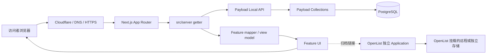
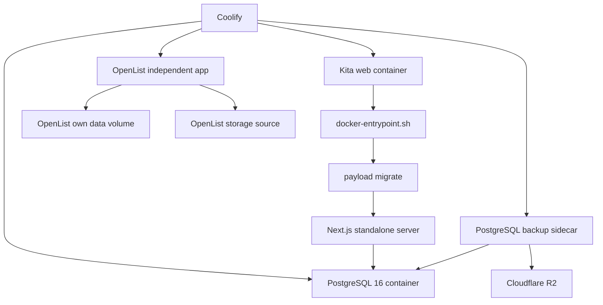

# Kita 技术决策、架构取舍与演进思路总览

> 日期：2026-07-16
> 原始写作基线：`main` / `3cc7977`
> 文档性质：技术决策地图、架构解释和长期维护指南
> 适用范围：Kita 主应用、本地开发环境、生产部署、备份、CI，以及与 OpenList 的边界
>
> 2026-07-20 状态更新：本轮文档分支基线为 `78ad2d2`（PR #13）。OpenList 已按本文决策作为独立 Coolify Application 运行，Kita 只保存公开 URL；`C:\dev\Kita` 已完成 GitHub 全新 clone、Dev Container、全新本地 PostgreSQL、页面 smoke、36 Vitest、4 个 backup shell 场景、`pnpm check` 与 `pnpm build` 的复建演练。最终 OpenList storage、PostgreSQL restore 与 Coolify/VPS 端到端恢复仍未完成。易变恢复事实只以灾难恢复 Runbook 为准。

## 1. 这份文档为什么存在

Kita 到现在已经使用了不少技术：Next.js、React、TypeScript、Payload、PostgreSQL、Docker、Dev Container、pnpm、Vitest、GitHub Actions、Coolify、Cloudflare、R2、OpenList 等。

如果只看到这些名称，很容易产生两个错误印象：

1. 项目是不是堆了太多技术；
2. 某个工具既然已经存在，是不是以后所有问题都应该继续交给它解决。

这两个印象都不准确。

Kita 的技术选择不是为了追求“技术栈完整”，而是在不同阶段解决不同问题。判断架构是否清晰，关键不在技术数量，而在于：

- 每项技术是否只有明确职责；
- 技术之间是否通过清楚的边界连接；
- 去掉其中一项时，影响范围是否可预测；
- 日常开发是否只有少量正常入口；
- 生产故障是否会被开发便利功能掩盖；
- 数据、secret 和部署状态是否被放在正确位置。

因此，这份文档不只是回答“项目用了什么”，还要回答：

- 当时遇到了什么问题；
- 为什么选择当前方案；
- 哪些替代方案没有采用；
- 当前方案付出了什么成本；
- 这个选择的安全边界在哪里；
- 未来什么时候应该保留、替换或扩展它。

阅读时需要始终区分两类信息：

- **历史理由**：当时为什么这样做；
- **当前事实**：今天仓库和生产实际上怎样运行。

历史理由帮助理解，当前事实决定操作。两者冲突时，以当前事实文档和当前代码为准。

---

## 2. 用一句话定义 Kita

Kita 是一个以个人内容、视觉表达和资料索引为核心的站点：Next.js 负责访问体验，Payload 负责内容管理，PostgreSQL 保存结构化内容，OpenList 作为独立归档入口存在，而 Docker、Dev Container、CI、备份和文档共同保证它可以稳定开发、部署和复建。

这个定义很重要，因为它解释了项目为什么没有沿着 SaaS、社交网站或大型后台系统的方向发展。

Kita 当前不是：

- 多租户 SaaS；
- 面向公众注册的用户系统；
- 微服务平台；
- 大规模对象存储服务；
- 在 Kita 进程中实现的下载服务器；
- 以组件库或企业后台模板为中心的产品。

它更接近一座私人策展型图书馆：

- 首页和各内容页面负责氛围与叙事；
- Payload 是管理员使用的编目室；
- PostgreSQL 是目录与元数据仓库；
- `/games` 是封面式陈列区；
- OpenList 是独立的归档领取窗口；
- 备份、CI 和文档是保证这座图书馆能继续维护的基础设施。

---

## 3. 技术选择背后的总原则

### 3.1 先解决真实问题，再引入技术

Kita 没有从第一天就一次性接入所有技术。早期先建立工程底座，之后才加入 CMS、数据库、生产迁移、备份、测试和独立归档服务。

这样做的好处是，每项技术都能对应一个已经出现的问题，而不是先搭一个庞大框架，再寻找使用场景。

### 3.2 一个组件承担一种主要责任

当前主要责任划分如下：

| 组件           | 主要责任                       | 不应承担的责任                 |
| -------------- | ------------------------------ | ------------------------------ |
| Next.js        | 路由、页面渲染、访问体验       | 数据库管理、归档文件存储       |
| Payload        | 内容模型、Admin、内容读写入口  | 页面视觉、对象存储下载站       |
| PostgreSQL     | 持久化结构化内容               | 页面渲染、文件分发             |
| OpenList       | 归档浏览与下载入口             | Kita 内容模型、Kita 页面实现   |
| Dev Container  | 统一开发工具和运行环境         | 代替生产环境或隐藏所有宿主差异 |
| Docker Compose | 编排开发和生产所需容器         | 替代业务架构                   |
| Coolify        | 生产部署与运行管理             | 代替 Git、测试或数据库设计     |
| GitHub Actions | 合并前质量门禁                 | 使用真实生产 secret 做生产演练 |
| R2 备份        | 保存 PostgreSQL 的外部恢复副本 | 代替数据库本身或完整恢复流程   |
| 文档           | 记录事实、边界和操作方法       | 代替自动化验证                 |

### 3.3 开发便利不能掩盖生产失败

开发环境允许使用 fallback 数据，是为了数据库暂时不可用时仍能观察 UI；生产环境则必须在真实数据获取失败时暴露错误。

这项原则贯穿多个选择：

- development 可以 fallback，production 不可以；
- CI 可以明确跳过真实 secret 校验，生产不能；
- development 可以 schema push，production 使用 migration；
- 本地可以自动启动 PostgreSQL，生产由 Compose 和 Coolify 管理生命周期。

“开发更方便”和“生产更严格”并不矛盾，只要环境分支是显式、可测试且不会互相渗透的。

### 3.4 默认入口必须安全

仓库无法绝对阻止一个有意绕过所有规则的 root shell，但可以保证正常入口默认安全：

- Dev Container 默认使用 `node` 用户；
- `pnpm dev` 和构建命令先检查工作区用户；
- `.next` 使用经过验证的 named volume；
- production runner 使用非 root 用户；
- backup 容器使用只读根文件系统、临时目录、最小权限；
- 正常修改通过分支和 PR 进入 `main`。

### 3.5 可替换性比“所有东西都集成”更重要

OpenList 没有嵌入 Kita、没有共享数据库，也没有与 Payload 建立复杂 API 集成。Kita 只保存一个稳定 URL。

这看起来集成较浅，但恰恰提升了可维护性：OpenList 可以升级、替换甚至下线，而 Kita 主站只需改变链接。

### 3.6 文档必须区分当前事实与历史材料

随着项目演进，旧评估文档可能仍有学习价值，但不一定代表当前操作方法。因此当前维护以少数事实文档为主，历史评估作为决策背景保留。

---

## 4. 整体架构地图

### 4.1 用户访问与数据流



这张图有三个关键点：

1. 页面不会直接操作 PostgreSQL；
2. Payload 生成的复杂文档类型不会直接扩散到所有 UI；
3. OpenList 不在 Kita 的数据链路内部，它只是用户点击链接后进入的另一套服务。

### 4.2 生产运行拓扑



Kita 与 OpenList 共享的不是容器、Volume、数据库或 secret，而只是同一个项目所有者和一个用户可访问的域名体系。

### 4.3 本地开发与生产的共同点和差异

| 关注点          | 本地开发                         | 生产                        |
| --------------- | -------------------------------- | --------------------------- |
| Node 环境       | Dev Container                    | Docker image                |
| 正常入口        | `pnpm dev`                       | Coolify 部署                |
| PostgreSQL      | `pnpm dev` 自动等待开发 Postgres | Compose 中的 PostgreSQL 16  |
| Schema 生命周期 | Payload development schema push  | 显式 migrations             |
| 数据失败        | 允许受控 fallback                | 必须暴露失败                |
| 环境变量        | `.env`，仅本地值                 | Coolify runtime secrets     |
| Next.js 输出    | development cache                | standalone production build |
| 用户            | Dev Container `node`             | runner `nextjs`，UID 1001   |
| 测试            | 可手动运行                       | GitHub Actions 自动运行     |
| 数据备份        | 不作为正常开发职责               | backup sidecar 上传 R2      |

---

## 5. 按时间理解 Kita 的演进

技术决策最好按时间阅读，因为后一个选择往往是在修复前一个阶段暴露的问题，而不是凭空增加复杂度。

### 阶段 0：先确定项目身份，而不是先选完整技术栈

最早需要回答的不是“使用什么框架”，而是“这个站点是什么”。Kita 被定位为个人内容与视觉站点，因此基础设计目标是：

- 页面表达自由；
- 内容可由后台维护；
- 不要求公开用户注册；
- 不需要从第一天构建复杂 API 平台；
- 可以在个人 VPS 上稳定部署；
- 以后能够由项目所有者重新搭建。

这个定位直接排除了许多不必要的初始复杂度。例如，登录优先的 SaaS starter 往往把 Auth.js、OAuth、用户表和会话管理放在中心，而 Kita 的核心是内容，不是公开账号体系。

### 阶段 1：建立工程底座

早期提交 `chore: establish engineering base` 的目标，是先解决所有后续开发都会遇到的共同问题：

- TypeScript 类型检查；
- ESLint 和 Prettier；
- Tailwind CSS；
- VS Code 工作区设置；
- typed routes；
- pnpm 和锁文件；
- Docker / Dev Container 骨架；
- 清楚的 `src` 目录结构。

这一步没有急着引入 CMS 或数据库，因为当时最重要的是建立一致开发方式。

参考来源主要有两个：

- CJ 的 Next.js 工程实践：编辑器配置、格式化、lint、类型安全环境变量和脚本；
- `bulletproof-react`：按 feature 组织业务代码，减少全局共享目录膨胀。

但 Kita 没有机械复制参考项目。它保留了适合 App Router 的 `src/app`，并没有引入参考项目中的 Auth.js、Google OAuth、Drizzle、Guestbook 或完整组件库。

### 阶段 2：用 Dev Container 统一开发环境

项目所有者明确希望避免在 Windows 主机上安装和维护一整套 Node、pnpm、PostgreSQL 工具链，因此采用 Dev Container。

目标不是宣称“主机完全没有任何依赖”，而是把项目级工具集中在容器中：

- Node 22；
- pnpm；
- Git 辅助工具；
- Docker CLI / Docker-in-Docker；
- 项目依赖；
- 本地 PostgreSQL 生命周期。

主机仍然需要 Docker Desktop、WSL2、VS Code 和 Dev Containers 扩展。这是重要边界：Dev Container 减少环境污染，但不是一个脱离宿主平台的虚拟宇宙。

### 阶段 3：引入 Payload 与 PostgreSQL

当内容开始需要后台编辑、发布状态、结构化字段和可持续管理时，仅使用本地静态数据已经不够。

Payload 被选择为 CMS 和内容访问层，PostgreSQL 被选择为持久化数据库。Payload 同时提供：

- Admin 后台；
- collection schema；
- Local API；
- 权限与发布状态；
- migration 能力；
- 类型生成。

这避免了自己分别开发：后台界面、CRUD API、字段验证、数据库映射和管理员认证。

随后建立了 Users、Tools、Reviews、Games 四个 collection，并形成当前的数据流：页面调用 server getter，getter 使用 Payload Local API，结果经过 mapper 转成 UI 需要的 view model。

### 阶段 4：形成 feature-oriented 目录与页面视觉体系

随着 Tools、Reviews、Games 和首页视觉逐步丰富，项目需要防止组件、类型和工具函数散落到全局目录。

因此采用按 feature 组织：

```text
src/features/games/
  components/
  data/
  types/
  utils/
  utils/__tests__/
```

同类结构用于 reviews、tools 等功能。`src/app` 只保留路由入口与页面组合，真正的功能实现留在 feature 中。

这一阶段也形成了 Kita 的视觉身份：首页雨效、玻璃质感、封面陈列和 lightbox 都不是通用后台模板能直接表达的，因此没有引入一个强势的完整 UI 框架来统一覆盖设计。

### 阶段 5：把开发路径与生产路径对齐

最初“本地能运行”并不自动等于“生产可复建”。项目随后补齐：

- production migrations；
- multi-stage Dockerfile；
- Next.js standalone 输出；
- non-root runner；
- `docker-entrypoint.sh` 启动时运行 migration；
- Compose 中的健康检查与依赖顺序；
- 本地和生产一致的 PostgreSQL 版本与关键环境变量。

生产首次部署使用全新 PostgreSQL Volume，并通过当前 migration 链路建立 schema。这使“migration 能否从空库建立当前结构”有了真实生产证据。

### 阶段 6：为 PostgreSQL 增加外部备份

数据库正常运行不等于数据已经安全。只保留 VPS 上的 PostgreSQL Volume，无法抵御：

- Volume 被误删；
- VPS 磁盘损坏；
- 主机整体不可恢复；
- 数据库升级或人为操作造成损坏。

因此增加独立 backup sidecar：

- 用 `pg_dump` 生成 PostgreSQL custom-format archive；
- 验证文件存在且非空；
- 通过 `rclone` 上传到 Cloudflare R2；
- 成功后才打印 `Backup completed`；
- 凭据只存在于 Coolify runtime environment variables；
- backup 容器不暴露公网端口，也不挂载 PostgreSQL 数据 Volume。

这一步解决的是“数据库丢失后至少存在外部副本”，但不等于恢复演练已经完成。恢复演练仍是独立的后续风险项。

### 阶段 7：修复 `.next` 所有权和构建产物问题

Dev Container、bind mount、Docker 命令以及 root shell 混合使用时，`.next` 可能由不同用户创建。结果是正常 `node` 用户无法更新缓存，质量门禁和开发启动受到影响。

项目采用两层防护：

1. 正常命令入口检查工作区用户和 `.next` 状态；
2. `.next` 使用 Dev Container named volume，隔离 Windows bind mount 的文件系统性能与所有权问题。

这两者不是重复方案：

- guard 管理“谁可以在正常入口写入”；
- named volume 管理“高频生成文件实际写在哪里”。

仓库无法阻止有人故意进入 root shell 并绕过所有脚本，但可以让正常入口默认安全。

### 阶段 8：增加高价值测试与 GitHub Actions

在没有测试和 CI 时，以下规则只能靠人工记忆：

- production 不能使用 fallback；
- mapper 必须处理 nullable 字段；
- seed 不能误删其他记录；
- backup 失败不能误报成功；
- 环境变量的字符串 `"false"` 不能被当成 `true`；
- Games 的 archive URL 映射必须稳定。

因此先加入小而高价值的测试，而不是追求覆盖率数字。当前基线是：

- 9 个 Vitest 文件；
- 36 个 Vitest 测试；
- 4 个 backup shell 场景。

GitHub Actions 的质量链路是：

```text
frozen install
→ format check
→ lint
→ typecheck
→ test
→ build
```

仓库 Ruleset 要求通过 PR 和 `quality` 检查后再合并到 `main`。这把“本机上看起来没问题”提升为“同一份提交在独立 CI 环境中也通过”。

### 阶段 9：收紧环境变量语义和文档事实

JavaScript 中任何非空字符串都是真值，因此：

```ts
Boolean("false") === true;
```

如果用 `Boolean(process.env.SKIP_ENV_VALIDATION)`，平台配置 `SKIP_ENV_VALIDATION=false` 反而会跳过校验。项目后来统一改成精确判断：

```ts
process.env.SKIP_ENV_VALIDATION === "true";
```

这体现了一项通用原则：环境变量全部是字符串，布尔语义必须由代码显式解析。

同一阶段也逐步整理事实文档，避免旧评估状态继续被误认为当前状态。

### 阶段 10：针对 Windows bind mount 做有限性能优化

Next.js 在 Windows bind mount 上生成大量小文件时，`.next` 和 `node_modules` 会产生明显性能损耗。因此 Dev Container 对这两个目录使用 named volumes：

- `/workspaces/Kita/node_modules`；
- `/workspaces/Kita/.next`。

这是经过实际性能与稳定性问题验证的例外，不代表所有目录都应该放入 Volume。

源代码仍然 bind mount 到主机，保持可见、可编辑、可由 Git 管理；只有依赖和可重建缓存进入 named volumes。

同时，`pnpm dev` 被明确为唯一正常开发入口：它先检查工作区，再自动启动并等待 PostgreSQL，最后运行 Next.js。

### 阶段 11：将 Games 与 OpenList 松耦合连接

`/games` 的视觉定位像私人图书馆的封面陈列区。如果在 Kita 内继续开发完整下载服务，会引入文件存储、下载协议、远程盘适配、权限和传输稳定性等大量新责任。

因此选择部署官方 OpenList 镜像作为独立 Coolify Application：

- Kita 继续负责封面、资料与策展体验；
- OpenList 负责归档浏览和下载页面；
- Games 记录只保存 archive URL；
- 用户点击后跳转到 `archive.kral-koharu.com`；
- 两个应用不共享数据库、Volume、secret 或代码生命周期。

这种方案的集成点很小，却符合站点定位：Kita 是主展厅，OpenList 是领取归档的窗口，不会让下载系统反过来主导主站设计。

---

## 6. 核心技术决策详解

## 6.1 为什么选择 Next.js，而不是纯 Vite SPA

### 面对的问题

Kita 需要多页面路由、服务端获取 Payload 内容、生产构建、图片处理、metadata 和可部署的 Node 服务。

### 当前选择

使用 Next.js App Router 和 React Server Components 为主的页面结构。

### 选择理由

- 路由由文件系统表达，内容页面结构直观；
- server component 可以直接调用 server getter，无需为每个内部查询再造 HTTP API；
- 与 Payload 3 的 Next.js 集成自然；
- production 可以输出 standalone 服务，适合 Docker；
- 页面 metadata、图片和服务端渲染能力集中在同一框架。

### 付出的成本

- Next.js 构建和 development cache 较重；
- App Router、RSC、缓存和动态渲染需要理解；
- Windows bind mount 上大量 `.next` 文件会放大性能问题；
- Next.js 版本升级可能带来生成文件和开发行为变化。

### 为什么没有选择纯 Vite SPA

Vite SPA 本身更轻，但需要额外设计：

- 服务端 API；
- Payload 与前端之间的访问层；
- SSR 或静态生成策略；
- 独立后端的部署边界。

对于当前规模，这会把一个集成应用拆成两个需要共同维护的应用层，却没有带来足够收益。

### 边界

如果未来 Kita 变成纯静态展示、所有内容都在构建时生成，或者需要完全独立的前后端团队，才值得重新评估 Vite SPA 或其他前端方案。

## 6.2 为什么使用 TypeScript、typed routes 和 Zod

### 面对的问题

内容字段、路由、环境变量和 Payload 返回值都可能因为拼写或 nullable 状态产生运行时错误。

### 当前选择

- TypeScript 作为应用语言；
- Next.js `typedRoutes`；
- Zod / `@t3-oss/env-nextjs` 校验环境变量；
- mapper 将 Payload 文档转成显式 view model。

### 选择理由

这些工具分别守住不同边界：

- TypeScript：代码内部类型；
- typed routes：链接目标；
- Zod：进程外传入的环境变量；
- mapper：CMS 文档到 UI 模型的转换。

### 付出的成本

- 类型定义、mapper 和配置会增加代码量；
- Payload 生成类型更新后需要同步；
- 开发者必须理解“编译时类型”和“运行时校验”并不是同一件事。

### 边界

Zod 不能证明 secret 值是否正确，只能证明形状满足要求；CI 中的占位值也不能证明生产连接可用。

## 6.3 为什么目录采用 feature-oriented，而不是按文件类型全局分组

### 面对的问题

如果所有组件都进入 `components/`、所有类型都进入 `types/`、所有工具都进入 `utils/`，功能增加后会很难判断一个文件属于哪个业务。

### 当前选择

采用经过 Kita 调整的 `bulletproof-react` 思路：

```text
src/
  app/
  features/
  server/
  payload/
  migrations/
  testing/
  shared/
```

### 选择理由

- `features/games` 可以集中查看 Games 的 UI、类型、mapper 和测试；
- 删除或重构一个 feature 时，影响范围更清楚；
- 测试与被测试的功能相邻；
- `shared` 只有真正跨 feature 的内容，避免成为杂物箱。

### 为什么没有完全照搬 bulletproof-react

Kita 是 Next.js App Router + Payload 项目，因此必须保留框架所有权明确的目录：

- `src/app` 属于 Next.js 路由；
- `src/payload` 属于 CMS schema；
- `src/server` 属于服务端查询和环境行为；
- `src/migrations` 属于生产数据库生命周期。

架构指导文件提供原则，不应该覆盖框架本身的清楚约定。

### 付出的成本

- 新开发者要先理解 feature、server、payload 三层差别；
- 很小的功能也可能分布在路由、feature、server、collection 四处；
- 如果不守边界，重复类型和工具仍可能出现。

### 判断文件应该放在哪里

可以依次提问：

1. 它是 URL 入口或页面组合吗？放 `src/app`。
2. 它只属于一个业务功能吗？放对应 `src/features/<feature>`。
3. 它需要 secret、数据库或 Payload 吗？放 `src/server`。
4. 它定义 CMS 字段和权限吗？放 `src/payload`。
5. 它真的被多个 feature 使用吗？才考虑 `src/shared`。

## 6.4 为什么选择 Payload，而不是自己写后台

### 面对的问题

Tools、Reviews、Games 需要结构化字段、发布状态、后台编辑、权限和持久化。

### 当前选择

使用 Payload 3 作为嵌入 Next.js 的 headless CMS。

### 选择理由

Payload 一次提供了：

- `/admin`；
- collection schema；
- Local API；
- 管理员用户；
- access control；
- rich text；
- PostgreSQL adapter；
- 类型生成；
- migration 工具。

自己开发这些能力会让项目从内容站变成后台系统开发项目。

### 为什么没有采用 Auth.js + Drizzle 作为中心

Auth.js 解决认证，Drizzle 解决数据库访问，但二者不会自动提供完整内容后台、字段编辑器、发布流程和 rich text 管理。

对于 Kita，公开用户认证不是核心，CMS 才是核心。因此 Payload 更贴近真实需求。

### 付出的成本

- Payload 与 Next.js 版本需要兼容；
- schema、generated types 和 migrations 需要保持一致；
- 首次 server getter 可能触发 Payload 初始化；
- Payload 的类型较复杂，不适合直接扩散到所有 UI。

### 边界

Payload 是内容平台，不应该成为所有外部服务的总线。OpenList 没有接入 Payload 内部，就是在保护这个边界。

## 6.5 为什么使用 PostgreSQL 16

### 面对的问题

Payload 需要可靠持久化，生产需要 migration、备份和恢复路径。

### 当前选择

本地和生产均以 PostgreSQL 16 为数据库基线。

### 选择理由

- Payload 官方 adapter 支持；
- schema、关系和查询能力适合内容模型；
- `pg_dump` / `pg_restore` 工具成熟；
- Docker 和托管环境普遍支持；
- 开发与生产可以使用同一数据库类型和主要版本。

### 付出的成本

- 本地开发需要一个真实数据库服务；
- 需要处理健康检查、Volume、migration、备份和 secret；
- 数据库未启动时，Payload 初始化会失败。

### 为什么不把本地开发改成另一种轻量数据库

不同数据库会让本地通过的 schema、查询和 migration 在生产中表现不同。Kita 选择让开发环境承担稍高启动成本，换取更真实的一致性。

## 6.6 为什么页面不直接使用 Payload 文档类型

### 面对的问题

Payload 文档包含 nullable、relationship、rich text 和生成字段。UI 若直接依赖这些结构，每个组件都会重复处理边界情况。

### 当前选择

通过 mapper 转换成 feature 自己的 view model。

```text
Payload document
→ mapper
→ GameDetail / ReviewPreview / ToolkitItem
→ component
```

### 选择理由

- UI 得到稳定、简单的字段；
- nullable 处理集中；
- CMS schema 改动不会直接传遍所有组件；
- mapper 可以独立做高价值单元测试。

### 付出的成本

- 同一概念会同时存在 Payload 类型和 view model；
- 新字段需要更新 collection、generated type、mapper 和 UI；
- 对极小功能来说，看起来比直接传对象更啰嗦。

### 边界

不要为了减少几行代码让 UI 重新直接依赖 Payload generated types；那会把短期简化变成长期耦合。

## 6.7 为什么使用 server getter

### 面对的问题

页面需要读取 Payload，但又不应该知道初始化、环境分支、fallback 和查询细节。

### 当前选择

在 `src/server/<feature>` 中建立 getter，例如 `getGames`、`getReviews`、`getTools`。

### 选择理由

getter 是页面和数据层之间的明确边界，负责：

- 获取 Payload client；
- 执行查询；
- 排序与筛选；
- 调用 mapper；
- 处理 development / production 不同失败策略。

### 付出的成本

- 增加一层调用；
- 必须测试正常、空结果、异常和环境分支；
- 如果 getter 过度承担业务逻辑，也会变得臃肿。

### 边界

getter 不应渲染 UI，也不应变成万能 service。复杂业务应该继续拆成小函数或 feature 工具。

## 6.8 为什么 development 有 fallback，而 production 没有

### 面对的问题

开发 UI 时，数据库可能暂时未启动或 collection 尚无内容。完全阻断页面会降低视觉开发效率；但生产 fallback 会把真实故障伪装成正常页面。

### 当前选择

- development：记录错误后可以使用本地 fallback；
- production：真实查询失败必须抛错。

### 选择理由

这在开发体验和生产可信度之间做了明确切分。

### 付出的成本

- 必须正确判断环境；
- 必须通过测试防止 production 误入 fallback；
- 开发者看到 fallback 时可能忽略数据库没有启动，因此日志必须清楚。

### 边界

fallback 只能作为开发辅助，不能逐渐变成第二套长期内容来源。真实内容仍以 Payload 为准。

## 6.9 为什么 development schema push 与 production migration 并存

### 面对的问题

开发阶段 schema 变化频繁，生产数据库则必须有可重复、可追踪的升级路径。

### 当前选择

- development 使用 Payload 的开发 schema 同步能力；
- production 启动前运行版本化 migration。

### 选择理由

- 开发快速迭代；
- 生产变更有记录；
- 新生产数据库可以从 migration 建立当前 schema；
- 现有生产库可以按顺序升级。

### 付出的成本

- collection 与 migration 必须同步；
- 开发库“已经能用”不能单独证明 migration 完整；
- schema 变更必须认真考虑生产数据。

### 当前证据

生产首次部署使用全新 PostgreSQL Volume，并由当前 entrypoint 和 migration 链路建立 schema；四个 migration 已有生产空库部署证据。

### 边界

不要在现有生产库上盲跑初始 migration，也不要把开发 schema push 当成生产升级方案。

## 6.10 为什么选择 pnpm 和 frozen lockfile

### 面对的问题

需要可重复安装、节省依赖空间，并让本地、容器和 CI 使用同一依赖解析结果。

### 当前选择

- `packageManager: pnpm@10.28.2`；
- `pnpm-lock.yaml` 进入 Git；
- Dev Container 和 CI 使用 frozen install。

### 选择理由

- lockfile 明确依赖版本；
- pnpm 的内容寻址存储节省重复依赖；
- 严格依赖布局有助于发现未声明依赖；
- Corepack 可以固定 pnpm 版本。

### 付出的成本

- `.pnpm` 目录结构对初学者不直观；
- Windows bind mount 上大量链接和小文件会较慢；
- named volume 重建后需要重新安装依赖。

### 边界

不要同时混用 npm、yarn 和 pnpm lockfile。依赖变更应在 Dev Container 内完成。

## 6.11 为什么使用 Dev Container

### 面对的问题

项目在 Windows 主机上开发，但生产运行在 Linux 容器。直接在主机安装 Node、pnpm、PostgreSQL 客户端和其他工具，会带来版本漂移与环境污染。

### 当前选择

使用 Node 22 Bookworm Dev Container，并以 `node` 用户工作。

### 选择理由

- 项目工具版本写入仓库；
- 新环境可以按配置重建；
- 开发命令与 Linux 生产环境更接近；
- 依赖安装和脚本不会直接修改全局 Windows Node 环境；
- VS Code 扩展与设置可以随项目加载。

### 付出的成本

- 依赖 Docker Desktop、WSL2、VS Code Remote Containers；
- 发生 Docker Desktop / WSL mount service 故障时，恢复链路比直接本机 Node 更复杂；
- 文件跨 Windows、WSL、Linux VM 和容器时可能变慢；
- Dev Container 重建不等于数据库 Volume 自动消失或自动恢复，需要理解各层状态。

### 它避免了什么污染

- 不需要在 Windows 全局固定项目 Node 版本；
- 不需要在 Windows 全局安装项目 pnpm 依赖；
- 不需要在 Windows 直接安装 PostgreSQL 服务；
- 项目命令统一在 Linux 用户空间运行。

### 它没有避免什么

- Docker Desktop 本身仍安装在主机；
- WSL2 仍是宿主依赖；
- 源代码仍存在于宿主机的 `C:\dev\Kita`；
- Docker named volumes 和 images 仍占用 Docker Desktop 磁盘。

## 6.12 为什么 Dev Container 使用 Docker-in-Docker

### 面对的问题

开发容器内部需要通过 Compose 启动项目 PostgreSQL，同时希望这些项目容器与宿主其他项目隔离。

### 当前选择

使用 Dev Containers 的 Docker-in-Docker feature。

### 选择理由

- `pnpm dev` 可以在容器内统一编排数据库；
- 项目 Docker 状态与宿主普通 Docker 项目相对隔离；
- 命令都从同一个开发 shell 执行；
- 与 Linux Compose 操作方式一致。

### 付出的成本

- Docker 内再运行 Docker，层次更深；
- `/var/lib/docker` 和 containerd 需要独立 named volumes；
- Dev Container 丢失、DIND 状态异常和 Docker Desktop 状态是不同问题；
- 初学者容易把宿主 Docker 容器列表与 DIND 内部容器列表混淆。

### 边界

DIND 是为统一开发流程服务的，不是业务架构。不要让应用代码依赖 Docker socket，也不要把生产 secret 注入开发 Docker daemon。

## 6.13 为什么只有两个 targeted named volumes

### 面对的问题

Windows bind mount 对 `node_modules` 和 `.next` 这类大量小文件、高频读写目录性能较差，也容易出现用户所有权问题。

### 当前选择

只有下面两个项目目录使用 Dev Container named volumes：

- `node_modules`；
- `.next`。

### 选择理由

- 两者都可重新生成；
- 不需要在 Windows 文件浏览器中直接管理；
- 对开发启动、编译和文件所有权影响最大；
- 源代码仍然保留在 bind mount，便于 Git 和编辑器访问。

### 付出的成本

- 重建 Volume 后需要重新安装或重新生成；
- Docker Desktop 内会看到不直观的长 Volume 名；
- 本地文件夹中看到的目录状态与容器内实际挂载需要区分。

### 为什么不把整个仓库放进 Volume

整个仓库进入 Volume 会降低主机可见性、备份直观性和 Git 操作透明度。当前优化是针对已验证瓶颈，而不是全面隐藏文件系统。

### 未来规则

新增 named volume 必须同时满足：

1. 内容可重建；
2. bind mount 已被证明确实造成性能或权限问题；
3. 不包含唯一数据；
4. 有清楚的重建方法；
5. 文档说明它与现有 Volume 的区别。

## 6.14 为什么 `pnpm dev` 是唯一正常开发入口

### 面对的问题

以前开发者可能先手动启动数据库，再运行 Next.js；如果忘记第一步，Payload 会连接 `127.0.0.1:5432` 失败，并触发重试、fallback 和长时间请求。

### 当前选择

`pnpm dev` 顺序执行：

```text
检查 node 用户与 .next
→ pnpm dev:services
→ docker compose up -d --wait postgres
→ next dev
```

### 选择理由

- 把正确顺序变成脚本，而不是记忆；
- PostgreSQL 健康后才启动页面开发；
- 减少“页面很慢其实是数据库没启动”的误判；
- 新开发会话只有一个正常命令。

### 付出的成本

- 启动 Next.js 时会顺带检查 Docker 服务；
- DIND 或 Compose 有问题时，`pnpm dev` 会立即暴露；
- 只想做纯静态前端实验时，也需要遵守正常入口或明确使用特殊方式。

### 边界

手动启动子命令仍可用于诊断，但不应写成第二套日常教程。

## 6.15 为什么要检查 root 和 `.next` 所有权

### 面对的问题

如果 root 在 bind-mounted workspace 中生成 `.next`，之后普通 `node` 用户可能无法更新或删除文件。

### 当前选择

在正常开发和构建脚本前运行 guard。

### 选择理由

- 尽早失败比编译中途出现奇怪权限错误更清楚；
- 提醒操作者回到正确用户；
- 防止质量门禁被损坏缓存误导；
- 与 production non-root 原则一致。

### 付出的成本

- 脚本增加了工程复杂度；
- 极端诊断场景需要理解如何安全修复所有权；
- 不能从仓库内部绝对禁止故意绕过 guard 的 root shell。

### 边界

这是一项默认安全措施，不是操作系统级强制沙箱。

## 6.16 为什么 Dockerfile 使用 multi-stage、standalone 和 non-root

### 面对的问题

生产镜像需要可重复构建、体积可控，并避免以 root 运行 Web 应用。

### 当前选择

- Node 22 Bookworm Slim；
- deps / builder / runner multi-stage；
- frozen dependency install；
- Next.js standalone 输出；
- runner 用户 `nextjs`，UID 1001；
- entrypoint 先 migration，再启动 server。

### 选择理由

- 构建依赖不必全部进入 runner；
- standalone 只携带运行所需内容；
- non-root 降低容器被利用后的权限；
- migration 与应用版本共同部署；
- 镜像本身构成可移植生产单元。

### 付出的成本

- Payload migration 和 runtime 所需文件必须明确复制；
- standalone 与 Payload 的组合需要验证；
- 构建阶段需要特殊的环境校验策略；
- Dockerfile 比直接 `node server.js` 更复杂。

## 6.17 为什么 Compose 分为 base 与 development override

### 面对的问题

开发与生产共享核心服务关系，但端口暴露、restart policy 和操作方式不同。

### 当前选择

- `compose.yaml` 描述核心拓扑；
- `compose.dev.yaml` 只添加开发差异。

### 选择理由

- 避免维护两份完整 Compose；
- PostgreSQL 版本、健康检查和依赖关系保持一致；
- 开发端口暴露不会自动成为生产配置；
- 本地命令可以明确组合两个文件。

### 付出的成本

- 必须理解 Compose merge 规则；
- 单独运行错误文件可能缺少必要配置；
- 文档必须给出唯一正常命令。

## 6.18 为什么使用 Coolify，而不是完全手写 VPS 部署

### 面对的问题

生产需要镜像部署、环境变量、域名、HTTPS、健康检查、日志、重启和滚动更新。

### 当前选择

在自有 VPS 上使用 Coolify 管理 Kita 和 OpenList 等 Application。

### 选择理由

- 保留 VPS 控制权；
- 减少手工维护 systemd、反向代理和部署脚本；
- 环境变量和 secret 集中在运行平台；
- 部署日志、容器状态和健康检查可视化；
- Docker image、Compose 和域名可以按 Application 隔离。

### 付出的成本

- 需要理解 Coolify 的 Application、Environment、Volume 和健康检查概念；
- Coolify 本身是额外运维组件；
- 平台 UI 自动生成的配置可能不完全透明；
- 复建时除应用外还要恢复 Coolify 管理能力或改用其他平台。

### 边界

Coolify 是部署控制面，不是唯一事实来源。应用结构、Dockerfile、Compose、migration 和操作文档仍应在仓库中。

## 6.19 为什么使用 Cloudflare 作为域名和 R2 边界

### 面对的问题

需要稳定域名、DNS、HTTPS，以及数据库备份的外部对象存储。

### 当前选择

- Cloudflare 管理域名/DNS；
- 独立子域名区分 Kita 与 OpenList；
- R2 保存 PostgreSQL backup archive。

### 选择理由

- DNS 与应用容器解耦；
- 子域名是清楚的服务边界；
- R2 让备份离开 VPS；
- S3-compatible API 适合 `rclone`。

### 付出的成本

- 需要管理 DNS、R2 bucket、access key 和权限；
- Cloudflare 配置不在 Git 中；
- 复建需要外部账户权限与记录。

### 边界

不要把 R2 access key 提交到仓库，也不要把“对象已上传”误认为“恢复流程已经演练”。

## 6.20 为什么环境变量分开发、CI 和生产管理

### 面对的问题

同一应用在不同环境需要相同配置键，但值、可信度和安全要求不同。

### 当前选择

- `.env.example` 记录键和格式，不记录 secret；
- 本地 `.env` 保存开发值，不提交；
- CI 使用构建所需的非生产占位值，并显式设置 `SKIP_ENV_VALIDATION=true`；
- Coolify 保存生产 runtime secrets。

### 选择理由

- 仓库可以说明需要什么，而不泄露真实值；
- CI 不需要接触生产数据库和 Payload secret；
- 生产值可独立轮换；
- Zod 在真正运行环境中校验必需键。

### 付出的成本

- 需要维护键名同步；
- 用户必须理解 build-time 和 runtime 区别；
- Coolify 中锁定的 secret 可能无法再次显示，因此要用密码管理器保存；
- CI 通过不证明生产 secret 正确。

### 关键语义

环境变量是字符串，只有精确字符串 `"true"` 才表示跳过校验。`"false"`、空值和未设置必须分别正确处理。

## 6.21 为什么测试与功能共置

### 面对的问题

如果测试全部集中在顶层 `tests/`，随着 feature 增加，很难看出测试保护的是哪个业务边界。

### 当前选择

- mapper 测试放在 feature 的 `utils/__tests__`；
- server getter 和 seed 测试放在对应 `src/server/.../__tests__`；
- 共享 fixture 放 `src/testing/fixtures`；
- backup shell 测试放在 `docker/postgres-backup/tests`。

### 选择理由

- 符合 feature-oriented 目录；
- 功能移动时测试一起移动；
- 基础设施测试留在基础设施旁边；
- 共享 fixture 集中但不把所有测试集中。

### 付出的成本

- 测试文件分散在项目各处；
- 需要统一命名与搜索习惯；
- 新人不能只看一个顶层目录了解全部测试。

## 6.22 为什么测试优先保护高价值规则，而不追求覆盖率数字

### 面对的问题

项目早期没有测试。一次性追求高覆盖率会消耗大量时间，却可能只覆盖简单展示代码。

### 当前选择

优先保护容易回归且后果明确的规则：

- mapper 的 nullable 字段；
- getter 的正常、空、异常和环境分支；
- seed upsert；
- environment skip 精确语义；
- archive URL 映射；
- backup 每个失败阶段绝不能误报成功。

### 选择理由

测试的价值不是数字，而是未来修改时能否阻止真实错误进入 `main`。

### 付出的成本

- UI 视觉回归和真实浏览器行为覆盖仍有限；
- PostgreSQL migration 与页面 smoke 尚未形成完整自动化链路；
- 需要根据新风险继续补充测试，而不是认为 36 个测试已经“完成测试”。

## 6.23 为什么使用 Git 分支、PR、Ruleset 和 GitHub Actions

### 面对的问题

直接从本地 push 到 `main` 时，错误提交可以在 CI 完成前进入主分支，也缺少一个集中阅读 diff 的阶段。

### 当前选择

正常工作流是：

```text
main 同步
→ 创建 codex/<topic> 分支
→ 修改
→ 本地验证
→ commit
→ push 分支
→ PR
→ quality 通过
→ merge
→ 本地 main fast-forward
→ 删除已合并分支
```

### 选择理由

- commit 是本地历史单元；
- push 是把分支历史传到 GitHub；
- PR 是审查和合并请求；
- Actions 是独立验证；
- Ruleset 是阻止绕过正常流程的仓库规则。

这些环节职责不同，不是同一个动作的重复版本。

### 付出的成本

- 小改动也多几个步骤；
- stacked PR 需要理解基础分支变化；
- 合并后需要清理本地和远程分支；
- `main` 更新后，后续 PR 可能需要 Update branch 并重新运行 CI。

### 边界

紧急情况可以由仓库所有者使用管理员能力，但不应把例外重新变成日常工作流。

## 6.24 为什么 CI 不使用 production secret

### 面对的问题

CI 需要验证代码能构建，但不应该为普通 PR 打开生产数据库、Payload secret 或 R2 权限。

### 当前选择

CI 使用只读仓库权限和非生产占位环境，仅运行代码质量链路。

### 选择理由

- 降低 secret 泄露风险；
- fork 或 PR 代码不能接触生产；
- build 的目标是验证代码结构，不是部署生产；
- CI 失败和生产访问故障保持解耦。

### 付出的成本

- CI build 不能证明生产连接正常；
- migration、真实备份和真实域名仍需要独立证据；
- 某些 runtime-only 错误不会在普通 CI 中出现。

## 6.25 为什么备份使用 sidecar，而不是宿主 cron

### 面对的问题

需要定期从 PostgreSQL 生成外部备份，同时希望备份逻辑可随项目版本化。

### 当前选择

在 Compose 中加入独立 backup 容器。

### 选择理由

- backup script、镜像和说明都在仓库；
- 不依赖某台 VPS 上不可见的手工 cron；
- 与数据库通过网络连接，不读取 live data directory；
- 可以单独限制权限和资源；
- 迁移到另一台 Docker 主机时更容易复用。

### 付出的成本

- Compose 多一个服务；
- 需要独立镜像、环境变量和日志；
- 调度是简单 interval/retry，不是完整监控平台；
- 容器成功运行不自动等于备份可恢复。

## 6.26 为什么备份使用 `pg_dump` custom format

### 面对的问题

直接复制正在运行的 PostgreSQL 数据目录可能得到不一致副本，也与具体数据库版本和文件状态紧密耦合。

### 当前选择

使用 `pg_dump` 生成逻辑备份 archive。

### 选择理由

- PostgreSQL 官方工具；
- 不需要挂载数据库 Volume；
- custom format 适合 `pg_restore`；
- 文件可以独立验证、上传和保留；
- 恢复时可选择更清楚的过程。

### 付出的成本

- 大数据库备份和恢复会耗时；
- 需要匹配 PostgreSQL 工具版本；
- 恢复仍需要创建临时库并实际演练；
- 不能替代实时高可用或 point-in-time recovery。

## 6.27 `rclone` 在备份中到底做什么

`rclone` 是一个命令行文件传输工具，支持 S3、R2、Google Drive、WebDAV 等远程存储。

在 Kita backup 中，它不负责生成数据库备份。完整顺序是：

```text
pg_dump 连接 PostgreSQL
→ 生成本地临时 .dump
→ 检查 archive 有效且非空
→ rclone 上传到 R2
→ 上传成功后打印 Backup completed
```

如果 `rclone` 上传失败，脚本必须返回失败，绝不能继续打印成功。

backup shell 测试通过假的 `pg_dump`、验证器和 `rclone` 命令模拟四种路径，证明失败不会被成功日志掩盖。它测试的是控制流程，不会触碰真实生产数据库或 R2。

## 6.28 为什么 OpenList 是独立 Application

### 面对的问题

Games 页面需要一个归档入口，但 Kita 不需要自己实现文件协议、远程存储挂载、目录浏览和下载页面。

### 当前选择

使用 OpenList 官方镜像，在 Coolify 中独立部署。

### 选择理由

- OpenList 本身已经包含服务端和前端；
- 支持多种远程存储；
- 有自己的管理员、访客权限、配置 Volume 和 UI；
- Kita 无需增加 Go、Gin、SolidJS 或 OpenList 源码；
- 故障和升级可以与 Kita 分开处理。

### 付出的成本

- 多一个生产 Application；
- 需要独立域名、Volume、admin secret、健康检查和存储配置；
- OpenList UI 不完全继承 Kita 视觉；
- 外部挂载源的可用性不由 Kita 控制。

### 为什么不把 OpenList 代码放进 Kita 仓库

这样做会把第三方产品升级、Go 服务、前端构建、存储驱动和安全更新全部变成 Kita 的责任。当前需求只需要一个归档入口，不值得承担这种耦合。

### 唯一合同

Kita 只保存并展示一个可访问的 archive URL。这是两个系统之间唯一需要长期稳定的接口。

## 6.29 为什么不急着定制 OpenList 前端

### 面对的问题

OpenList 默认界面与 Kita 的深色图书馆视觉并不完全一致。

### 当前选择

第一阶段接受官方界面，只做名称、语言、访客访问和目录范围等必要配置。

### 选择理由

- 用户从 Kita 点击后，已经理解自己进入下载/归档页面；
- 定制或 fork 前端会显著增加升级成本；
- 当前内容数量少，视觉不一致造成的损失低于维护 fork 的成本；
- Kita 的设计品味仍由主站页面承担。

### 未来何时值得定制

只有当满足以下条件时才重新评估：

- OpenList 已成为高频核心入口；
- 默认 UI 明显阻碍用户；
- 品牌一致性带来的收益可以覆盖持续升级成本；
- 有明确的最小定制方案，而不是全面 fork。

## 6.30 为什么首页雨效的复杂度可以接受

### 面对的问题

首页雨效比普通静态组件复杂，涉及 canvas、设备能力、触摸、reduced motion、生命周期和性能。

### 当前选择

保留它作为 Kita 的核心视觉身份，同时设置能力与降级边界。

### 选择理由

- 视觉表达是这个项目的主要价值之一，不是装饰性后台；
- 它让站点与通用模板区分开；
- 复杂度集中在特定 feature，而没有扩散到数据层；
- 已考虑 reduced motion、触摸设备、fallback 与 cleanup。

### 付出的成本

- 组件行数和状态逻辑较多；
- 浏览器兼容与性能需要持续关注；
- 视觉回归不容易只靠单元测试覆盖。

### 边界

视觉复杂度可以存在，但必须局部化。不要因为首页需要 canvas，就让全站基础架构围绕动画系统重构。

---

## 7. 主要替代方案与没有采用的原因

| 问题          | 当前选择                  | 没有采用的方案                 | 没有采用的主要原因             |
| ------------- | ------------------------- | ------------------------------ | ------------------------------ |
| 前端与服务端  | Next.js 一体化            | Vite SPA + 独立 API            | 当前规模会增加部署和接口层     |
| 内容后台      | Payload                   | 自写 CRUD/Admin                | 非核心工作量过大               |
| 认证          | Payload admin users       | Auth.js / Google OAuth 为中心  | 项目不需要公开用户体系         |
| 数据访问      | Payload Local API         | Prisma/Drizzle 作为主层        | 会绕开 CMS schema 与权限模型   |
| 数据库        | PostgreSQL 16             | 本地轻量库、生产再换库         | 会削弱开发生产一致性           |
| 目录结构      | feature-oriented          | 全局 components/utils/types    | 功能边界会随规模变模糊         |
| UI            | 自有 Tailwind 视觉        | 完整组件库统一全站             | 会限制个性化视觉并增加依赖     |
| 本地环境      | Dev Container             | 全部装在 Windows 主机          | 版本漂移与污染更明显           |
| 项目数据库    | DIND 内 Compose           | Windows 本地 PostgreSQL        | 生命周期和环境不统一           |
| 高频目录      | 两个 named volumes        | 全仓库 bind mount              | 已有实际性能与权限问题         |
| 源代码        | Windows bind mount        | 整仓库 named volume            | 主机可见性与 Git 透明度更重要  |
| 开发启动      | `pnpm dev` 自动服务       | 记住两条手动命令               | 容易忘记数据库并误判性能问题   |
| 生产部署      | Coolify + Docker          | 手写 systemd / proxy / scripts | 当前维护者更需要可视控制面     |
| 生产构建      | standalone non-root image | 直接开发服务器运行             | 安全性、可重复性和镜像边界较差 |
| 数据库升级    | migrations                | production schema push         | 不可追踪且风险更高             |
| 数据备份      | sidecar + R2              | 只留 PostgreSQL Volume         | 无法抵御主机或 Volume 丢失     |
| 备份格式      | `pg_dump` archive         | 复制 live data directory       | 一致性和可移植性较差           |
| 备份调度      | 简单 interval/retry       | 立即建设完整监控平台           | 当前规模收益不足               |
| 测试策略      | 高价值边界测试            | 先追覆盖率百分比               | 数字不等于风险保护             |
| Git 流程      | branch + PR + quality     | 日常直接 push main             | 缺少合并前门禁                 |
| 归档服务      | 独立 OpenList             | Kita 内开发下载系统            | 责任和维护面会急剧扩大         |
| OpenList 集成 | URL-only                  | 共享 DB/API/Volume             | 当前没有足够收益               |
| OpenList UI   | 官方前端                  | 立即 fork 定制                 | 升级维护成本过高               |

---

## 8. 当前架构中最重要的边界

这些边界比具体文件名更重要。未来修改如果破坏它们，项目会迅速变得难以理解。

### 8.1 路由入口保持薄

`src/app` 应该主要负责：

- URL；
- metadata；
- 获取页面所需数据；
- 组合 feature UI。

不要把数据库查询、复杂 mapping 或大量交互细节直接堆在 `page.tsx`。

### 8.2 UI 不直接连接数据库

所有数据库访问应经 Payload 和 server getter。不要在 React 组件里直接创建数据库 client。

### 8.3 Payload schema 不等于 UI model

collection 描述内容如何存储，view model 描述页面需要什么。mapper 是故意存在的隔离层。

### 8.4 development 便利不得进入 production

- fallback 仅 development；
- seed 仅 development；
- schema push 仅 development；
- `SKIP_ENV_VALIDATION=true` 仅明确的 build/CI 场景；
- production 必须依赖真实配置和 migration。

### 8.5 secret 只属于运行环境

以下内容不得进入 Git：

- production `DATABASE_URI`；
- `PAYLOAD_SECRET`；
- R2 access key / secret key；
- OpenList admin password；
- 第三方存储 token。

仓库只保存键名、格式和配置说明。

### 8.6 Volume 不是随手使用的文件夹

不同 Volume 承担不同责任：

- PostgreSQL data Volume：唯一业务数据之一；
- OpenList data Volume：OpenList 配置与状态；
- `node_modules` Volume：可重建依赖；
- `.next` Volume：可重建缓存；
- DIND Docker/Containerd Volume：开发容器运行状态。

它们不能因为都叫 Volume 就采用相同删除策略。

### 8.7 OpenList 不进入 Kita 内核

Kita 不应该：

- 读取 OpenList 数据库；
- 共享 OpenList admin secret；
- 依赖 OpenList 内部 API 才能渲染 Games；
- 把 OpenList Volume 挂到 Kita；
- 在主仓库维护 OpenList fork。

只要 URL 可以打开，Kita 的合同就成立。

---

## 9. 当前复杂度是否合理

### 9.1 看起来技术很多，但不是同一层重复堆叠

可以把当前技术分成七组：

| 层       | 技术                             | 解决的问题            |
| -------- | -------------------------------- | --------------------- |
| 页面     | Next.js、React、Tailwind         | 路由、渲染、视觉      |
| 内容     | Payload、Lexical                 | CMS、Admin、rich text |
| 数据     | PostgreSQL                       | 持久化结构化内容      |
| 开发     | Dev Container、DIND、pnpm        | 统一工具和本地服务    |
| 交付     | Docker、Compose、Coolify         | 构建和部署            |
| 质量     | TypeScript、Zod、Vitest、Actions | 类型、校验、回归保护  |
| 外部能力 | Cloudflare、R2、OpenList         | DNS、备份、归档下载   |

同一层内部没有明显的重复框架。例如，没有同时使用 Prisma 和 Drizzle，没有同时使用多个 UI 组件库，也没有让 Kita 与 OpenList共享两套数据模型。

### 9.2 真正复杂的三个地方

#### Dev Container + DIND + Windows/WSL

这是本地复建中最难理解的部分。它换来了主机清洁、Linux 一致性和一键服务编排，但需要理解五层状态：

```text
Windows
→ WSL2
→ Docker Desktop Linux VM
→ Dev Container
→ Dev Container 内的 Docker / PostgreSQL
```

这项复杂度目前有实际收益，但必须继续依靠文档、唯一入口和保守的 Volume 操作控制。

#### Payload + Next.js 初始化与构建

Payload 嵌入 Next.js 带来一体化 CMS，但也让 build、env、migrations、server getters 和 generated types 相互关联。当前通过边界文件和测试控制，尚未失控。

#### 生产数据安全

PostgreSQL、backup sidecar、R2、Coolify secrets 和 restore 流程共同构成数据安全链。当前“备份生成与上传”已有证据，“临时库完整恢复演练”仍是接受中的剩余风险。

### 9.3 不应该继续扩张的地方

在没有明确需求前，不建议增加：

- Redis；
- 消息队列；
- Kubernetes；
- 第二套 ORM；
- 第二套 CMS；
- 自建 OpenList 前后端 fork；
- 全量 E2E 平台和复杂测试矩阵；
- 独立 API gateway；
- 为少量归档内容开发自己的对象存储服务；
- 仅为了“架构完整”而拆微服务。

---

## 10. 当前已经解决的问题与剩余风险

### 10.1 已经解决或有充分证据的问题

- `.next` 正常入口下的用户与写入保护；
- `.next` / `node_modules` 的 bind mount 性能例外；
- `pnpm dev` 自动启动并等待 PostgreSQL；
- production migration 从全新数据库建立 schema；
- production 不应使用 development fallback；
- `SKIP_ENV_VALIDATION=false` 不再错误跳过校验；
- PostgreSQL 定期 archive 可以上传到 R2；
- backup 各失败阶段不会误报 `Backup completed`；
- 初始 Vitest 和 shell 测试已进入 CI；
- GitHub `quality` 已成为 main 的必要检查；
- OpenList 已作为独立 Application 部署；
- Kita 与 OpenList 只通过 URL 连接；
- generated `next-env.d.ts` 不再作为手工维护事实文件。

### 10.2 已知但当前接受的风险

#### 数据库完整恢复演练未闭环

已有外部 backup archive 不等于已经证明能在临时 PostgreSQL 中完整恢复。当前内容较少，可以暂缓，但不能把它描述成“永远不需要”。

#### OpenList 状态也需要独立备份思路

OpenList data Volume 保存配置和状态。远程文件不一定在 VPS，但挂载配置、用户和设置仍需单独考虑复建。

#### 本地复建依赖 Docker Desktop / WSL 健康

仓库配置完整不代表 Docker Desktop 的 WSL mount service 永远正常。需要把宿主平台诊断和项目诊断分开。

#### 浏览器级 smoke coverage 仍有限

当前测试擅长保护数据映射、环境分支和 shell 控制流，但不能自动证明每个视觉交互和生产域名都正常。

#### 外部存储链接的长期稳定性不由 Kita 保证

OpenList 挂载的远程存储、第三方资源或 URL 可能变化。Kita 的松耦合降低了代码影响，但不能消除内容运营工作。

---

## 11. 可移植性与复建难度

### 11.1 源代码可移植性：高

原因：

- Git 保存应用代码、migrations、Dockerfile、Compose、CI 和文档；
- Node 与 pnpm 版本明确；
- 生产构建为标准 Docker image；
- 数据库使用标准 PostgreSQL；
- OpenList 是官方镜像，不在仓库中维护 fork。

### 11.2 本地开发复建难度：中等

所需外部条件：

- Windows 或其他可运行 Docker 的主机；
- Docker Desktop / Docker Engine；
- Windows 场景需要 WSL2；
- VS Code 和 Dev Containers；
- 本地 `.env`；
- named volumes 可重新生成。

主要难点不是代码，而是理解 Dev Container、DIND 和宿主 Docker 的层次。

### 11.3 生产应用复建难度：中等

所需内容：

- Git 仓库；
- Docker/Coolify 或等价平台；
- production environment variable values；
- DNS 控制权；
- PostgreSQL 数据或 backup archive；
- OpenList 单独配置。

应用容器本身较容易复建，真正不可替代的是数据、secret 和外部账户权限。

### 11.4 数据复建难度：中等偏高

PostgreSQL 已有 R2 archive，但完整恢复演练仍会决定真正的恢复信心。恢复过程至少包括：

```text
取得 R2 archive
→ 创建隔离 PostgreSQL 16
→ pg_restore
→ 检查 migrations 与表
→ 启动 Kita 指向临时库
→ 验证 Admin / Tools / Reviews / Games
```

### 11.5 OpenList 复建难度：中等

OpenList 官方镜像容易重新部署，但仍需：

- 正确 UID/GID 和 Volume 权限；
- data Volume 或配置备份；
- admin access；
- guest setting；
- storage mount credentials；
- `archive.kral-koharu.com` DNS 与 HTTPS。

因为 Kita 只保存 URL，OpenList 复建期间 Kita 的其他内容仍可独立运行。

---

## 12. 日常开发的正确心智模型

### 12.1 开始工作

```text
打开 Kita
→ Reopen in Container
→ 确认终端用户是 node
→ git status
→ git pull --ff-only origin main
→ 创建 codex/<topic> 分支
→ pnpm dev
```

`pnpm dev` 会负责正常开发所需的 PostgreSQL，不再要求先记住另一条数据库启动命令。

### 12.2 修改代码

先判断修改属于哪一层：

- 页面入口：`src/app`；
- 功能 UI / types / mapper：`src/features`；
- Payload 查询：`src/server`；
- CMS 字段：`src/payload`；
- 数据库升级：`src/migrations`；
- 基础设施：Docker / Compose / scripts；
- 事实说明：current docs。

### 12.3 验证

按风险选择：

- 小 mapper：对应 Vitest；
- getter/env/seed：单元测试；
- 通用修改：`pnpm check`；
- 合并前：`pnpm test` 和必要 build；
- 页面视觉：本地浏览器人工检查；
- migration/backup/production：遵守专门安全边界，不能拿现有生产数据做随意实验。

### 12.4 进入 main

正常方式永远是分支、PR、quality、merge。合并后：

```text
切回 main
→ git pull --ff-only origin main
→ 删除已合并本地分支
→ git fetch --prune origin
```

---

## 13. 未来引入新技术前的准入问题

以后遇到新的库、服务或架构建议时，不应先问“流行不流行”，而应回答下面的问题。

### 13.1 它解决了哪个已经出现的问题

如果只能描述可能未来出现的问题，不足以立即引入。

### 13.2 现有组件为什么不能解决

例如：Payload 已能管理内容，就不应仅为了写一张表再引入第二 ORM。

### 13.3 它属于哪一层

如果无法指出它在架构图中的单一位置，很可能会造成职责重叠。

### 13.4 它新增哪些运行状态

任何服务都会带来：

- secret；
- Volume 或数据；
- 日志；
- 升级；
- 备份；
- 健康检查；
- 故障模式。

不能只评估“代码接入是否简单”。

### 13.5 删除它时会影响什么

可替换性是判断耦合的重要方法。OpenList 的答案很清楚：替换 URL；如果一个新工具无法被局部替换，就需要更强理由。

### 13.6 它会不会创造第二套事实来源

危险信号包括：

- Payload 和另一数据库同时保存同一内容；
- fallback 逐渐变成长期内容源；
- 文档和脚本各写一套不同入口；
- Kita 与 OpenList 同时管理相同文件目录。

### 13.7 谁负责长期升级和恢复

引入技术的成本不止第一次部署，还包括未来两年的升级、密钥、迁移和故障恢复。

### 13.8 能否先用更小的合同连接

优先顺序通常是：

```text
稳定 URL
< 明确文件格式
< 小型 API
< 共享数据库
< 共享运行时和源码
```

越往右耦合越强，必须有更大收益才能合理。

---

## 14. 哪些事情现在不需要继续纠结

项目已经拥有足够可靠的工程基础。当前不需要继续为了“更专业”无止境扩展底座。

可以暂时停止反复调整：

- 顶层目录形状；
- Next.js 与 Payload 的基本组合；
- pnpm / Dev Container 的选择；
- GitHub PR 质量链路；
- OpenList 是否应该嵌入 Kita；
- 是否需要完整 UI 组件库；
- 是否应该引入微服务或第二 ORM；
- 是否为了少量资源开发自己的下载后端。

下一阶段更高价值的工作不是增加技术，而是：

- 整理和录入真实内容；
- 明确 Tools、Reviews、Games 各自的内容标准；
- 改善页面文案和信息层级；
- 为 Games 选择少量稳定归档入口；
- 在真实使用中观察哪些体验确实需要优化；
- 定期确认 backup 持续产生；
- 在合适时机完成一次隔离恢复演练。

---

## 15. 项目结构速查

```text
Kita/
├─ .devcontainer/             # 开发容器、node 用户、DIND、两个性能 Volume
├─ .github/workflows/         # GitHub Actions quality gate
├─ docker/postgres-backup/    # 备份镜像、脚本、测试和说明
├─ docs/                      # 当前事实、历史评估、操作与决策文档
├─ scripts/                   # 工作区用户守卫等工程脚本
├─ src/
│  ├─ app/
│  │  ├─ (site)/              # 公共站点路由
│  │  └─ (payload)/           # Payload Admin/API/GraphQL 路由
│  ├─ features/               # 按业务功能组织的 UI、types、mapper、测试
│  ├─ server/                 # Payload client、getters、seed、服务端测试
│  ├─ payload/collections/    # Users、Tools、Reviews、Games schema
│  ├─ migrations/             # 生产数据库 migration 链
│  ├─ config/                 # 类型安全环境变量
│  ├─ testing/fixtures/       # 跨测试共享 fixture
│  └─ shared/                 # 仅真正跨 feature 的共享内容
├─ compose.yaml               # 核心生产拓扑
├─ compose.dev.yaml           # 开发差异
├─ Dockerfile                 # production multi-stage image
├─ docker-entrypoint.sh       # migrate 后启动 Next.js
├─ package.json               # 唯一正常命令入口
├─ payload.config.ts          # Payload 总配置
└─ next.config.ts             # standalone、typed routes、工作区保护
```

---

## 16. 术语解释

### App Router

Next.js 以 `src/app` 文件结构定义页面、layout 和 route 的系统。

### Payload Local API

在同一个 Node 进程内直接调用 Payload 的内容 API，不需要浏览器经 HTTP 访问内部接口。

### Collection

Payload 中的一类内容模型，例如 Games 或 Reviews，类似带字段、权限和后台编辑器的数据表定义。

### Mapper

把 Payload document 转换成 UI 易用 view model 的纯函数。

### Migration

可按顺序执行的数据库结构变更记录，用于生产升级或从空库建立 schema。

### Schema push

开发阶段根据当前 collection 快速同步数据库结构的机制，不是生产 migration 的替代品。

### Bind mount

把主机目录直接映射到容器。源代码使用这种方式，因此 Windows 文件与容器内文件是同一份。

### Named volume

由 Docker 管理的持久目录。Kita 开发中只把 `node_modules` 和 `.next` 作为经过验证的性能例外。

### Docker-in-Docker

在 Dev Container 内运行独立 Docker daemon，使项目可从容器内启动 PostgreSQL 等开发服务。

### Standalone output

Next.js 为生产生成的最小可运行服务结构，适合放入 Docker runner stage。

### Sidecar

与主应用并列运行、承担辅助职责的独立容器。Kita 的 PostgreSQL backup 就是 sidecar。

### `pg_dump`

PostgreSQL 官方逻辑备份工具，负责从数据库生成 archive。

### `rclone`

远程文件传输工具。在 Kita 中负责把已生成、已验证的 PostgreSQL archive 上传到 R2。

### Quality gate

PR 合并前必须通过的自动检查。本项目包括 format、lint、typecheck、test 和 build。

### Stacked PR

后一个分支从前一个尚未合并的分支继续开发。前一个 PR 合并后，GitHub 会根据共同提交重新计算后一个 PR 的真实差异。

### Fail fast

发现关键配置或生产数据错误时立即失败，不用 fallback 或假成功掩盖问题。

### Loose coupling

两个系统只通过小而稳定的合同连接。Kita 与 OpenList 的合同就是 archive URL。

---

## 17. 当前事实来源与历史资料的阅读顺序

### 17.1 开始协作时优先阅读

1. `docs/CODEX_HANDOFF.md`
2. `docs/current-project-status.md`
3. `docs/project-structure.md`
4. `docs/development-production-alignment.md`

这些文件回答“现在应该怎样操作”。

### 17.2 理解架构和质量状态

- `docs/kita-architecture-portability-review-2026-07-15.md`
- `docs/kita-code-review-2026-07-09.md`
- 本文档

### 17.3 理解具体专题

- `docs/testing-and-github-actions-guide-2026-07-10.md`
- `docs/git-pull-request-workflow-guide-2026-07-12.md`
- `docs/local-dev-performance-remediation-2026-07-14.md`
- `docker/postgres-backup/README.md`
- `docs/games-openlist-index-evaluation-2026-07-13.md`
- `docs/openlist-kita-project-boundary-evaluation-2026-07-13.md`

### 17.4 理解项目早期形成过程

- `docs/day-1-engineering-base-notes.md`
- `docs/technical-stack-skeleton.md`
- `docs/kita-structure-evaluation-report.md`

这些历史文件用于理解选择，不应覆盖当前事实文档中的新命令和状态。

---

## 18. 最后的整体判断

Kita 当前不是一个“技术很少”的项目，但它仍然是一个边界清楚的单体内容应用，而不是混乱的技术集合。

它的核心结构可以压缩成五句话：

1. Next.js 负责页面，Payload 负责内容，PostgreSQL 负责数据。
2. feature 负责 UI 模型，server getter 负责数据边界，mapper 负责二者转换。
3. Dev Container 负责一致开发，Docker/Coolify 负责一致部署，GitHub Actions 负责合并前验证。
4. R2 backup 保护数据库外部副本，OpenList 独立承担归档下载，二者都不进入 Kita 页面内核。
5. 日常开发只有 `pnpm dev` 和分支 PR 流程；生产 secret、数据库和 Volume 不用临时命令随意操作。

当前最值得保留的不是某个具体框架，而是已经形成的决策方式：

- 先确定项目身份；
- 给每项技术一个明确职责；
- 对便利与严格环境做显式区分；
- 优先小合同和可替换边界；
- 用测试保护真实规则；
- 用文档记录为什么；
- 在没有新问题时停止扩张底座，把精力放回内容与体验。

从这个角度看，Kita 已经完成了从“能运行的网站”到“可维护、可部署、可解释项目”的基础转变。下一阶段的重点应该是使用这套底座，而不是继续证明底座本身。
