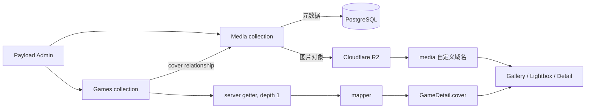

# Payload Media 与内容能力升级评估

> 日期：2026-07-21
>
> 评估基线：`main` / `17d0995`
>
> 当前实现基线：`main` / `78776c8`（PR #18 已合并并完成生产验证）
>
> 文档性质：架构评估与实施记录
>
> 实施状态：P1 Media/R2 与 P6 Games legacy cover 清理均已完成；生产 6 条 Games 已迁移到 Media-only
>
> 当前建议：下一项只做 slug/URL 验证、显式写权限与共用 rich-text 配置；随后再补 PostgreSQL 集成 smoke

## 0. 2026-07-22 生产验证与最终清理（已完成）

### 0.1 最终结果

- 独立 Cloudflare R2 media bucket、custom domain、bucket-scoped token 和 Coolify 变量已配置；
- 真实图片上传会生成 original、thumbnail、display 对象，公开 URL 使用 media custom domain；
- 生产 6 条 Games 已全部关联 Payload Media，重复图片复用同一 Media；
- `/games`、详情页和重新部署后的对象/relationship 持久性已经人工确认；
- PR #18 将 `Games.cover` 设为必填，mapper 改为 Media-only，并删除旧 `coverSrc`、`coverAlt`、`coverWidth`、`coverHeight` schema；
- 清理 migration 在删除旧列前检查空 `cover_id`，并已在隔离数据库副本验证安全失败及完整 `up/down` 往返。
- 合并提交 `78776c8` 已通过 main CI，并在生产成功执行 migration；公开 API 返回 6 条完整 Media relationship，旧字段命中数为 0；
- `/games`、6 个详情页和 6 个 `media.kral-koharu.com` 图片 URL 均返回 HTTP 200。

### 0.2 PR #18 的设计思路：从兼容双轨收敛到单一事实源

PR #18 不是再次实现 Media/R2，而是在 PR #17 和生产内容迁移已经成功之后，安全删除临时兼容层。它解决的核心问题是：同一张封面的 URL、alt 和宽高不应长期同时保存在 Game 和 Media 两处。

清理前的结构是有意保留的过渡状态：

```text
Games.cover（可选 Media relationship）
  + coverSrc / coverAlt / coverWidth / coverHeight（必填 legacy 字段）
  + mapper：优先 Media，无法解析时回退 legacy 字段
```

这让 PR #17 可以先上线而不破坏原有 6 条 Game，但长期保留会形成两个事实源：更换 Media 后，四个 legacy 字段不会自动同步；新代码也无法确定哪一套数据才是权威值。

生产 6 条 Game 全部关联 Media 并通过页面、R2 URL 与 Redeploy smoke 后，PR #18 才把结构收敛为：

```text
Games.cover（必填 Media relationship）
  -> Media.url / alt / width / height
  -> mapper
  -> 不变的 GameDetail.cover DTO
  -> Games 列表与详情 UI
```

也就是说，数据库和 Payload Admin 改为只维护 Media relationship，但前端仍接收原来的 `GameDetail.cover`。本次清理没有要求页面理解 Payload、PostgreSQL 或 R2。

#### 0.2.1 为什么必须拆成两个 PR

如果 PR #17 在第一次引入 Media 时就立刻要求 `cover` 必填并删除旧字段，生产原有 Game 在尚未关联 Media 时会无法读取或无法通过 migration。拆分后的顺序是：

1. PR #17 先增加 Media/R2、可选 `cover` 和 legacy fallback，不删除旧数据；
2. 项目所有者在生产 Payload Admin 上传唯一封面，并让 6 条 Game 全部关联 Media；
3. 验证生产上传、custom-domain URL、Games 页面和 Redeploy 持久性；
4. PR #18 只在上述前置条件成立后收紧约束和删除重复字段。

这相当于先让新旧两条读取路径短期并存，完成真实内容搬迁后，再拆除旧路径。内容迁移和破坏性 schema 清理没有在同一次部署里互相依赖。

#### 0.2.2 PR #18 在代码层做了什么

PR #18 同步修改了所有依赖封面结构的边界，而不只是删除四个数据库列：

1. **Payload Collection**：`Games.cover` 从可选变为必填；从 Games schema 删除 `coverSrc`、`coverAlt`、`coverWidth`、`coverHeight`。
2. **Getter/mapper 契约**：getter 继续使用 `depth: 1` 获取填充后的 Media；mapper 删除 legacy fallback。relationship 未填充或 Media 缺少可用 URL/尺寸时会显式报错，而不是悄悄返回错误封面。
3. **前端 DTO**：`GameDetail.cover` 的 `src/alt/width/height` 结构保持不变，因此 Games 列表、详情页和图片查看器不需要跟随数据库重构。
4. **本地 seed**：不再把四个旧字段写入 Game；先按 filename 查找 Media，不存在时从本地 public 图片创建 Media，然后把 Media id 写入 Game。
5. **类型和测试资料**：重新生成 Payload types，并把 fixture 改成包含真实 Media document 的形状。
6. **行为测试**：保留 Media display/original 解析测试，并增加 relationship 未填充、Media 元数据不完整时必须显式失败的测试。
7. **Migration 注册**：新增 `20260722_172809` 并加入 migration index，使生产容器启动时按既有流程执行。

PR #18 没有删除 Media document、没有删除 R2 对象、没有改变 R2 bucket，也没有删除仓库中的 legacy public 图片。它清理的是 Games 表和应用读取路径中的重复字段；静态文件是否删除可以在确认不再被其他页面引用后另做普通资源清理。

#### 0.2.3 `up migration` 为什么能安全删除旧字段

`up` 的目标是把已经完成的内容迁移固化为数据库约束，而不是在部署时猜测如何匹配图片：

```text
先检查所有 games.cover_id
  -> 只要有一条为 NULL：抛错并停止
  -> 全部非 NULL：将 cover_id 设为 NOT NULL
  -> 删除四个 legacy cover 列
```

图片与 Game 的对应关系由项目所有者此前在 Payload Admin 中确认，migration 不会根据文件名自动匹配生产内容。这个 guard 让“生产仍有 Game 未迁移”成为可见的部署失败，而不是带着缺图数据继续执行破坏性清理。

#### 0.2.4 `down migration` 恢复的是旧代码兼容性，不是历史快照

PR #18 之前的旧代码仍声明并读取四个 legacy 列。数据库执行 `up` 后这些列已经不存在，所以不能只把 Docker 镜像切回旧版本；旧代码可能直接遇到 `column games.cover_src does not exist`。

PR #18 的 `down` 因此按相反方向恢复 schema：

| 重建字段       | 当前数据来源                                            |
| -------------- | ------------------------------------------------------- |
| `cover_src`    | `Media.sizes.display.url`，缺失时回退 `Media.url`       |
| `cover_alt`    | `Media.alt`                                             |
| `cover_width`  | `Media.sizes.display.width`，缺失时回退 `Media.width`   |
| `cover_height` | `Media.sizes.display.height`，缺失时回退 `Media.height` |

它先把四列以可空形式加回并从当前 Media relationship 填充；只要任何 Game 无法得到完整四项数据就抛错。全部重建成功后，才重新设置四列为 `NOT NULL`，并把 `cover_id` 放宽回可选，恢复 PR #18 之前的数据库契约。

这个 `down` 不会把数据库“倒带”到某个历史时刻。例如旧 `cover_src` 曾经是 `/games/covers/title.jpg`，当前 Media URL 是 `https://media.../title.webp`，重建值会使用当前 Media URL。它提供的是可供旧代码使用的等价数据，不保证四个旧字段过去的逐字原值；需要精确恢复历史状态时，应使用与旧镜像时间点匹配的 PostgreSQL dump。

`down` 只回退 PR #18 的 Media-only 清理，因此保留 `Media` collection 和 `cover_id`。如果要继续回退到 PR #17 之前，还需要单独审查并执行更早的 Media migration down；这不是日常回滚路径。

#### 0.2.5 正常升级与紧急回滚顺序

正常升级已经完成：

```text
PR #17 兼容接入
  -> 生产内容迁移与验证
  -> 确认最新 PostgreSQL R2 dump
  -> 部署 PR #18
  -> 自动执行 up migration
  -> API / 页面 / Media URL smoke
```

只有需要把应用退回 PR #18 之前时，才运行 `down`：

```text
暂停生产写入
  -> 再创建一份当前数据库备份
  -> 使用包含 PR #18 migration 的版本执行 down
  -> 核对四个旧列已重建且无 NULL
  -> 部署旧 Docker 镜像
  -> 检查 Admin / Games / Media URL
```

日常运行、新部署或重新部署当前 main 都不需要执行 `down`。生产 dump 提供历史恢复边界，但完整 PostgreSQL restore drill 仍是独立未完成事项。

#### 0.2.6 实际验证

- migration 的空 `cover_id` guard failure 与完整 `up/down` SQL 已在一次性数据库副本验证，测试数据库随后删除；
- 47 个 Vitest、4 个 backup shell 场景、`pnpm check`、production build 和合并后的 GitHub quality 全部通过；
- 合并前确认最新 PostgreSQL R2 dump 存在；
- 合并后公开 API 返回 6 条完整 Media relationship 和 0 个 legacy 字段；
- `/games`、6 个详情页和 6 个 `media.kral-koharu.com` 图片 URL 均返回 HTTP 200。

下面的 2026-07-21 内容保留为第一阶段兼容接入的历史实施记录；当前事实以本节和 `current-project-status.md` 为准。

## 0.3 2026-07-21 兼容接入状态（历史记录）

当前分支已完成：

- 新增公开 `Media` collection，匿名可读，写入只允许登录用户；
- 本地使用忽略的 `.payload-media`，生产通过官方 S3 adapter 接入独立 Cloudflare R2；
- 新增 thumbnail/display WebP 尺寸、图片 MIME 限制和 10 MiB 单文件上限；
- Games 新增 nullable `cover` relationship，getter 使用 `depth: 1`；
- mapper 优先使用 Media display/original 元数据，并保留旧字段回退；
- 更新 Next remote image、Docker/Compose、环境变量、generated types、import map 和 migration；
- 隔离 PostgreSQL 已通过完整 migration `up/down/up`；
- 本地真实 JPG 已通过 Payload upload、Sharp 尺寸生成和删除清理 smoke。
- R2 模式 standalone 镜像已使用假凭据完成 migration/startup smoke，`/games` 与 `/admin` 返回 200；该检查不包含真实 R2 上传。

仍需项目所有者完成：

- 创建独立 media bucket、custom domain 和 bucket-scoped R2 token；
- 在 Coolify 配置 Media 环境变量并部署；
- 完成生产上传、R2 对象、custom-domain URL、Games 页面和重新部署持久性 smoke；
- 生产稳定后再逐个迁移真实 Games 封面；本 PR 不删除旧字段或旧图片。

## 1. 结论先行

Kita 现在适合把 Games 封面从 Git 管理的 `public` 静态文件升级为：

```text
Payload Media collection
  + Cloudflare R2 对象存储
  + Games.cover upload relationship
  + 现有 mapper / GameDetail.cover 边界
```

这个升级有真实收益：

- 图片可以直接在 Payload Admin 上传和选择；
- 新增或替换游戏封面不再要求修改 Git、重新构建 Docker image；
- 图片的 URL、宽高、文件类型等由 Media document 统一管理；
- Games、Reviews 和未来的 About/Home 内容可以复用同一套媒体能力；
- 图片文件不依赖 Coolify Web 容器文件系统，也不需要新增生产 Docker Volume；
- 前端仍只读取稳定的 `GameDetail.cover`，不需要理解 R2 或 Payload upload 细节。

这个 PR 不应该被扩大成“重做整个后端”。Kita 仍然应保持：

```text
Next.js 页面
  -> server getter
  -> Payload Local API
  -> PostgreSQL / Media relationship
  -> mapper
  -> 前端 DTO
```

推荐把第一次实施限定为：

1. 新增一个 `Media` collection；
2. 使用 Payload 官方 S3 storage adapter 连接 Cloudflare R2；
3. 给 Games 新增可选 `cover` upload relationship；
4. mapper 优先读取 Media，缺失时回退现有 `coverSrc` 等字段；
5. 保留当前 `public` 图片和旧字段作为回滚路径；
6. 完成类型、migration、测试、Docker 和文档验证。

只有在真实内容完成迁移并稳定运行后，才通过另一个很小的清理 PR 删除旧字段和旧图片。

## 2. 为什么现在可以改变旧决定

历史方案 [`games-image-asset-decoupling-plan.md`](./games-image-asset-decoupling-plan.md) 当时推荐：

```text
public/games/covers
  + coverSrc / coverAlt / coverWidth / coverHeight
```

当时这个决定是合理的，因为：

- Games 仍处于演示和结构迁移阶段；
- 生产 Games 数据为空；
- 图片数量很少；
- 项目还没有确定对象存储和恢复边界；
- 优先目标是停止为每张图片修改 enum 和 migration。

现在触发条件已经改变：

- Games、Reviews、Tools 已经实际接入 Payload/PostgreSQL；
- Games 内容已经开始通过 Admin 录入；
- Cloudflare R2 已经实际用于 PostgreSQL 外部备份；
- 用户明确希望 Payload 成为真实内容管理入口，而不只是数据库字段编辑器；
- 继续使用 `public` 意味着每张新图片仍然需要 Git commit、Docker build 和生产部署；
- 后续 Reviews、About、Home 也存在真实媒体需求。

仓库当前只有一张 `public/games/covers` 图片，大小约 0.41 MiB。这说明迁移成本仍然很低，但不应据此推断生产数据库内容状态。实施必须允许数据库已经存在真实 Games document。

因此，新方案不是否定旧设计，而是在旧设计完成“解除 enum/schema 耦合”之后，继续解除“内容图片必须随代码部署”的耦合。

## 3. 当前后端是否过于简陋

不是。

当前后端代码短，是因为 Payload 已经承担了：

- Admin；
- 用户认证；
- Collection CRUD；
- Local API、REST API 和 GraphQL API；
- PostgreSQL schema 管理；
- generated types；
- migration；
- access control。

Kita 自己保留的层次也很清楚：

| 层次           | 当前职责                           |
| -------------- | ---------------------------------- |
| Payload config | 注册 collections、数据库和后台能力 |
| Collection     | 内容字段、权限和 Admin 编辑体验    |
| server getter  | 查询范围、发布状态和生产失败边界   |
| mapper         | Payload document 到前端 DTO 的转换 |
| feature UI     | 页面、卡片、Lightbox 和详情展示    |
| PostgreSQL     | 结构化内容和 Media 元数据          |
| R2             | 图片二进制对象                     |

没有必要为了“看起来像后端”而新增 Express、Prisma、Redis、独立 API service 或微服务。Media/R2 是一次扩展现有边界的真实业务能力，不是为了增加技术数量。

## 4. 图片存储方案比较

| 方案                              | Admin 上传 | 新图片是否部署代码 | 生产持久性 | 复杂度 | 结论             |
| --------------------------------- | ---------- | ------------------ | ---------- | ------ | ---------------- |
| `public` + 普通路径字段           | 否         | 是                 | 高         | 低     | 当前可用，待升级 |
| Payload upload + Web 容器本地目录 | 是         | 否                 | 低         | 中     | 不采用           |
| Payload upload + Docker Volume    | 是         | 否                 | 中         | 中     | 不优先           |
| Payload Media + Cloudflare R2     | 是         | 否                 | 高         | 中     | 推荐             |
| Payload Media + Cloudflare Images | 是         | 否                 | 高         | 中高   | 暂缓             |
| 自建上传 API + R2                 | 可以       | 否                 | 高         | 高     | 不采用           |

### 4.1 为什么不把图片留在 Web 容器

Coolify 部署会创建新的 Web 容器。上传文件如果只在容器可写层中，重新部署后可能消失。为此增加 Volume 虽然可行，但还会增加：

- Volume 挂载和权限；
- Web 容器与文件备份的耦合；
- 迁移到其他宿主机时的恢复步骤；
- 多实例时的共享存储问题。

R2 已经是项目实际使用的外部能力，使用对象存储比新增生产 Volume 更符合当前架构。

### 4.2 为什么先不用 Cloudflare Images

Cloudflare Images 的动态转换、托管优化和交付能力有价值，但当前需求只是：

- 从 Admin 上传图片；
- 保存原图；
- 生成少量固定尺寸；
- 通过 CDN 域名访问。

Payload upload 已能通过 Sharp 生成固定尺寸，R2 能保存对象，Cloudflare custom domain 能提供缓存。当前再叠加 Cloudflare Images 会增加另一套产品配置、URL 规则和费用判断，提升有限。

结论：第一阶段只用 R2。只有未来确实出现大量实时尺寸、格式转换或图片交付优化需求时，再独立评估 Cloudflare Images。

## 5. 推荐目标架构



关键边界：

```text
PostgreSQL
  保存 Media document、Games relationship、alt、宽高和文件元数据

Cloudflare R2
  保存图片二进制，不保存 Games 业务字段

Payload
  负责上传、删除、关联和 Admin 编辑体验

mapper
  把 Media document 转换成现有前端 cover DTO

前端
  不知道 bucket、S3 endpoint、access key 或 Payload storage adapter
```

## 6. 推荐的 Media collection

第一版 Media 只服务公开站点图片，保持字段和权限简单。

建议内容：

```text
Media
├── filename / mimeType / filesize  Payload upload 自动字段
├── width / height                  Payload 图片元数据
├── url                             本地或 R2 公开 URL
├── alt                             必填，供前端无障碍描述
├── caption                         暂不需要
└── image sizes                     thumbnail / display
```

建议约束：

- 仅允许 JPEG、PNG、WebP、AVIF 等图片 MIME type；
- 设置合理的单文件上限，第一版不允许几十 MiB 原图；
- 保留原图；
- 生成 Admin thumbnail；
- 生成一个受控的前台 display 尺寸；
- 不为每个页面生成很多相近尺寸；
- Media `read` 允许匿名访问，因为站点封面本来就是公开资产；
- Media `create`、`update`、`delete` 只允许已登录管理员。

Payload upload collection 会自动提供文件元数据和 Admin 上传体验，也支持 `imageSizes` 与 `adminThumbnail`。参考 [Payload Upload 文档](https://payloadcms.com/docs/upload/overview)。

### 6.1 alt 应该放在哪里

第一版把 `alt` 放在 Media document 中，不额外增加 Games 的 override 字段。

原因：

- 当前封面主要是一张图片对应一个游戏；
- Admin 上传时可以一起填写描述；
- mapper 可以直接得到 URL、alt、宽高；
- 避免同时维护 `Media.alt` 和 `Games.coverAlt`。

只有未来同一张图片在不同上下文确实需要不同描述时，再增加局部 override；现在不提前设计。

### 6.2 图片尺寸

实现时建议先只保留：

```text
thumbnail  Payload Admin 使用
display    Games 页面、Lightbox 和详情页共用
original   保留，但不要求页面直接使用
```

当前 Games 前端已经使用 Next `<Image>`。第一版由 mapper 输出 display URL、宽度和高度，卡片所需的响应式尺寸继续交给 Next Image 优化，不再额外生成一套 card 图片。具体 display 像素应根据现有 Lightbox 和真实封面比例确定，不在评估文档中提前锁死。只有测量证明单一 display 造成明显浪费时，才增加更多尺寸。

## 7. Cloudflare R2 边界

Payload 官方文档明确建议：Node.js 环境通过 R2 的 S3-compatible API 使用 `@payloadcms/storage-s3`；`@payloadcms/storage-r2` 主要用于 Cloudflare Workers 原生 binding。参考 [Payload Storage Adapters](https://payloadcms.com/docs/upload/storage-adapters)。

推荐生产结构：

```text
独立 bucket：kita-media
公开域名：media.<项目域名>
API token：只允许访问 kita-media
上传协议：R2 S3-compatible endpoint
读取协议：公开 custom domain
```

必须遵守：

- 不复用 `kita-postgres-backups`；
- 不复用 PostgreSQL backup token；
- 不把 access key 或 secret access key 写入 Git、Markdown、日志或截图；
- S3 API endpoint 只用于上传，不作为前端图片 URL；
- 生产读取使用稳定 custom domain，不使用 `r2.dev`；
- 公开 Media 与未来可能出现的私密文件使用不同 collection 和 bucket。

因为第一版 Media 明确是公开图片，可以让 adapter 通过 `generateFileURL` 生成 custom-domain URL，并对这个 collection 使用 `disablePayloadAccessControl: true`，避免图片再由 Kita Web 容器代理。这个选项只适用于公开 Media；未来私密文件必须使用不同 collection/bucket，并保留 Payload access control 或签名下载。

Cloudflare 说明 R2 bucket 默认不公开，`r2.dev` 是非生产开发入口；自定义域名才能使用更完整的缓存和安全能力。参考 [Cloudflare R2 Public Buckets](https://developers.cloudflare.com/r2/buckets/public-buckets/)。

### 7.1 服务端上传优先

第一版使用 Payload 服务端上传，不启用 browser direct upload / `clientUploads`。

理由：

- Kita 运行在自托管 Coolify，不受 Vercel 4.5 MB serverless body 限制；
- 服务端上传不需要给浏览器暴露临时上传能力；
- 不需要额外配置 R2 CORS PUT；
- 权限和失败日志仍集中在 Payload；
- 当前只有一个管理员，上传并发很低。

如果实际上传遇到反向代理 `413`，应先检查并合理调整上传大小上限，而不是一开始就引入 direct upload。

### 7.2 本地开发策略

推荐：

```text
本地开发 / CI
  -> Payload local upload directory
  -> 目录加入 .gitignore 和 .dockerignore
  -> 不需要生产 R2 secret

Coolify production
  -> Payload S3 adapter
  -> Cloudflare R2
  -> disableLocalStorage
```

这样可以避免：

- 本地开发误删生产图片；
- 每位开发者都持有生产 R2 token；
- CI 为构建注入真实 Cloudflare secret；
- 本地离线时 Admin 无法使用。

本地上传目录位于 C SSD，只保存少量开发图片，不需要新增 Docker named volume。它必须被排除在 Git 和 Docker build context 之外。

生产必须 fail fast：如果声明使用 R2，但 bucket、endpoint、public URL 或凭据不完整，应用应拒绝启动，而不是悄悄退回容器本地存储。

## 8. Games 的兼容迁移

### 8.1 第一个实现 PR

Games 新增：

```text
cover
  type: upload
  relationTo: media
  required: false
```

第一次必须是可选字段，因为已有 Games document 可能只有：

```text
coverSrc
coverAlt
coverWidth
coverHeight
```

getter 使用足够的 relationship depth 取得 Media document，mapper 执行：

```text
如果 cover 是完整 Media document
  -> 优先使用 Media display URL / width / height，并使用 Media.alt
  -> display 不存在时回退 Media 原图元数据

否则
  -> 使用 coverSrc / coverAlt / coverWidth / coverHeight
```

前端继续只接收：

```ts
cover: {
  src: string;
  alt: string;
  width: number;
  height: number;
}
```

因此以下组件不需要知道 Payload Media：

- `GameGalleryCard`；
- `GameLightbox`；
- `GameDetailPage`；
- `GameSharedModal`。

### 8.2 内容迁移

部署兼容 PR 后，通过 Payload Admin：

1. 上传现有封面到 Media；
2. 检查 Media URL 和缩略图；
3. 把 Media document 赋给对应 `Games.cover`；
4. 检查 `/games`、Lightbox 和详情页；
5. 保留旧 `coverSrc` 字段和 `public` 文件一段观察期。

图片上传和 relationship 赋值是内容操作，不是 migration，也不应写进数据库 migration。

### 8.3 后续清理 PR

全部真实 Games 验证完成后，再单独执行：

```text
cover 改为 required
删除 coverSrc
删除 coverAlt
删除 coverWidth
删除 coverHeight
更新 mapper / fixture / seed
最后删除不再引用的 public 图片
```

清理 PR 不能和首次接入合并，否则会失去最简单的代码回滚路径。

## 9. Reviews 是否同时迁移

Reviews 当前仍使用：

```text
gameTitle: text
coverImage: text
```

从长期一致性看，`coverImage` 最终也应该改成 Media upload relationship。但不建议在第一个 Media PR 中同时删除 Reviews 旧字段。

推荐选择：

```text
本 PR
  Media 基础设施
  Games.cover 兼容接入

后续小 PR
  Reviews.cover 兼容接入
  真实 review 内容验证
  再决定旧字段清理时间
```

这样第一轮只打通一条完整生产路径，遇到 R2、Next Image 或 migration 问题时更容易定位。

## 10. 还值得使用的 Payload 能力

“必须使用 Payload 后端能力”不等于把所有页面都变成 CMS。只有能减少真实维护成本的能力才值得引入。

### 10.1 总体优先级

Media/R2 完成后的建议排序如下：

| 顺序 | 能力或改进                     | 真实收益                                      | 复杂度 | 当前决定                              |
| ---- | ------------------------------ | --------------------------------------------- | ------ | ------------------------------------- |
| 1    | slug/URL 验证与 Admin 输入约束 | 阻止坏路由和坏外链进入数据库                  | 低     | 下一项，与显式权限同一小 PR           |
| 2    | 显式 create/update/delete 权限 | 让 API 和 Admin 写权限可审计，不依赖默认行为  | 低     | 下一项，与字段验证同一小 PR           |
| 3    | 共用 rich-text 配置            | 消除 Games/Reviews Lexical 配置漂移           | 低     | 下一项修改 collection 时顺手完成      |
| 4    | PostgreSQL migration smoke     | 证明全部 migration 能从空库建立真实 schema    | 低到中 | 随后单独做；下一复杂 migration 前完成 |
| 5    | Trash / 软删除                 | Games、Reviews、Media 误删后可从 Admin 恢复   | 低到中 | 出现误删风险或内容价值提高后做        |
| 6    | Reviews -> Media relationship  | 统一 review card 和详情图片                   | 中     | 真实 Reviews 内容增长时做             |
| 7    | Reviews -> Games relationship  | 避免 `gameTitle` 手填漂移，并支持关联查询     | 中     | 真实 Reviews 增加时做                 |
| 8    | About Global                   | 通过 Admin 维护仍是 placeholder 的 About 正文 | 中     | Media 稳定后的内容型 PR               |
| 9    | Home content Global            | 通过 Admin 管理壁纸和短句                     | 中     | 确认需要经常调整时再做                |
| 10   | Payload drafts / versions      | 草稿历史、差异、恢复和预览                    | 中到高 | 出现真实编辑痛点后做                  |
| 11   | Admin roles / Email            | 多人分权、密码重置、通知                      | 中     | 单管理员阶段不做                      |
| 12   | Jobs、Search、Localization 等  | 解决异步任务、大规模检索或多语言问题          | 高     | 当前没有问题，不做                    |

这里的核心原则是：

```text
先保证录入的数据正确
  -> 再保证权限和 migration 可验证
  -> 再改善误删恢复和内容关联
  -> 最后才考虑更完整的编辑工作流
```

### 10.2 字段验证：最适合紧接 Media 完成

当前 Collection 已有 `required`、`unique`、`min`、`max` 等基础约束，但仍有几个真实缺口。

#### 10.2.1 slug

Games 和 Reviews 当前都是普通必填、唯一 text：

```text
slug: text + required + unique
```

它仍然接受：

```text
White Album 2
white_album_2
/white-album-2
white-album-2?draft=true
```

这些值可能进入数据库，但不适合当前动态路由。

建议继续保留手工 slug，而不是立即换成自动 slug：

```text
只允许小写 ASCII 字母、数字和单个连字符
不允许开头或结尾连字符
限制合理长度
继续 required + unique
Admin description 给出示例
```

建议格式：

```text
^[a-z0-9]+(?:-[a-z0-9]+)*$
```

Payload 已有内置 `slugField()`，带自动生成和锁定 UI。参考 [Payload Text / Slug Field](https://payloadcms.com/docs/fields/text)。但 Kita 的标题可能包含日文、中文、符号或多个官方译名，完全从 title 自动生成不一定得到稳定、可读的 ASCII URL。

因此当前建议是：

- 不引入新的 slugify 依赖；
- 不在修改标题时自动改变现有 URL；
- 保留人工选择 slug；
- 只增加轻量、同步的格式验证；
- 如果以后录入量明显增大，再使用 Payload `slugField()` 的 lock/unlock UI。

#### 10.2.2 URL

当前自由 URL 字段包括：

```text
Tools.url
Games.links[].href
```

它们现在只要求有字符串，因此拼写错误或缺少协议仍能保存。

建议增加一个共享的 `validatePublicHttpUrl`：

```text
new URL(value) 必须成功
protocol 只允许 http: 或 https:
不在保存时请求远端 URL
不自动改写 path、query 或编码
```

这样可以拦截明显错误，又不会因为 VNDB、OpenList 或其他站点暂时不可用而阻止内容保存。不要使用异步网络探测作为字段验证，因为 Payload Admin 会频繁执行 validation，远端网络不应该成为保存内容的依赖。

Payload 的 field `validate` 会同时在 Admin 和后端执行。自定义 validator 会替换该字段的默认 validator，因此实现时需要复用 Payload 的默认 text validation，再叠加 Kita 规则，避免意外丢失 required/minLength/maxLength 行为。参考 [Payload Fields Validation](https://payloadcms.com/docs/fields/overview)。

#### 10.2.3 Games.releaseDate

当前 `releaseDate` 是自由 text。实际 fallback 使用：

```text
2010-03-26
```

而 Admin 也可能接受：

```text
20121123
March 26
unknown
```

如果所有真实 Games 都能确定到具体日期，推荐最终改成 Payload `date` field，并配置：

```text
pickerAppearance: dayOnly
```

Payload date field 会在数据库中保存完整日期值，Admin 提供日期选择器。参考 [Payload Date Field](https://payloadcms.com/docs/fields/date)。前端 mapper 再统一格式化为 `YYYY-MM-DD`，并使用 UTC/date-only 口径，避免时区造成日期前后偏移。

这个修改不能只改 Collection 类型。安全步骤是：

1. 只读盘点现有 `releaseDate` 形状，不输出其他内容或 secret；
2. migration 明确兼容 `YYYY-MM-DD` 和 `YYYYMMDD`；
3. 遇到无法解析的值时让 migration 失败并列出 document id，不静默猜测；
4. 数据转换成功后再删除旧 text 列；
5. 更新 mapper、fixture、seed 和测试；
6. 检查 Admin、Gallery、详情页和 metadata。

如果未来确实需要表示“只知道年份”或“只知道年月”，就不应伪造 1 月 1 日；那时保留经过格式验证的 text，或者显式拆成 precision + value。当前已知内容使用完整日期，因此暂不为未知需求增加这套复杂模型。

#### 10.2.4 其他字段

建议保留现状：

- `rating` 已有 0 到 10 范围，不需要新模型；
- `playStatus` 和发布状态使用稳定 select，适合枚举；
- `tags` 数量较少，仍用 array of text，不创建 Tags collection；
- `developer` 仍用 text，不创建 Developers collection；
- `readingTime` 暂时手填，不增加遍历 Lexical 的 hook；
- `links[].label` 只加合理 `maxLength`，不建立链接类型 enum；
- Tools `category` 当前稳定，继续使用 select。

这里要避免“数据库正规化冲动”：只有需要复用、查询或强一致性的对象才升级成 relationship。

### 10.3 显式写权限：行为基本不变，但审计价值高

Games、Reviews 当前只显式写了 public/read 边界；Tools 只显式写了 public read。create、update、delete 依赖 Payload 默认访问控制。

Payload 默认访问控制确实会检查请求中是否有已登录用户，因此当前并不是匿名用户可以写入。参考 [Payload Access Control](https://payloadcms.com/docs/access-control/overview)。问题在于：

- 代码阅读者必须知道框架默认值；
- Collection 文件看不出完整 CRUD 边界；
- 以后加入 Media、Global 或第二类用户时容易出现不一致；
- 测试难以直接引用一个共享的权限规则。

推荐增加一个非常小的 helper：

```text
isAuthenticated
  -> Boolean(req.user)
```

并在这些 Collection 中明确写出：

```text
Games
  read: 登录用户全部；匿名只看 published
  create/update/delete: isAuthenticated

Reviews
  read: 登录用户全部；匿名只看 published
  create/update/delete: isAuthenticated

Tools
  read: public
  create/update/delete: isAuthenticated

Media
  read: public
  create/update/delete: isAuthenticated
```

Users 暂时继续使用 Payload auth collection 的安全默认值，不在这个小 PR 中设计 self-update、admin-only create 或角色规则。

这项修改原则上不改变当前单管理员行为，所以不需要 migration。测试只需覆盖：

- 没有 `req.user` 时写入被拒绝；
- 有 user 时写入允许；
- Games/Reviews 匿名 read 仍返回 published query constraint；
- Tools/Media 匿名 read 仍允许。

需要特别记录：Payload Local API 默认 `overrideAccess: true`。当前前台 getters 已正确使用 `overrideAccess: false`；未来安全测试也必须显式传 `overrideAccess: false` 和 user/anonymous context。内部 seed 可以继续作为受环境变量和非生产路由保护的特权操作，但应明确这是有意绕过，不是假装通过普通用户权限。参考 [Local API Access Control](https://payloadcms.com/docs/local-api/access-control)。

### 10.4 集成测试：先做 migration smoke，不急着引入浏览器测试框架

当前 47 个 Vitest 对 mapper、getter、seed、Media 配置、权限和环境变量已有良好覆盖，但 getter 测试仍使用 mocked Payload client。PR #18 的 migration 已在一次性数据库副本验证，仍应把真实数据库 smoke 固化进 CI。现有 GitHub Actions：

```text
没有 PostgreSQL service
SKIP_ENV_VALIDATION=true
执行 format / lint / typecheck / unit + backup tests / build
```

这意味着 CI 目前没有验证：

- 六条 production migration 能否在全新 PostgreSQL 16 上完整执行；
- Media relationship 与 legacy cleanup migration 是否能持续从空库重建；
- Payload config 在实际 PostgreSQL schema 上能否初始化。

第一步推荐新增独立 `migration-smoke` job：

```text
GitHub Actions PostgreSQL 16 service
  -> 使用 CI 专用、非生产数据库密码和 PAYLOAD_SECRET
  -> pnpm install
  -> pnpm payload:migrate
  -> pnpm payload:migrate:status
```

收益：

- 每个 PR 都从空库按顺序执行全部 migration；
- 能发现 SQL、扩展、表顺序和 generated migration 问题；
- 不需要 Testcontainers；
- 不需要启动浏览器；
- 不需要生产 secret；
- 不接触任何现有本地或生产数据库。

第二步只有在第一步稳定后，再考虑一个很小的真实 Payload Local API 测试：

```text
创建临时用户
创建 draft / published document
anonymous + overrideAccess false 只能读 published
authenticated + overrideAccess false 可以写入
测试结束清理临时数据库
```

暂时不建议引入 Playwright、完整 Admin E2E、Testcontainers 或在 CI 启动整套 Coolify Compose。这些工具不是没有价值，而是当前维护成本高于单人内容站的风险。

### 10.5 Trash / 软删除：比复杂自动清理更实用

Payload 的 `trash: true` 会给 Collection 增加 `deletedAt`，Admin 自动提供 Trash、Restore 和 Permanently Delete。普通查询默认不返回 trashed document。参考 [Payload Trash](https://payloadcms.com/docs/trash/overview)。

它适合 Kita 的原因：

- 单管理员最常见的数据事故是误删，不是复杂并发冲突；
- Games 或 Reviews 恢复比从 PostgreSQL backup 单条找回简单；
- Media soft-delete 时对象可以继续保留，恢复 relationship 更安全；
- 不需要新增服务、定时任务或自建回收站 UI；
- 与显式 delete access 使用同一权限边界。

建议 Media 稳定后，对以下 Collection 启用：

```text
Games
Reviews
Media
Tools（可选）
```

不要在 Media 首次接入 PR 中同时启用，因为需要先确认 R2 adapter 在 soft delete、restore 和 permanent delete 三种路径上的行为。

验收必须包括：

```text
删除 Game -> 前台不再出现
Trash 中可以看到 -> Restore 后重新出现
删除 Media -> R2 对象在 soft delete 阶段仍可恢复
永久删除 Media -> R2 对象按预期删除
普通 getter 不返回 trashed document
```

Trash 不是备份。永久删除后仍然需要依赖 R2/数据库恢复策略；它只是降低日常误操作成本。

### 10.6 复用富文本配置：值得做，但不值得单独扩张架构

Games 和 Reviews 目前重复定义了相同的 Lexical features：

```text
Paragraph
H2/H3/H4
Bold / Italic
Ordered / Unordered List
Blockquote / Link
Fixed / Inline Toolbar
```

风险不是代码行数，而是以后只在一个 Collection 增加能力，两个正文编辑器逐渐不一致。

推荐抽出一个小文件，例如：

```text
src/payload/fields/content-rich-text.ts
```

只导出一个 editor config 或创建 richText field 的函数。不要建立复杂的 schema DSL、page builder 或通用 block system。

验收标准：

- Games 和 Reviews Admin 编辑器功能不变；
- generated schema 不变；
- migration generator 不应产生数据库变更；
- 类型检查和现有 rich text 页面正常。

最适合在下一次同时修改 Games/Reviews Collection 时顺手完成，不需要为了这几十行重复代码单独做中型 PR。

### 10.7 Reviews -> Games relationship

Reviews 的 `gameTitle` 是手工文本。它可能出现：

- 游戏改名后 review 仍显示旧标题；
- 大小写或语言版本不一致；
- 无法可靠查询“某个游戏有哪些 review”；
- Admin 不能从现有 Games 中选择。

Payload relationship field 正是用来连接两个 collection document 的能力。参考 [Payload Relationship Field](https://payloadcms.com/docs/fields/relationship)。

推荐以后新增：

```text
Reviews.game
  type: relationship
  relationTo: games
```

第一次同样使用兼容迁移：

```text
新增 optional game relationship
mapper 优先读取 game.title
没有 relationship 时回退 gameTitle
真实 Reviews 完成关联
最后再删除 gameTitle
```

不要一开始把 relationship 设为 required，因为并不是每篇 Review 对应的游戏都一定已经建立 Games document。等真实内容证明这一约束合理后再收紧。

后续可以在游戏详情页查询相关 Reviews，但暂时不需要 Join field、反向关系插件或在 Game document 中保存 review id 数组；直接查询 `Reviews where game equals id` 更简单，也不会产生双向同步。

### 10.8 About Global 与 Home Global

About 当前仍有 placeholder，并且页面自己已经写明以后可由 Payload 管理。这是比“把所有导航都放进 CMS”更明确的需求。

Payload Global 适合只存在一份的内容，例如 About、站点设置或首页短句；它会自动获得 Local API、REST、GraphQL 和 Admin 编辑入口。参考 [Payload Globals](https://payloadcms.com/docs/configuration/globals)。

建议未来先做一个小而明确的 `About` Global：

```text
title
intro rich text
sections
background Media relationship（可选）
```

不建议同时把路由、Tailwind class、导航颜色或 WebGL 参数交给 CMS。视觉结构继续由代码负责，Payload 只管理内容。

Home 可以更晚再评估一个 `HomeContent` Global：

```text
wallpapers: Media array
verses: text array
```

但导航路由、hover 颜色、雨滴效果参数和 layout 继续留在代码。只有当用户确实希望不部署代码就更换首页壁纸或短句时，Home Global 才带来真实价值。

### 10.9 为什么暂不迁移到原生 Drafts / Versions

Games 和 Reviews 现在已有简单的：

```text
draft / published
```

Payload 原生 drafts 会自动增加 `_status`、版本表、Save Draft / Publish 和预览能力。参考 [Payload Drafts](https://payloadcms.com/docs/versions/drafts)。

它的能力更完整，但迁移会影响：

- collection schema；
- access control；
- getter 查询；
- generated types；
- migration 和现有内容状态；
- Admin 工作流。

当前没有“需要保存多次未发布版本”或“必须预览草稿”的明确问题，因此保留现状更简单。等真实写作频率证明需要版本历史时再做。

明确的启用触发条件：

- 一篇 Review 需要跨多天编辑；
- 需要在发布前预览真实页面；
- 需要查看修改差异或恢复上一稿；
- 误改内容已经成为比误删更常见的问题。

如果以后启用，建议：

- 先只在 Reviews 试点；
- 设置合理 `maxPerDoc`，避免版本无限增长；
- 用 migration 将现有 `status` 映射到 `_status`；
- 更新所有 getter/access tests；
- 验证预览 URL 后再考虑 Games。

Trash 应该先于 Versions，因为它更简单，并且先解决当前更现实的误删问题。

### 10.10 角色、邮件和其他能力

#### Admin roles

当前只有一个管理员，角色系统不会增加安全边界，只会增加：

- Users schema；
- JWT 字段；
- 各 Collection 分支权限；
- 首个用户和角色迁移；
- 更多测试矩阵。

只有出现第二类真实用户时再做，例如：

```text
owner   可以管理 Users、永久删除 Media、修改全部内容
editor  只能创建和编辑内容，不能管理账号或永久删除
```

#### Email adapter

Payload 当前在开发日志提示没有 email adapter。单管理员、密码保存在 Bitwarden、没有邮件通知流程时，这不是运行故障。

只有需要以下能力时再配置：

- 忘记密码邮件；
- 邀请第二位管理员；
- 表单或发布通知。

不要为了消除一条开发 warning 就引入邮件服务和另一组生产 secret。

#### Hooks

Hooks 只在存在明确生命周期规则时使用。当前可接受的轻量例子是：

- 保存前 trim 某些文本；
- 以后发布内容时触发 Next on-demand revalidation；
- 维护确实需要的派生字段。

当前不建议用 hook：

- 自动请求外部网站检查 URL；
- 自动删除“看起来未引用”的 R2 对象；
- 自动同步 OpenList；
- 自动改写已发布 slug；
- 在每次保存时执行复杂正文分析。

Payload field/collection hooks 很强，但强生命周期副作用会让内容保存变得更难预测。参考 [Payload Hooks](https://payloadcms.com/docs/hooks/overview)。

#### 当前明确不需要的能力

```text
Localization
  当前没有同一内容多语言编辑需求

Jobs / Queue
  当前没有需要异步执行的重任务

Search plugin
  内容量不足，列表和数据库查询已经够用

Form Builder
  当前没有公开投稿或复杂联系表单

SEO plugin
  Games/Reviews 已能从 title + summary/excerpt 生成基础 metadata

Folders
  Media 数量很少，先使用清楚文件名和 Admin 搜索

Query Presets
  单管理员、少量内容不需要保存复杂后台筛选

Live Preview
  在原生 Drafts 和真实预览需求出现前不启用
```

这些都不是“永远禁止”，而是没有触发条件时不安装、不配置、不维护。

## 11. 明确不进入本 PR 的内容

为了防止范围膨胀，第一次 Media PR 明确不做：

- 不引入 Express、Prisma、Redis 或独立后端服务；
- 不引入 Cloudflare Workers；
- 不引入 Cloudflare Images；
- 不启用 browser direct upload；
- 不建立公开用户注册；
- 不增加管理员角色系统；
- 不迁移 Payload 原生 drafts / versions；
- 不把 Home、About、导航和站点设置一次性迁入 Payload；
- 不删除旧 Games 图片字段；
- 不删除当前 `public` 图片；
- 不在 migration 中插入真实图片或生产内容；
- 不复用 PostgreSQL backup bucket 或 token；
- 不尝试自动删除所有未引用对象；
- 不修改 OpenList 边界。

## 12. 预期文件范围

实现 PR 预计会涉及以下类型文件：

```text
package.json / pnpm-lock.yaml
payload.config.ts
next.config.ts
.env.example
.gitignore / .dockerignore
compose.yaml
src/config/*（R2 配置验证）
src/payload/collections/media.ts
src/payload/collections/games.ts
src/payload/payload-types.ts
src/server/games/get-games.ts
src/features/games/utils/map-game-document-to-game-detail.ts
对应 unit tests / fixtures
一个新的 Payload migration
当前状态与恢复文档的小幅同步
```

这不是“小型字段修改”，而是一个中等规模功能 PR；但它仍然只有一个清楚目标，没有增加新的运行中服务。

## 13. 环境变量建议

命名可以在实现时微调，但职责应保持清楚：

```text
MEDIA_STORAGE_MODE=local|r2
MEDIA_R2_BUCKET
MEDIA_R2_ENDPOINT
MEDIA_R2_PUBLIC_URL
MEDIA_R2_ACCESS_KEY_ID
MEDIA_R2_SECRET_ACCESS_KEY
```

边界：

- `MEDIA_R2_PUBLIC_URL` 不是 secret；
- access key 与 secret access key 只存在于 Coolify runtime；
- `.env.example` 只记录键名和占位符；
- 本地默认 `local`，不要求 Cloudflare 凭据；
- production 必须显式使用 `r2`；
- `r2` 模式缺任意必需值时 fail fast；
- PostgreSQL backup 使用的 `POSTGRES_BACKUP_R2_*` 保持完全独立。

Docker build 使用 `SKIP_ENV_VALIDATION=true` 时不能发起 R2 网络请求。最终 production container 必须实际验证 runtime 能根据 Coolify 变量启用 R2 adapter，不能只验证 `next build`。

## 14. 数据与灾备边界

接入 Media 后，Kita 的持久数据会分为：

```text
PostgreSQL
  Games / Reviews / Media 元数据 / relationship

Cloudflare R2 media bucket
  图片对象
```

现有 PostgreSQL custom dump 不包含 R2 图片二进制。因此：

- 数据库恢复成功不等于图片已经恢复；
- R2 media bucket 不是 PostgreSQL backup bucket；
- 灾备 Runbook 必须新增 Media bucket、custom domain、token scope 和恢复顺序；
- 不应把“R2 本身持久”写成“媒体已有独立备份演练”；
- 删除 Media document 前应先确认引用，第一版可以依赖单管理员操作规则，不急着增加复杂自动引用扫描。

推荐恢复顺序：

```text
恢复应用和 PostgreSQL
  -> 恢复或重新连接 media bucket
  -> 验证 Media URL
  -> 验证 Games / Reviews 页面
```

## 15. 风险与控制措施

| 风险                                   | 影响                          | 控制方式                                                    |
| -------------------------------------- | ----------------------------- | ----------------------------------------------------------- |
| R2 配置错误                            | Admin 上传失败或图片 404      | production fail fast；部署后真实上传 smoke                  |
| S3 endpoint 被误当公开 URL             | 前端 URL 错误                 | endpoint 与 public URL 使用不同变量                         |
| 误用 backup bucket/token               | 权限边界和数据分类混乱        | 独立 bucket、独立最小权限 token                             |
| Next Image 不允许远程域名              | 页面图片无法渲染              | 配置精确 `remotePatterns`，加入页面 smoke                   |
| relationship 只返回 ID                 | mapper 取不到 URL             | getter 固定 `depth: 1`；mapper 对未展开关联明确报错         |
| 数据还未绑定 Media                     | 清理 migration 会破坏旧内容   | migration 在删列前检查空 `cover_id`，存在时立即中止         |
| 上传文件过大                           | 上传慢、代理 413、带宽浪费    | MIME/大小上限；固定尺寸；服务端上传 smoke                   |
| 删除 Media 后仍被内容引用              | 页面破图                      | 先改引用再删；单管理员操作规则；暂不做复杂自动 GC           |
| 本地误操作生产对象                     | 生产图片丢失                  | 本地默认 local storage，不持有生产 token                    |
| R2 正常但数据库丢失                    | 对象存在但关系丢失            | 保留 PostgreSQL backup；Runbook 记录双数据源                |
| 数据库恢复但 R2 对象缺失               | Media document 存在但图片 404 | Runbook 单独盘点 Media bucket；不夸大现有 backup 能力       |
| storage plugin 与 Payload 版本不一致   | 类型或运行时异常              | `@payloadcms/storage-s3` 与现有 Payload 3.85.1 保持同版本线 |
| 构建模式与 production runtime 行为不同 | CI 通过但线上 adapter 未启用  | 验证真实 standalone container runtime + R2 upload           |

## 16. 测试与验收标准

### 16.1 自动测试

至少覆盖：

- Media document 能映射为现有 `GameDetail.cover`；
- Media relationship 只有 ID 时明确失败，不生成坏 URL；
- Media 缺少可用 URL/宽高元数据时明确失败；
- anonymous 只能读取公开 Media，不能创建、更新、删除；
- production `r2` 模式缺配置时拒绝启动；
- local 模式不需要 R2 secret；
- getter 使用正确 depth 和 `overrideAccess: false`；
- remote image hostname 配置正确；
- generated types 和 migration 已更新。

完整门禁：

```bash
pnpm test
pnpm check
pnpm build
```

### 16.2 本地人工 smoke

```text
Payload Admin 登录
  -> 上传一张本地测试图
  -> Media thumbnail 正常
  -> 新建或修改一个 Games document
  -> /games 卡片正常
  -> Lightbox 正常
  -> /games/[slug] 正常
  -> 删除测试内容后无异常
```

本地测试只能证明 Payload upload 和页面链路，不证明 R2 production 配置。

### 16.3 生产人工 smoke

部署兼容 PR 后：

```text
/admin 正常登录
上传一张经过控制的小图片
R2 bucket 出现新对象
Media URL 使用 custom domain
Games 绑定 Media 后前台图片正常
6 条 Games 均已绑定 Media 且页面正常
重新部署一次 Web container 后图片仍正常
```

最后一项用于证明图片确实不依赖旧 Web 容器文件系统。

## 17. 部署顺序

推荐顺序：

1. 在 Cloudflare 创建独立 media bucket；
2. 创建 media custom domain；
3. 创建 bucket 范围内的最小权限 token；
4. 在 Coolify 配置新的 Media 环境变量，不输出真实值；
5. 合并并部署兼容 PR；
6. 观察 migration、Web 启动和 Admin；
7. 上传一张测试图片；
8. 绑定一个 Game 并做完整页面 smoke；
9. 逐个迁移真实封面；
10. 经过观察期后再创建 legacy cleanup PR。

不要采用：

```text
先删 public 图片和旧字段
  -> 再配置 R2
  -> 再尝试恢复页面
```

## 18. 回滚策略

第一次 PR 保留旧字段和旧图片，因此代码回滚非常直接：

```text
新 Media / R2 链路异常
  -> mapper 继续读取 legacy cover
  -> 或回滚应用版本
  -> public 图片仍可服务
```

回滚时：

- 不删除已经上传的 R2 对象；
- 不手工回滚生产数据库 migration；
- 先恢复应用可用性；
- Media 表和 nullable relationship 可以暂时保留；
- 修复后重新部署并继续验证。

这正是第一次 PR 不删除旧字段的主要原因。

## 19. 对 PR 大小的最终判断

如果 PR 同时做以下所有事情，它就过大：

```text
Media + R2
+ Games 全量破坏性迁移
+ Reviews 迁移
+ Reviews -> Games relationship
+ About Global
+ Home Global
+ 原生 Drafts
+ 角色系统
+ 自动未引用图片清理
```

如果 PR 只做以下内容，则大小合适：

```text
Media collection
+ R2 storage adapter
+ Games nullable cover relationship
+ mapper legacy fallback
+ migration / types / tests
+ 配置和恢复文档
```

这个范围属于“中等规模但单一目标明确”的功能 PR，适合现在实施。

## 20. 推荐演进顺序

```text
已完成  Media + R2 + Games.cover 兼容接入
  ↓
已完成  6 条 Games 真实图片迁移与生产验证
  ↓
已完成  Games.cover 必填 + legacy 字段清理
  ↓
下一项  slug / URL validation + 显式写权限
       同时抽取共用 rich-text 配置
  ↓
随后    CI PostgreSQL 16 migration smoke
       + 真实 Payload published 权限集成测试
  ↓
按需    releaseDate date migration / Trash
       / Reviews.cover / Reviews.game / About Global
```

下一项建议严格限制为一个无数据库 migration 的小 PR：

- 为 Games、Reviews 的 slug 增加小写 ASCII、数字和连字符约束；
- 为外部 URL 字段增加同步 `http/https` 绝对 URL 验证，不做远端网络探测；
- 为 Games、Reviews、Tools、Media 显式声明 create/update/delete 权限，保持“匿名不能写、登录用户可以写”的现有行为；
- 增加匿名/登录用户权限单元测试，并确保 Local API 测试显式使用 `overrideAccess: false`；
- 在同时修改 Games/Reviews collection 时抽取共用 Lexical rich-text 配置。

暂不在这一步修改 `releaseDate` 数据库类型，因为生产仍有 placeholder 日期内容；应先修正真实内容，再单独生成并审查 date migration。下一项完成后，单独增加 PostgreSQL 16 CI service 和真实 Payload Local API published 权限集成测试，再决定是否需要新的 schema 能力。

这不是要求连续完成所有候选项。推荐实际停点是：

```text
完成字段验证 / 显式权限小 PR
  -> 完成 PostgreSQL / published 集成 smoke
  -> 回到真实内容和产品体验
  -> 只有出现误删、Review 关系或编辑历史痛点时才扩展 Payload
```

每一步都必须回答一个已经存在的问题。没有出现相应问题时，不继续扩张 Payload 配置。Trash、Reviews relationships、Globals、Drafts、角色系统、Jobs 和搜索都不是当前阻断项。

## 21. 最终建议

Media/R2 与 Games Media-only 清理已经完成，不应再把它们描述成待实施方案。当前架构已经实际使用了 Payload 的核心后端能力：

- upload collection；
- relationship；
- Admin 内容工作流；
- access control；
- generated types；
- migration；
- Local API；
- storage adapter。

实施结果没有显著增加 Kita 的整体复杂度：

- 没有新增运行中的服务；
- 没有新增生产 Volume；
- 没有新增前端状态管理；
- 没有新增自建上传 API；
- 没有改变现有页面 DTO；
- 没有一次性重构其他 collection；
- 兼容接入、内容迁移和破坏性清理被拆成独立阶段；
- migration 有空 relationship guard、可审查的 `down` 和生产 backup 边界。

因此，当前最合适的下一项不是再增加大型 Payload 功能，而是补齐低复杂度的数据验证和显式权限；随后用真实 PostgreSQL 集成 smoke 固化 migration 与 published access 的可靠性。完成这两项后应暂停技术扩张，把时间放回真实内容、About placeholder 和前台产品行为。

## 22. 主要参考资料

- [Payload Upload](https://payloadcms.com/docs/upload/overview)
- [Payload Upload Field](https://payloadcms.com/docs/fields/upload)
- [Payload Storage Adapters / Cloudflare R2](https://payloadcms.com/docs/upload/storage-adapters)
- [Payload Relationship Field](https://payloadcms.com/docs/fields/relationship)
- [Payload Globals](https://payloadcms.com/docs/configuration/globals)
- [Payload Drafts](https://payloadcms.com/docs/versions/drafts)
- [Payload Text / Slug Field](https://payloadcms.com/docs/fields/text)
- [Payload Date Field](https://payloadcms.com/docs/fields/date)
- [Payload Field Validation](https://payloadcms.com/docs/fields/overview)
- [Payload Access Control](https://payloadcms.com/docs/access-control/overview)
- [Payload Local API Access Control](https://payloadcms.com/docs/local-api/access-control)
- [Payload Trash](https://payloadcms.com/docs/trash/overview)
- [Payload Hooks](https://payloadcms.com/docs/hooks/overview)
- [Payload Migrations](https://payloadcms.com/docs/database/migrations)
- [Cloudflare R2 S3 API](https://developers.cloudflare.com/r2/api/s3/api/)
- [Cloudflare R2 Public Buckets](https://developers.cloudflare.com/r2/buckets/public-buckets/)
